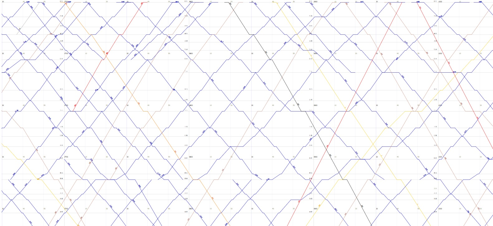

大家好，這裡是潛水員CCT。

《初音未來 Project DIVA MEGA39's+》最近在Steam發售，對身為待在DIVA坑內9年多的筆者來說，這是個令人興奮的消息。今天想來討論一下，DIVA系列之中有一首名曲，它的由來特別容易被誤會，就是「1925年到底發生了什麼事，而成為這首歌曲名的由來？」對於這個問題，我個人在釐清之後，稍微用FB、Twitter、Google等多個平臺或引擎搜尋，誤解其由來的人大有人在，其中中文的部份幾乎沒有人說對；而基於個人所見，也尚未見到有文章試圖辯證這些說法的真偽。對於一首13年前投稿，高達400萬再生的名曲，其由來的說法分歧已久，卻似乎沒人出來舉證質疑誰對誰錯？這好像有點奇怪。當然這只是小小的誤會，不過這也確實引爆了我大大的好奇心，決定一探究竟。

Vocaloid在最近兩年彷彿進入了開元盛世（當然希望接下來不是安史之亂啦），許多國高中生也成為了粉絲，讓一直以來大量被譜出的曲多了不少聽眾，一些早期的經典名曲也繼續被為人熟知。不過早期名曲的記憶，並不是都能被長江後浪們所繼承：有些曲子即便在過去紅透半邊天，但隨著時間推移卻出現了「代溝」，儘管在過去家喻戶曉，但今日卻相對不被新粉絲們所熟知；個人認為，《1925》也許就是這樣的曲子。

《1925》一曲由T-POCKET在2009年10月05日投稿，本曲是T-POCKET在2008年成為Vocaloid-P一年多後製作的曲子，由buchiko所繪製的「一枚絵」，顯示MIKU穿著大正風格鐵道車掌的制服，並有都市及鐵道的意象，頗具復古風格。歌曲方才投稿便引來巨大的迴響，短短6日內成為殿堂曲（T-POCKET的第一首殿堂），不到一年便突破100萬再生成為傳說曲（T-POCKET的第一首也是唯一一首傳說）。

歌曲出名後，在曲名、曲風和「一枚絵」內容的暗示下，本曲的由來也自然成為討論的焦點；然而對於歌曲由來卻出現了多種論述，其中「1925年是日本第一位女性車掌被聘用的一年」是廣泛被Vocaloid中文圈粉絲所認知的論述，筆者在FB等社交平臺或Google等搜尋引擎查詢，所見幾乎均為此種說法。

但是，真的是這樣嗎？

>
> 《1925》\
> 作詞：T-POCKET\
> 作曲：T-POCKET\
> 插圖：buchiko\
> 歌　：Vocaloid　初音ミク\
> 投稿日期：2009年10月05日\
> <https://www.nicovideo.jp/watch/sm8430328>\
> <https://youtu.be/QvGLt5CUBVo>

# 前言

為了釐清這種說法是否屬實，筆者首先也前往Twitter等平臺查詢日文的推文，發現日文的推文主要有兩種說法：

1. 「1925年是日本第一位女性車掌被聘用的一年」*（中文圈粉絲普遍認知）*
1. 「1925年是東京市電採用第一位女車掌的一年」

其中東京市電為今日東京都電車的前身，其電氣化軌道發跡於1903年，於1911年東京市內的電氣軌道均移交東京市電氣局，東京市電於焉誕生。隨後到了1943年，根據昭和18年法律第89號，東京市廢止後其所轄35區改制為東京都23區，東京市電車也更名為東京都電車；然而隨著戰後日本經濟復甦，東京都市街迅速擴張，道路交通逐漸壅塞、地鐵系統逐漸完善，東京都電車各線遂因不敷運輸需求而相繼廢止，1972年起僅存荒川線營運至今。

那麼，「日本第一位女性車掌被聘用的一年」和「東京市電採用第一位女車掌的一年」兩種說法，誰對誰錯呢？

誠如前述，筆者概略搜尋了一下社交平臺的中文內容，在本文投稿前，所見之範圍內，似乎沒有一個人講對。不過其實簡單Google之後就可以看到許多網路資料可供初步反證，包括「日本第一位女性車掌被聘用的一年其實是1918年」，如此看來似乎「東京市電首位女車掌」才是正確的；但考慮到這些網路資料均未提供參考文獻，也不能直接證明東京市電一說為真，因此筆者認為對於這個問題，有必要進一步釐清。

目前已經無法確知兩種說法分別是何時出現：究竟是同時出現，還是其中一種說法先出現後，被誤解並傳播後成為另一種說法。不過目前看來，首先必須搞清楚的是，這裏指的「車掌」都是什麼的車掌呢？是公車或是電車？還是不分車種，「車掌」一職的第一位？

# 大正民主與女性就業

1925年正處所謂「咆哮的二十年代」，也是日本「大正民主」的時代。大正時期始於1912年大正天皇即位，當年倒幕有功之人士組成的藩閥政治，也因爾後第一次護憲運動的成功，逐漸過渡至民主政治，拉開大正民主的序幕。與此同時，國際的緊張氣氛終於引爆了第一次世界大戰，日本加入協約國，在1914年揮軍德國殖民地，攻佔山東青島以及赤道以北的德屬新幾內亞；而歐洲列強則投入傾國之力，在歐陸血腥廝殺，彼此大傷元氣，並以中央同盟國的戰敗告終。歐洲戰場因男子的缺乏而進用女性進入職場，令女性社會地位普遍得到提升，加上戰後巴黎和會提倡「民族自決」原則，戰後這些新穎的、五彩斑斕的社會風潮如雨後春筍般發展，「咆哮的二十年代」榮景也進入了日本帝國境內；而日本不僅作為戰勝國，在一次大戰期間動員80萬人死亡與失蹤共4,000餘人，人財損失均相對輕微，甚至還大發戰爭財，迎來了空前的「好況」景氣。經濟的榮景加上政治的開明風氣，為女性擔任車掌提供了良好的背景條件。

隨著婦女的就業需求提升，1923年日本職業調查會出版《女が自活するには》，提供時下婦女諸多就業之建議，其中「乘合自動車車掌」即是一大選擇，並如此介紹：

> 乘合自動車（*公路運輸客運*）的車掌雇用女性乃為三、四年前（*1919、1920年*）東京市街乘合自動車會社新的嘗試。儘管也曾有出於在這種職業雇用婦女會發生甚麼事情的一類擔憂，不過作為對男性勞動力的補充，當時歐洲各國從戰時到戰後均大量聘用女性，其中甚至包括需劇烈勞動之職業，並且頗具成果。……現在女車掌儘管只聘於市街自動車會社，但將來必定會增加，將來電車等地將會聘用女性車掌之傾向也逐漸明朗[^乘合自動車車掌]。
>

從引文可以窺出，日本的公路客運進用女性車掌一事，確實是因一次大戰歐洲男性勞動力缺失的影響，而歐洲各國在較需勞力的職業廣泛聘用女性並取得成果[^嘗試雇用女性車掌]，鼓勵了日本嘗試雇用女性車掌；引文中更主要的重點，是作者點出了「電車」雖尚未聘用女車掌，但是指日可待。從這點至少能發現，早在1920年就有公路客運女車掌了，所以「1925年的第一位女車掌」顯然不是公路客運，而應該是鐵道軌道運輸。那麼問題來了，引文的「電車」是指什麼？全日本的路面電車？鐵道運輸？還是只有東京市電車？

[^乘合自動車車掌]: 原文「乘合自働車の車掌に女を使用したのは三、四年前東京市街乘合自働車會社の新らしい試みでありました。斯ういふ職業に婦人を用ひることはどんなものだらうと危んでゐるものもあつた位でありましたが、當時旣に歐洲各國では戰時中から戰後へかけて男子の補給として盛に女子を採用し、中には隨分激しい職業にまで婦人を使用して、かなりの成績を舉げてゐたのであります。……今のところ女車掌は市街自働車會社だけでありますが、將來必ず增加し、電車なども將來は婦人車掌を使用するやうになる傾向が充分になります。」
[^嘗試雇用女性車掌]: 1926年當時，包括自動車及東京市電車的女性車掌被歸類為「主要付出勞力的職業」，成為車掌的資格也必須要「小學畢業、能夠計算金錢、身體強健、待客親切」。參見：主婦之友社（1926），《現代婦人職業案內》，頁81。

# 誰的第一位女性鐵路車掌？

在前一節我們既已確認，不待1925年，日本早已有女性的公路客運車掌。因此本節將重點置於鐵路[^鐵路]車掌。

[^鐵路]: 其實這邊說鐵路並不嚴謹。在日本，「鐵道」和「軌道」是兩個不同的概念，其適用的法規也不同（分別適用《鐵道事業法》和《軌道法》）；東京市電屬於路面電車，路面電車不是鐵道而是軌道，其適用的也是《軌道法》。本文說的鐵路均指廣義的鐵路運輸，在日本會以「鐵軌道部門」統稱，包含了鐵道及軌道。

2018年，日本獨立行政法人國立女性教育會館舉辦了「鉄道と女性展　鉄道を動かし、社会を動かす」收集、整理、保存並展出女性與鐵道相關的史料；從展示之壁板（見於〈鉄道と女性展展示パネル〉）可以見到日本史上第一位女性鐵路車掌，誕生於1918年，位於岐阜縣的「美濃電氣軌道」；這裡的「美濃」沒有粄條和油紙傘，而是日本岐阜縣南部的稱呼，古代美濃國之所在地，因而得名。礙於文獻取得之限制，許多文獻臺灣未有館藏（而且亞馬遜也賣上萬日圓），僅能前往日本調閱，無法進一步確認；不過由於該展覽為公法人基於史料展出，且附有諸多參考文獻，筆者認為該來源已較其他網路資源或部落格來得嚴謹可靠許多，故採納此一說。

「美濃電氣軌道」是日本的地方私營鐵道會社，其聘用女性車掌的時間遠較日本國有鐵道即鐵道省來得早，鐵道省於1935年才出現第一位女性車掌；而對女性車掌聘用積極者乃屬位於熊本縣的熊本電氣軌道，其於1939年聘用女性車掌，時至1944年時甚至所有車掌均為女性，還出現了女性電車司機（運轉士），其原因應與二次大戰期間男性勞動力之缺乏有關。

由此可見，日本史上第一位女性鐵路車掌誕生於1918年，而不是1925年，至此可以基本否定「1925年是日本第一位女性車掌被聘用的一年」一說；接下來筆者將嘗試闡述「1925年是東京市電採用第一位女車掌的一年」一說較接近事實。

# 東京市電女性車掌招聘公報

1925年底，中央職業紹介事務局在其出版物《職業紹介公報－第26號》介紹了「東京市電車自動車女車掌」的招聘訊息，這篇文章很詳細地寫出當時東京市電車女車掌的概要、教習、招聘手續、資格、考試、薪水等資訊，有助於我們瞭解當時東京市電氣局的電車女車掌大概是什麼樣的職業。

從概要可以得知，東京市電女車掌的聘用是離當時很近的事情，其中自動車車掌從1924年12月開始，而電車車掌從1925年04月中旬開始聘用；首次錄取女性電車車掌120人，自動車320人；但由於聘用之後一次都未有補充，因此在招聘當時（1925年底）才不過百餘人。該些車掌在當時均在巢鴨、新宿、青山三間出張所服務，其附有「補助車掌」之名，僅進行剪票工作。從這點可以清楚發現，1925年似乎確實是「東京市電第一位女車掌」被聘用的一年，第一批女性電車車掌120人於1925年04月正式就職；傳言之「日本第一位女車掌」云云，在鐵證面前不攻自破。

有趣的是，針對1925年初聘用的第一批女性車掌，東京市當局也在該招聘訊息中記載當時對男女比較之意見，其以雇主之角度對這批女性車掌讚譽有加，指出在金錢的處理上婦女一般來說比男子細心、缺勤日數較少、通常傾向希望延長工作時間（每日工作6小時以上會有本薪與額外30%的加班費）、電車女車掌由於多對乘客親切叮嚀，因此與乘客之紛爭少，「硬要說缺點的話，有在職期間短，以及難以執行時至深夜的業務等點」（中央職業紹介事務局，1925）；此處指的深夜並非今日認為的午夜時分，當時東京市電的電車車掌，工作時間為於05:30至21:20之間，排定至少6小時的工作，而女性會較男性晚出勤而早退勤，因此這裏指的深夜其實最晚也僅至21:20左右。諸如此類，該招聘訊息有許多珍貴的資訊，包含前述提及之當時女性車掌的應聘條件、考試、實習、薪資等訊息，筆者也覺得相當有趣，不過礙於篇幅問題，且這不是本文之重點，因此就不詳細寫出來了。

# 結論：回到《1925》的歌詞意境

在大正民主的發展、一次大戰戰後日本的經濟榮景，以及1920年代多采多姿、百花齊放的社會風氣下，東京市電氣局也嘗試進用女性擔任如車掌般較需體力的工作，並取得良好的成績。本文在經過分析後認為，「1925年是東京市電採用第一位女車掌的一年」也許是較為可信的說法；不過考慮到東京市電氣局存在著自動車及電車車掌，而自動車女車掌始聘於1924年，因此

> 1925年是東京市電氣局採用第一位女性電車車掌的一年

其實更為嚴謹而無歧義；也因此嚴格來說，也許本文冒頭討論的兩種說法都是有問題的；但其實「東京市電」或者「東京都電」在口語使用上，一般都是指電車而不包含巴士，因此「1925年是東京市電採用第一位女車掌的一年」並不算是錯誤的說法。

《1925》這首歌的意境以及歌詞的意義有多種解讀，其中大多離不開1920年代女性地位的提升或是對資本主義的批判。不過個人認為，透過翻譯後的歌詞來解讀，多多少少都會忽略歌詞另一種可能的解讀方式（這真的是翻譯不可避免的宿命，不見得是譯者的錯）。對於《1925》，本曲原歌詞大量把玩文字遊戲，翻譯後將無可避免地會「損失」一部分資訊，其中尤以兩者值得一提：

1. 歌詞中出現的詞彙，及其隱含的諧音
2. 歌詞中隱藏的鐵道相關知識

前者例如「♪尊徳の感情はないの」[^歌詞翻譯]（尊德之情感確實沒有），此處「尊徳」與「損得」（得失、損益）同音，而「感情」與「勘定」（指對資產或帳目的仔細檢視與校對）同音，兩者合為「損得勘定」一詞，字面意義為「檢視與判斷對自己是得是失」，實為貶義詞，有「自利」與「計較」的意味，與我們中文說「那個人很摳、那個人毛很多」類似。在第一段副歌內，前三句都在講錢，唯獨這句看似跳到形而上的境界，突然不講錢這種俗物；但仔細檢視可以發現，表面上講感情，實際上還是金錢。

後者例如最後一句歌詞「♪ひび割れしにくいだけなので、ダイヤなどいらないのです」（正因為不容易出現裂痕，什麼鑽石都不需要，註4），這裏的「ダイヤ」除了「鑽石」（ダイヤモンド）以外，可能還暗示了「鐵路運行圖」（train diagram，其中diagram為ダイヤグラム，在日文簡稱ダイヤ）的意思，正好與本曲主題的鐵路運輸相互呼應；鐵路運行圖對現代鐵路來說十分重要，它把空間及時間量化繪製於二維座標系，可以清楚檢視什麼時候、什麼列車應該在什麼地方，對維護鐵路運行的秩序與安全至關重要。它看起來長這樣[^鐵路運行圖]：

[^歌詞翻譯]: 本文提及之歌詞翻譯均取自Vocaloid中文歌詞wiki，譯者：Fe。
[^鐵路運行圖]: 本圖為臺鐵縱貫線南段2022年05月28日鐵路運行圖的一小部份。資料來源：「臺灣鐵路運行圖」網站。

鑽石硬度極大，不容易使其龜裂，而如蜘蛛網般縱橫交錯的鐵路運行圖，也難以將每條線拆開；這些線縱橫交錯、彼此相關，這也是為什麼往往一班車誤點，後面的列車也會跟著被影響而誤點。然而「ダイヤ」是否真有這層雙關，畢竟只是個人臆測和解讀，作者實際是怎麼想的，也許只有他自己知道了（某調查口吻）。

**CCT**

**2022年05月28日**

# 參考資料

- International Labour Office, Enquête sur la production. Rapport général. Paris [etc.] Berger-Levrault, 1923–25. Tom 4, II Les tués et les disparus, p. 29.
- 《東京都制・御署名原本・昭和十八年・法律第八九號》，藏於日本國立公文書館。
- 中央職業紹介事務局（1925），《職業紹介公報－第26號》，東京：作者。
- 日本職業調査會（1923），《女が自活するには》，東京：周文堂。
- 主婦之友社（1926），《現代婦人職業案內》，東京：作者。
- 商工大臣官房統計課（1929），《卸賣物價統計表－昭和元年乃至昭和3年》，東京：商工省。
- 協調會情報課（1925），《大正十三年下半期の勞働運動》，東京：協調會。
- 東京市電氣局（1925），《東京市電氣局震災誌》，東京：作者。
- 東京都交通局（2012），《東京都交通局100年史》，東京：作者。
- 国立女性教育会館リポジトリ，〈鉄道と女性展展示パネル〉。取自：https://nwec.repo.nii.ac.jp/?action=pages_view_main&active_action=repository_view_main_item_detail&item_id=18852&item_no=1&page_id=4&block_id=58 （2022年05月27日檢視）。
- 臺灣鐵路運行圖。取自：https://tradiagram.com/show_svg.php?lineKind=west_link_south&date=20220528 （2022年05月28日檢視）。

---

> **原文出處**
>
> 本文最初發布於 **2022-05-28**，
> 原文連結如下，本站版本僅針對排版進行改善及更正錯別字，未改動內文：
>
> - Facebook 未來群像：https://www.facebook.com/FutureImages.TW/posts/pfbid02Srsg9xCrSDz2tW4HjpU2UMT3YfncwLSRdc6NGUsavoxivbrDSa2VrhZv5uw1eDD2l
> - Blogger 未來群像：https://futureimagestw.blogspot.com/2022/05/1925.html
