大家好，這裡是CCT！今天的文章有點長。

（2019年）四天前的01月24日，我特地前往花蓮，爬上很久以前就想爬的「初音山」。山名雖然並不與初音未來相關（初音山這個名字取的早得多），但是單純因為山名就成為了我前往登山的原動力。

初音山之名是得名於吉安鄉的某塊區域。這塊區域的名字也造成了這附近留下相當多叫做初音的地名。雖然在戰後，這座山被改名為「初英山」，但是「初音山」這個名字似乎更為人知，或是更多人叫。類似的情況也發生在「吉安」這個名字，在阿美語還是稱它的舊名吉野（Yoshino）。可以從台鐵列車上的阿美語廣播略知一二。 

扯遠了，總之本篇將大略介紹初音山，與花蓮縣吉安鄉干城村舊初音小字的簡史，以及本篇的主題：關於爬初音山的注意事項和我個人的登山紀錄。

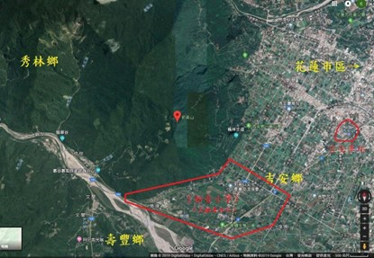

*初音山周邊衛星地圖與日治時期初音小字的概略範圍。圖源：Google、自行加註*

 

# 花蓮縣吉安鄉干城村與「初音」之名的關聯

為什麼會有「初音山」？

 

其實「初音」這個詞本來就是日本的姓氏和地名，一直以來都不一定和初音未來有關。在日本本土與日本統治過的許多區域都曾經有過「初音」的地名，在台灣主要是兩處： 

1. 台中市中區中華路以南、柳川以北、民權路以東、中港路以西，這塊過去叫做初音町。且東邊的大誠街過去叫做「初音町通り」 
2. 花蓮縣吉安鄉干城村的一塊區域，如下圖。

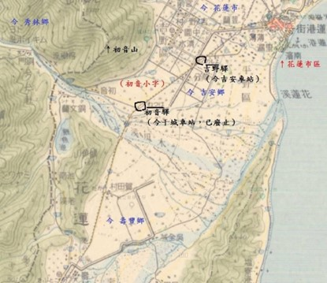

*1930年的街庄圖疊上今日的地圖，可看出黑線圍著的初音小字。圖源：自行疊製*

 

由於舊地名如此，花蓮縣吉安鄉也有許多「初音」的地名，例如：

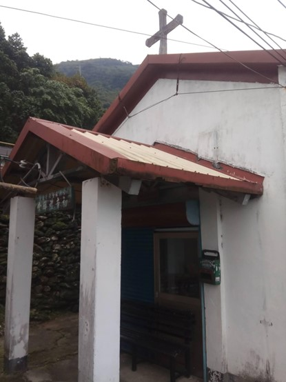

*長老教會初音禮拜堂，2019年01月24日（下同）。本張與所有照片皆為自行拍攝*

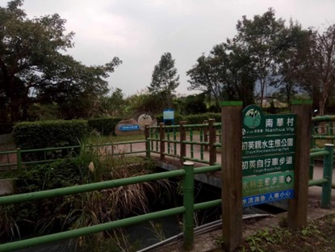

 *公園與自行車道。雖然名字是「初英」，但是拼音Chuyin對應的是舊名「初音」（「英」應該是ying而「音」是yin）*

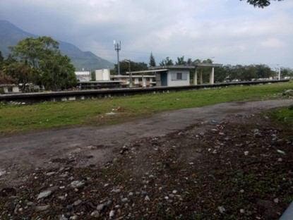

*已廢棄的干城車站（初音車站）站體，另一側是初音驛生態公園。*

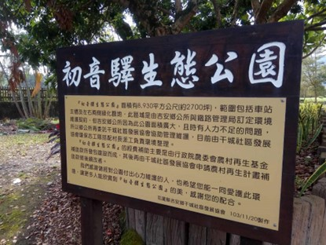

*初音車站內的生態公園看板。幸好舊車站站體也因此得以保存。*

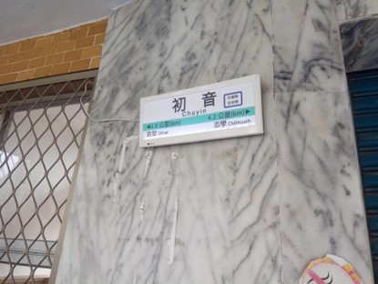

*車站入口的招牌，當初因為業務清淡而廢站，不知道有沒有機會復站？*

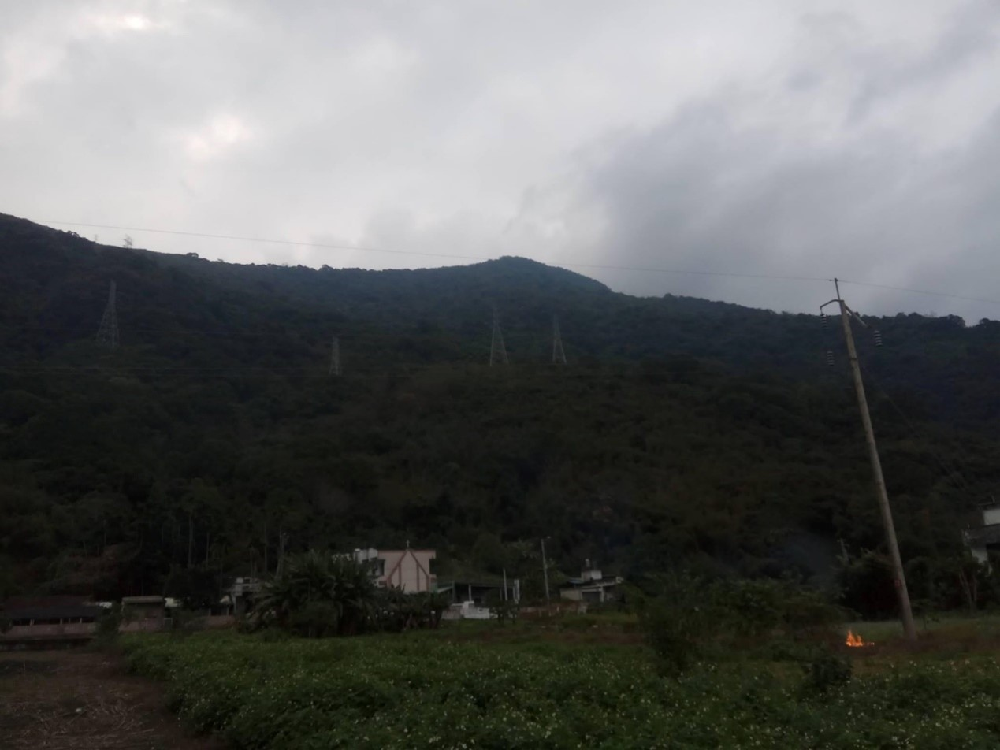

*最後是初音山，也是今天的主題！從山腳下仰望初音山的山頭。*

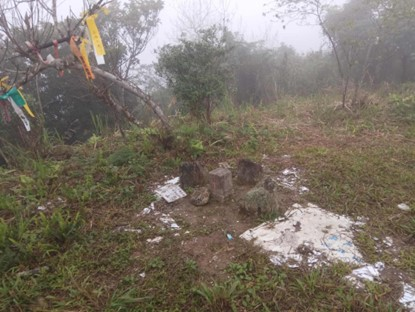

*初音山山頂的二等三角點與熱心山友製作的石牌。*

 

族繁不及備載。 

初音山並不在當時的吉野庄吉野區吉野村初音小字之內，而是在當時未建制的「蕃地」上，初音山之名或許可以理解成「初音小字旁邊那座高山」。雖然初音山905m的高度，在多山的臺灣似乎不是特別起眼，但是對一個幾乎沒爬過山的人來說也是不小的考驗。

 

*聲明：本人並非登山專業，也幾乎沒有登山經驗。本篇純粹分享自己的見聞。若有敘述錯誤或不佳望請給予指謫。*

 

# 注意事項

> [!WARNING]
>
>  我是從木瓜溪畔慕谷慕魚（初音山南側）登山，根據當天的見聞給有意想爬的人一些注意事項： 
>
> 1. 一定要租台機車爬產業道路，路面顛簸請小心慢騎，且路上的爛泥是真的有可能會讓你和機車滑下山谷的。所以尤其是下山，請靠山壁騎。另外產業道路偶爾會有當地農民的汽車通行。 
>
> 2. 山上的狗很兇又沒綁，三不五時就有狗衝出來追你。 
>
> 3. 騎車時有些蚋蟲之類的飛蟲可能會飛進眼睛，安全帽最好要能遮眼。 
>
> 4. 挑天氣好的時候去，當天爬的時候下雨，到處都是爛泥，滑倒好幾次也真的差點送命。另外山上常常起霧，請注意保暖。 
>
> 5. 可以的話請結伴同行，除非經驗豐富不然自己爬會很無助。總之請結伴同行！若跟我當天一樣幾乎沒經驗就莽撞地單獨上山是很容易迷路或出意外的。 
>
> 6. 產業道路是以電線桿來定位的，在之後的敘述中會用到。 
>
> 7. 登山口不僅超難找，越往上爬，路況不會變好只會變糟。最後你是要看登山布條分辨進路，同時也要確保自己記得怎麼下來。 
>
> 8. 接下來會有三個階段：荒煙漫草、陡坡和上稜線，上了稜線後只有一邊是正確的路，老實說我繞滿久。上到山頂可以看到有三條登山路徑，請記得你從哪條上來。 
>
> 9. 記得要帶熱量高的乾糧和多一點水，可以喝也可以清洗傷口。裝備請齊全，可以的話請帶登山杖，否則下山時很容易滑倒。 
>
> 10. 切記，萬一失足是真的會要人命的。
>

 

# 登山紀錄

接下來可以分成幾個階段： 

（山腳）→產業道路→泥路→荒煙漫草→陡坡→稜線→（山頂）

 

## 產業道路階段：小心顛簸和惡犬 

本階段佔路程的大部分，但由於是騎機車，應該也算是最輕鬆的部分。

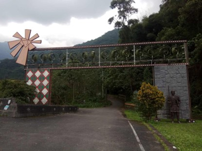

*12:34*　*在山腳下慕谷慕魚的牌樓，我是從這裡開始騎車上山。*

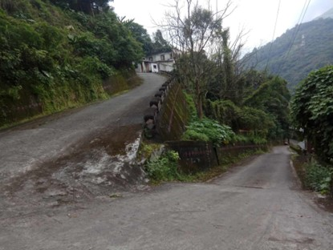

*12:36*　*上去後不久往回拍。上面的岔路住著幾戶人家，請往照片後方直走。*

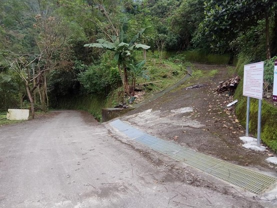

*12:49*　*往山頂方向拍。接下來會有許多這樣的岔路，請都往主幹道走。也就是照片左方。*

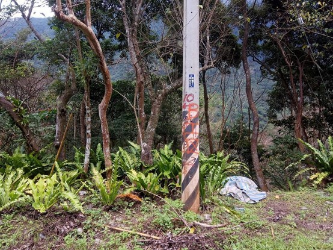

*12:56*　*57號電桿。這邊有一個卜字型的三岔路。*

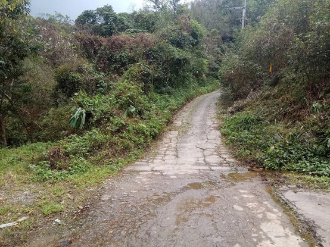

*12:57*　*往山頂方向拍。57號電桿在本張照片的左方。前方是通往山頂。地上的水似乎來自天然湧泉。*

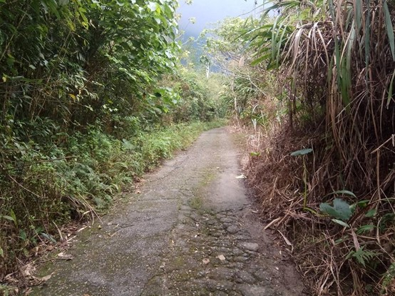

*12:59*　*過了57之後，請繼續直走。*

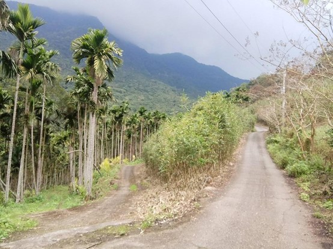

*13:00*　*人生遇到岔路沒關係，相信電線桿就對了。*

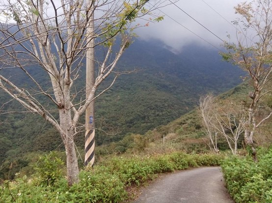

*13:02*　*94號電線桿與此處的美景。不妨駐足欣賞。*

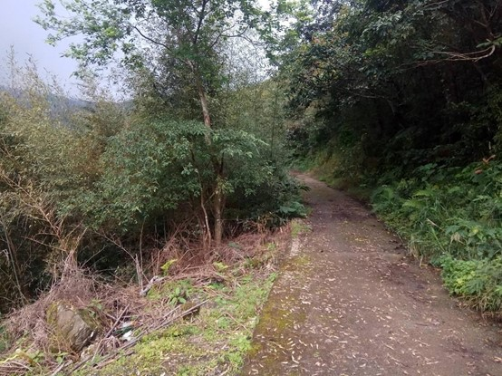

*13:06*　*119號電線桿處會遇到一個岔路，不要直走，也就是不要走照片中這條。*

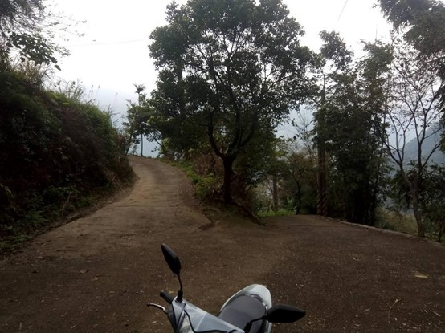

*13:06*　*上一張照片的回拍，同樣是119號電桿。右方是下山，左方是往山頂。*

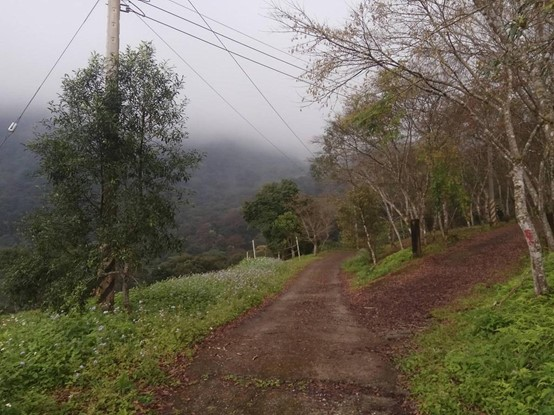

*13:17*　*171號電線桿，右前方電桿繼續編號但是不要走。直走沒電桿的產業道路。*

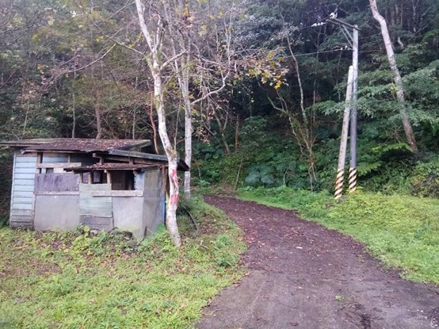

*13:19*　*車子騎到鐵皮工寮處，因為怕停前面可能會阻礙道路，所以在這邊的空地停車，接下來以步行的方式續行產業道路。停車後不久就開始下雨了，老天真不賞臉。*

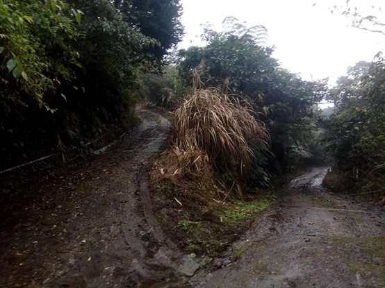

*13:34*　*回拍卜字路口。照片右邊那條是回程，左邊是往山頂。換句話說，到了這條岔路後不要直走，而是要右轉。*

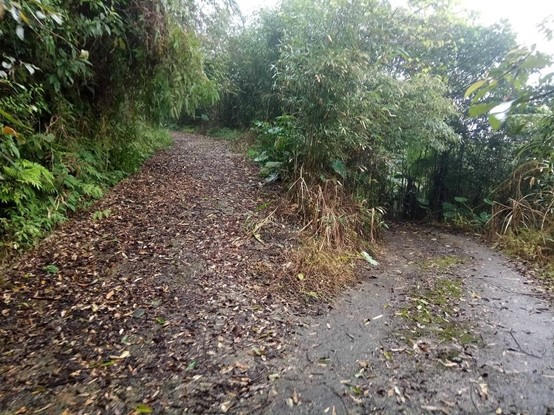

*13:37*　*接下來會遇到這個岔路，請往左轉走泥路直上。* 

 

## 泥路：小心爛泥

因為雨開始變大了，開始空不出手紀錄，加上泥路的路程短且沒有岔路，故途中沒有拍照。

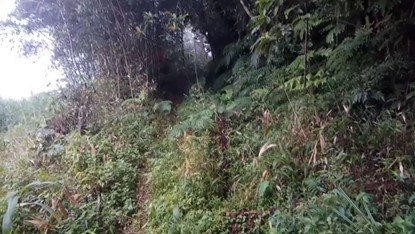

*13:39*　*這是從我當時紀錄的影片截圖的。繼續走到底，在左方隱約看見一個缺口（如圖），上面還綁著紅色登山布條，是通往山頂的路。*

 

## 荒煙漫草：注意腳步

俗話說打草驚蛇。在這裡我隨便撿一枝樹枝撥開雜草探路，另一隻手拿著雨傘，也幾乎無法隨時紀錄。

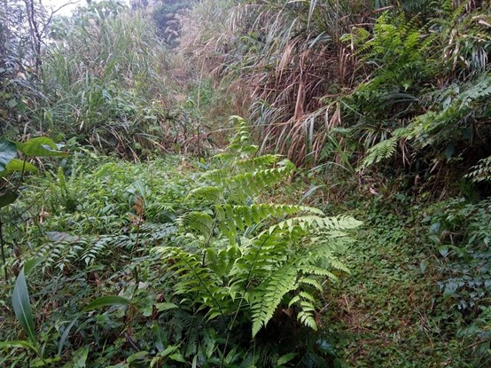

*13:43*　*進入登山口後是這樣的光景，雖然路窄又不好走，但基本上沒有岔路。撥開雜草往前進吧。*

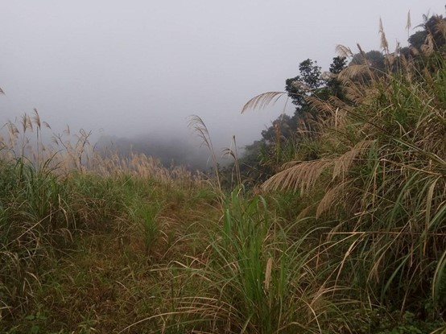

*13:46*　*在荒煙漫草之中獨自前行是很無助的。請找找兩側有沒有登山布條，它們是你最好的引路明燈。*

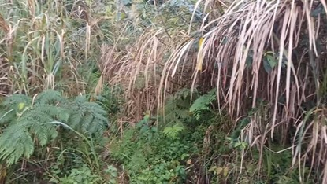

*13:47*　*截自影片。直走的途中看到右側有黃色的登山布條。此時就別直走了，上去就對了。*

 

## 陡坡：小心滑倒

因為要爬陡坡，所以我收起傘、放下樹枝，才空得出手攙扶。

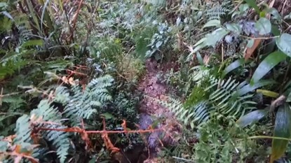

*13:48*　*往回拍，坡真的很陡。此時還在下雨，地上都是爛泥，滑倒了幾次也差點沒命……又怕會迷路，此時萌生了想放棄的念頭。*

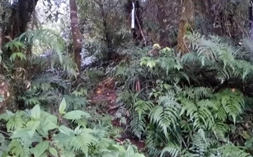

*13:52*　*此時已經氣喘吁吁了……在攀爬的途中隨時注意登山布條分辨進路，也要記得怎麼回去。印象中過了這條白色布條後代表已經上稜線，在稜線上請往左轉上初音山山頂。*

 

## 稜線：最後一哩路

上了稜線後，左邊是通往初音山山頂。在左轉前可以先往回看，讓自己記住要從這裏下山。當然此時的路還是不好走。剛上稜線的我不知道自己已經上稜線了，更不知道自己到底是不是在往山頂走……就這樣一無所知地硬著頭皮繼續走。還好這種對未知的焦慮並沒有持續太久。

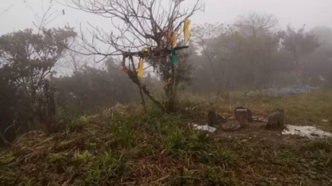

*14:00*　*前方的樹叢間照進光芒，且上面瀰漫著濃霧，上來之後終於！！*

 

到山頂後雨剛好停了，也發現自己身處在白茫茫的濃霧之中。

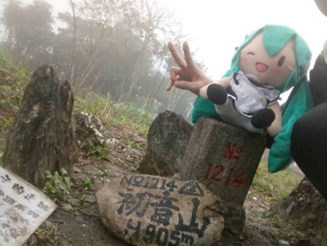

*14:04*　*到了山頂上趕快拍照留念。把在背包裡的MIKU請出來ww*

 

山頂的展望不太好，並不如途中看見的美景。加上起了大霧，讓視野變得更不清楚。因為怕下山時迷路，甚至怕可能快天黑了還回不去，而且因為下雨，全身都溼透了，鞋襪也完全濕掉，非常不舒服，所以只在山頂上停留10分鐘就趕快下山。不過還好下山的過程很順利，並沒有迷路、沒有出意外、也沒有走冤枉路。 

- 14:10離開山頂 
- 14:15離開稜線 
- 14:23離開陡坡 
- 14:30離開荒煙漫草 
- 14:33離開泥路 
- 14:58離開產業道路，回到山腳下 

# 結語

我上去時最主要的恐懼應該是未知吧，這座山不像很多熱門的山，登山口或道路做得「很觀光景點」，初音山算是偏冷門的山，很多路要嘛不明顯要嘛不知道該走哪。我看了許多登山紀錄，雖然大多評論初音山多是平易近人、不難爬的山，但是真的也沒那麼好爬。 

假如有意去爬，請一定要結伴同行，而且最好同伴之中有人有登山經驗；該有的東西要有、水要帶夠、小心惡犬、小心爛泥、注意布條、注意腳步、看好路況、看好回程。帶著MIKU攻頂那一刻的喜悅，真的會讓整趟旅程非常地值得。

 

**CCT**

**2019年07月23日**

---

> **原文出處**
>
> 本文最初發布於 **2019-07-23**，
> 原Facebook初始發文時間及連結已不可考，巴哈姆特為備份。
>
> 原文連結如下，本站版本僅針對排版進行改善及更正錯別字，未改動內文：
>
> - Facebook 未來群像：（佚失）
> - 巴哈姆特（備份）：https://home.gamer.com.tw/artwork.php?sn=5963621

 