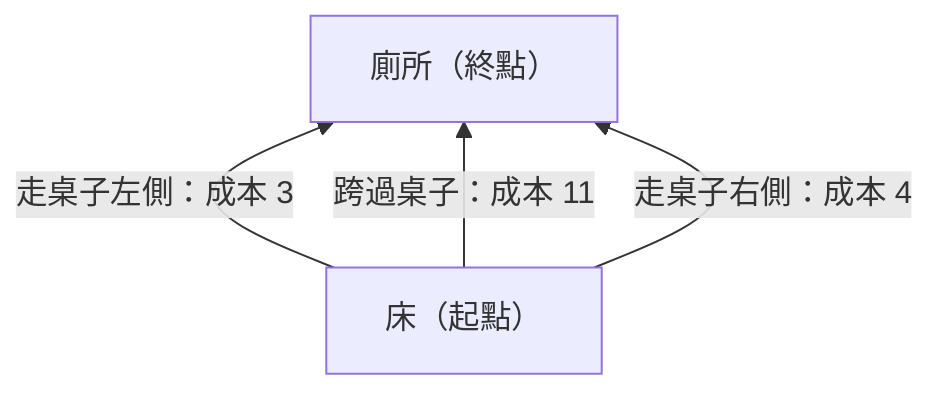
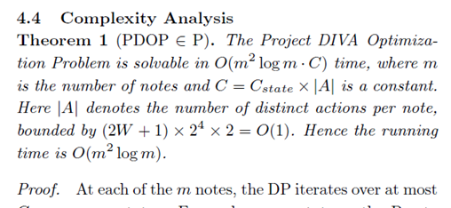
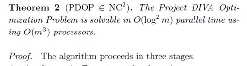

# 前言

大家好，這裡是CCT。

在年初的時候，我完成了一篇學術論文，是針對音樂遊戲街機「初音未來Project DIVA Arcade」（下稱**DIVA AC**或**DIVA**）的，計算複雜性理論（computational complexity theory）的研究；我投稿到日本的情報處理學會（Information Processing Society of Japan，IPSJ）的，具備同行評審制度的學術期刊《Journal of Information Processing》（JIP）當中的《エンタテインメントコンピューティング》（Entertainment Computing，娛樂計算）特集，該特集旨在收錄許多與娛樂、遊戲的計算、設計相關（包含但不限於電子遊戲）的原創學術研究。

經過了3個多月嚴謹的審查，接受來自3位審查委員嚴厲但必要、刁鑽但精準的修正意見後，很榮幸能夠獲得肯定。審查委員正式接受了我的論文，並預計約在今（2026）年12月榮登JIP期刊第34期！

在這篇文，我會介紹一下我的研究，包括問題的背景和我取得的成果等等。考慮到篇幅，我不會深入介紹技術層面的問題，比如我具體是透過什麼方式來得出我的主要成果、定理具體的證明步驟等等也都會掠過；但是我還是會大概介紹一下計算複雜性理論，這是電腦科學的一個分支，旨在研究給定可計算問題的「本質上的複雜度」，希望這些介紹能幫助各種背景的讀者大致理解我的工作。

這篇文章力求簡潔（雖然還是滿長的啦，畢竟還是有不少東西需要介紹），我們會預設讀者都大致瞭解過[年初的DIVA機台傾向調查的文章]()以及[前陣子我翻譯的影片]()，知道DIVA與多數音遊非常不同：想獲得更高分，通常需要故意打偏乃至打錯；即使寫一個機器人上機，照著節拍全部打最準，也不會獲得最高分；而這一切的元兇，不是因為遊戲有什麼複雜的規則，都只是來自單純但又特殊的HOLD規則。同時，這篇文章也略過了我形成問題意識的大多數過程（這其實是好幾年的長跑），以及整個研究過程遇到的趣事和瓶頸。假如有人好奇這些過程，那可能就再考慮額外發文分享(#

為了簡介我的成果，我們會需要一些鋪墊。考慮到這點，我如此安排本文的章節：

1. **研究簡介**：開門見山來摘要本篇文，從問題背景到主要成果
2. **計算複雜性理論簡介**：介紹本研究所屬的領域
3. **DIVA的遊戲規則回顧**：介紹本研究的問題背景
4. **我的主要成果**：介紹論文的兩大定理，不含證明過程
5. **這項成果的意義**：理論與工程之間存在著鴻溝，但可供遊戲設計參考

# 研究簡介

**論文標題**：*Surprisingly Tractable: Score Maximization in Hatsune Miku: Project DIVA Arcade* 

**中譯**：〈意外地可解：初音未來Project DIVA Arcade的分數最大化〉

在大多數音樂遊戲中，想要獲得最高分，就是每個音符都打最準就好，即為「貪婪」（greedy）的策略：每一步都選擇當下最好的選項，最終就能得到全局的最佳解。

但是「初音未來Project DIVA Arcade」（以下簡稱DIVA AC或DIVA）不一樣。這款遊戲的長按（HOLD）導致了奇特的現象：**故意打錯、打偏或無視某些音符，反而可以得到更高的分數**。這導致分數最大化問題，變成一個需要全局思考的最佳化問題，無法透過簡單的貪婪策略來解決、無法選擇局部最優解來得到全局最優解。

玩家社群（DIVA圈）長久以來都認為這種最佳化「非常困難」，即使有諸多輔助工具來幫助計算，但至今為止仍需要大量人工尋找路線，至今仍未有的，快、狠、準的尋找路線的工具被公開。這導致即使是十幾年前發布的譜面，也經常有新的更高分路線被發現。不過我的研究卻發現了令人意外的結論：

> **這個問題理論上是可以在「合理時間」內被計算出來的。**

「合理時間」具體是指多項式時間可解（因此是P類問題），並且可以被高效「平行化」（屬於 $NC²$ ）……這在複雜性理論被認為是容易解決的，和DIVA圈長久以來的經驗和普遍認知，似乎大相逕庭：DIVA圈普遍認知的難，以及複雜性理論上推導出的簡單，中間是巨大的鴻溝。不過在文章的最後我會進一步解釋：中間的這個巨大鴻溝，我認為主要來自理論與實務的工程與技術落差，也就是一個工程學問題；這可以解釋為何十幾年來，似乎沒有類似的路線搜尋演算法被成功開發並公諸於世。

據我們所知，這是針對商業節奏遊戲大型街機得分機制，首個正式的計算複雜性分類成果。

# 計算複雜性理論簡介

在進入正題之前，我想先簡單介紹一下這個計算複雜性理論究竟是在研究些什麼。如果你已經有相關背景，可以跳過這一節。

這個領域的大哉問就是：**這些問題需要多少資源（e.g. 時間、空間）來解決？**

## 我能從床走到廁所嗎？

我們的日常生活中面臨著許多問題，這類現實中的問題有不少是因人而異的：比如自己從自家床上爬起來，走路去離你最近的廁所如廁，這邊先稱它是「上廁所問題」；假設你住一間中型套房，床和廁所距離只有3公尺，並且只隔一道廁所門和一個5公分高的門檻，其餘都是完全平坦且好走的地板。這個問題對一位健康的成年人來說是易如反掌，不過假如你是嬰兒、拄拐杖的老人、得流感發燒的病人、手受傷的人、或是剛開完刀仍昏迷的人，就會有不同的難度，起床、坐起來、站起來、走路、開門、跨過門檻，都會對不同的人來說是不同的瓶頸點，乃至於幾乎不可能辦到……假如你有照顧長輩乃至長照的經驗應該深有感觸。

前面說的那種難度差異來自你是誰，以及你在物理和生物構造上的能力，不是「上廁所問題」本質上的難點，因此這不是計算複雜性理論想討論的。本質指的是要是客觀的，我們不關心是誰要來解這個問題，只關心問題天然的結構複雜度；傾盡人類目前的知識，最快能多快被解決。

## 從床走到廁所有路嗎？

不過，假如我們把上述問題稍微改一下：變成一個起點（床）和終點（廁所）；中間的門檻之類的障礙物，以及床和廁所間的距離等等，這些我們需要付出努力的因素，一併量化成一個「成本值」；這個成本是相對的，沒有單位的值。並且，也許床和廁所之間有不只一條路，比如中間有桌子，我們可以選擇是要繞過桌子左側還是右側，甚至是跨過桌子等，每條路的成本值都不一樣。假設就只考慮這3條路，我們可以發現起點、終點和中間的路線，變成「改版上廁所問題」，就可以抽象成一張圖。

此時我們如果問：「給定上圖，是否存在從床到廁所的路徑？」

或者問：「給定上圖，從床到廁所的最短路徑（即最低成本的路徑）為何？」

這兩個問題就比較像是計算複雜性理論關心的問題。事實上，第一個問題叫做「**S-T連通性問題**」（S-T Connectivity Problem）、第二個問題叫做「**最短路徑問題**」（Shortest Path Problem），要解決它們也都有對應所需的資源，衡量它們的複雜度。看著這張圖，類似的問題也可以問出很多，比如「是否存在一條能夠經過所有點的路徑？」，這就叫做「**漢米爾頓問題**」（Hamiltonian Problem）；或是「是否存在一條能夠經過所有線的路徑？」，即「**歐拉路徑問題**」（Eulerian Path Problem）……等等類似的問題還有很多。

可能有些人會想，現在只有兩個點和三條線，一看就知道前兩題的答案是「是」和「走桌子左側」，有什麼好研究的？但重點是，當點和線的數量增加，問題就不是那麼容易解決了；同時我們可以注意到，解決這種問題所需的資源是跟著點或線一起增加的。

那麼，解決這些問題所需的資源，是**如何**隨著點或線的數量增加的呢？

## 當從床到廁所的路變遠，花的力氣會多多少？

先把前面例子的點和線稱為「輸入值」（input）。我們可以注意到，解決一些問題所需的資源隨著輸入值增加的幅度感覺沒有那麼大，比如「S-T連通性問題」就只是要檢查起點和終點之間能不能連通吧，在中間增加點和線好像不至於會讓問題複雜太多，也許就是呈**多項式**增長吧；但是「漢米爾頓問題」就不一樣，因為它要求所有點都要經過，所以它的複雜度會隨著點和線的增加呈**指數**增長。所以我們會初步認為，「漢米爾頓問題」看起來似乎會比「S-T連通性問題」還要複雜。

當然，我們要求需要儘可能用人類已知最快的演算法來處理這些問題，否則我都故意挑龜速算法，得出每個問題都很複雜的結論，那研究就沒有意義了。

我們給出演算法之後，就可以幫前面那堆問題分類；每個類別都是一個定義下的問題集合，類別和類別之間有互相包含關係。這就是計算複雜性理論的重要研究方向。

# DIVA的遊戲規則回顧

在年初的《[機台傾向調查]()》一文中，我們曾經討論過DIVA的機台傾向和它的複雜性，不過這裡我想仔細解釋為什麼這款遊戲的計分系統這麼特別。

我們知道，節奏遊戲通常就是聽著音樂、打著節拍，會有各種音符飛過來要你打，根據打下去的正確性和準確性而影響分數吧。每個遊戲的具體規則都會有不同，但是大方向是這樣。不過DIVA正是這個具體規則，導致玩家若要追求最高分，就不能光打準就好。

這邊我不會把一些過於瑣碎的，比如什麼判定加多少分、血量如何變化這種都寫出來；我只專注於那些比較關鍵的特性，這些特性直接造成DIVA的一系列奇特現象，包括計算勢之類的「職業」，以及更重要的：計算最高分的複雜度。當然，何謂「奇特」總還是要有個比較標準，那我們就先從一些主流的音遊街機說起。

## 多數音遊的規則

在大多數音樂遊戲街機（這邊就拿maimai、CHUNITHM、Sound Voltex當作代表）中，計分系統有兩個重要的性質：

1. **分數單調性**：打得越準，分數越高。比如PERFECT永遠比GREAT好，GREAT永遠比GOOD好。
2. **無負面依賴**：在當前音符執行最佳決策，不會導致後續音符無法執行最佳決策。

在這種系統下，分數最大化是「**貪婪可解**」的：每個音符都追求最準的判定就對了。

再次強調，我們關心的不是「因人而異的特徵」；就像前面的「改版上廁所問題」一樣，我們不關心你有沒有跛腳。前面說的「無法執行最佳決策」也不關心你手的位置在哪、你的力氣夠不夠、你是大佬還是萌新；這邊說的是，即使寫一個機器人上去打，機器人還有10隻手，都會得出這個結論。此時的音符的各種決策就是一字排開讓你挑的，只要不違反遊戲規則，你就可以挑那個判定。

## DIVA的奇特之處

不過，DIVA違反了這兩個性質，一切的元兇就是長按（HOLD）這個東西。DIVA如果單論判定分數，確實也是打得越準，分數越高；但是如果考慮了HOLD的分數，並從分數總和的角度來看，情況就不一樣了。

確實，許多音遊也都有類似長按／HOLD的機制，按住按鈕可以持續累積分數；在一些音遊這種長按的中間是會計算combo（連擊）的，如果在長按的中途放掉，也許就會「斷combo」。雖然在每一款音遊當中，斷combo的影響程度不一；但是通常我們會想追求combo盡量多，最好是full combo，也就是從頭連到尾，所以會想避免斷combo。

至於DIVA，DIVA確實也有HOLD這種東西，不過首先，它HOLD的途中不會算combo、結束的時間點本身也不會算combo；而開始HOLD的地方一定會有一個帶HOLD屬性的音符，若且唯若按正確才會開始這一條HOLD，除了那個音符算combo以外都沒有combo。接著，HOLD的中間，除了每1幀每1HOLD跑10分以外，不會有任何額外的影響。最後，雖然你可以在任何時候結束這個HOLD，但是最多就是持續5秒，不會永遠跑下去；不過既然都好不容易跑滿5秒，遊戲也不會虧待你，跑滿5秒後會送你豐厚的獎勵分數（這叫做max hold bonus），這一組HOLD才會結束。

一段話來概括HOLD的規則就是：HOLD本身跟combo和生命值都沒有直接相關；假設當下HOLD著 $n$ 顆按鍵，那分數每幀就是 $10n$ 分，滿5秒就給 $1,500n$ 分的bonus。就這樣。

這樣看起來，DIVA這個HOLD的規則，似乎比其他音遊的HOLD還要簡單？畢竟假如我只想追求full combo，那這些HOLD完全可以無視：我只要一開始的音符打正確，後面完全不HOLD也行。其實這個行為就叫做「棄HOLD」，尤其是玩家試圖想拚一個很難的譜面全接（full combo）時，就會在困難的地方棄HOLD，把兩隻手都空出來對付麻煩的譜面；所以拚full combo玩這招確實可行，不過就分數來說，損失就會滿慘重的。

那你可能會想說，我可不可以棄一半，比如HOLD著兩個按鍵，有些地方也許棄掉其中一顆就好打得多，不一定要全部棄掉；雖然還是損失分數，但至少損失沒那麼大吧？好吧，我們先從**共享釋放約束**（Shared Release Constraint）這個性質開始談起。

### 共享釋放約束（Shared Release Constraint）

「共享釋放約束」這個名字是我自己取的啦，DIVA圈原本其實沒有一個名詞來描述這個特色，所以也沒有對應的日文。

我在論文特別提出這個概念，其實是早期探索時發現，這是一個被玩家視為理所當然，但其實是需要特別拿出來提的性質。這篇文章沒有要講我的探索過程啦，不過早期我試圖把DIVA的遊戲規則類比成一個叫做3-SAT的問題，但是怎麼嘗試都不成功。後來發現，只要仔細檢視這個性質，就會知道注定不可能成功，所以我把這個性質的描述保留了下來。它就代表：

> **如果你放開任何一個正在HOLD著的按鈕，所有HOLD都會同時結束。**

假設你正在同時按著圈和叉兩顆HOLD，這時飛來一顆圈音符。如果你要打這顆新的圈，就必須先放開手上的圈。但這會造成叉HOLD也會被迫結束！

HOLD的數量要嘛增加、要嘛直接歸零，不能個別減少；要就是整組捧走，不要就拉倒。

總之，這個性質就代表HOLD與HOLD之間其實是會相互依賴的，這種相互依賴會讓情況變得複雜，比如因為HOLD不能單獨放開，你就必須要考慮不同組合的多個HOLD一起跑的時候，會遇到哪些衝突的音符。這種地方也許都會讓打錯變得更高分，因為我能往下繼續跑的HOLD，要嘛是這一整組、要嘛都不能往下跑；而HOLD著的按鍵越多代表分數跑得越快，所以往往就需要把擋路的音符都排除，具體就是靠打錯或無視。

### 打錯反而更高分

我們在《[DIVA機台傾向調查]()》的文章其實也有談過類似的情況。在文中我們面臨如下選擇：

- **決策A**：打新的音符維持combo，但犧牲接下來的HOLD分數。
- **決策B**：故意miss或打錯，以獲得接下來的HOLD分數，但造成combo斷掉。

在大多數音遊的規則下，通常大概不需要面臨這種抉擇。以maimai為例，HOLD結束的地方是一個明確的終點，在那個地方就要放掉；並且如果手還HOLD著，不只不會有額外的分數，反倒是結束音符會MISS，所以也不存在維不維持combo、犧不犧牲的問題。

不過在DIVA，這兩個決策哪個比較划算？就要看很多因素：比如目前的HOLD還剩多久？combo現在多少？之後還有沒有其他HOLD？甚至是生命值還夠不夠？又甚至是「後面遠處的生命值」會因為我這樣犧牲後夠不夠用？總之需要考慮諸多面向，無法一概而論，往往需要對譜面進行全局分析和計算，才能準確判斷哪種決策可以獲得更高分。

### 打偏反而更高分

前面面臨的抉擇是打錯（WRONG）或無視（WORST），但是DIVA還有一種特別奇葩的情況，就是要故意打偏（我們也會稱呼叫「早遲」）。沒錯，想追求最高分，一些地方要打偏，而且這種地方還不少、而且通常還要求是特定的偏：也許是早1幀、也許是晚7幀，有不少這類地方被稱為「猶豫0」（日文是*猶予0*），就是指要正好在那一幀，不能多也不能少，否則會**大失分**（當然也有一些比較寬鬆的地方可以「猶豫1」啦）；往往在某個地方差了這1/60秒，這整局就廢了，而且原因還不是你打得不夠準，而是偏得不夠剛好。那這是怎麼回事呢？

首先，因為HOLD分是逐幀計算，每HOLD一幀你就會多拿一點分數，所以HOLD開始和結束的地方偏一點點，早點開始晚點結束，就可以偷到一些分數。這一招是我們在《[DIVA機台傾向調查]()》一文也有談過的案例，可以說是**平凡的早遲**，也是分布最廣、在幾乎所有譜面都無處不在的早遲，它遵循著還算是滿規律的判斷方法，也是讓ranker們受苦受難的大功臣。

但其次，還有一種比較奇葩的情況，這就要接著從DIVA的另外一些特殊規則：「**10幀規則**」（10フレルール，10-frame rule，本質上是一個非常隱晦的懲罰機制）和「**HOLD滿的獎勵分數**」（max hold bonus，就是前面說的豐厚的獎勵分數）來進一步說明。

- HOLD開始後，如果在10幀內「結束」，這段長按的分數會被歸零（嚴格來說是10.02幀，而且這個「結束」也涵蓋HOLD追加的情況，就不展開說了）
- HOLD持續達301幀（5秒多一點點），會獲得豐厚的「max hold bonus」

對，HOLD滿有獎勵、HOLD太少有懲罰。

這些情況也會造成**故意打偏**可以獲得更高分，而且影響更重大。怎麼說呢？假設HOLD的結束點（也許是另一個長得一樣的音符，為了打它就要讓HOLD結束）原本是第300幀，剛好差1幀而拿不到bonus。這時如果故意在結束時「打晚1幀」（仍然在最佳判定的範圍內），HOLD就會跑滿301幀，成功拿到豐厚的bonus！

當然這只是理想情況啦，實際情況會滿複雜的：比如對同一顆按鍵HOLD放開再打下去，中間會有一段空隙；雖然玩家有一套技術（被稱為「燕返」）來盡量縮小這個空隙，但這個空隙的存在還是會造成我們至少需要額外的2幀左右來拿bonus……就有點像是DIVA版的海森堡測不準原理吧，無論多努力縮小這個誤差，都沒辦法縮到特定的值之內，並且這是一個天然的限制（而且玩家有充分的理由證明它是「天然的」限制）。不過我們先忘記空隙跟燕返的事情，只要能理解「可能需要打偏來獲得更高分」這點就夠了。

至於10幀規則造成的早遲，原因也呼之欲出了。其實《[初音未來的激唱](https://www.nicovideo.jp/watch/sm11328911)》紅譜和紫譜就有很經典的案例：因為200 BPM的半拍相當於9幀，而這兩張譜有**7處**這種HOLD只有9幀，你需要透過早遲把它們都拉開到10幀乃至11幀來規避懲罰（就如同[這支影片]()說的一樣，剛好10幀會不會被懲罰、在什麼情況下會被懲罰，至今都找不到規律，所以建議拓寬到11幀），否則少拿一組就會硬生生少掉100分。所以對top ranker來說，搞不好後面的連打都算平地，真正刁鑽的地方可能是這裡……。而且10幀規則非常隱晦，據我所知玩家也是後面才發現，相關討論我最早能追溯到2013年，彼時遊戲都稼動3年了XD。

### 計算勢和情報戰：DIVA的特殊職業和特殊戰場

在《[DIVA機台傾向調查]()》我們有提到DIVA當中有「**計算勢**」（指專門計算高分路線的玩家）和「**情報戰**」（玩家將計算出的路線本身作為有價值的戰略情報而有意將其保密，因而形成數座資訊孤島）的現象，其實根本原因就是這些規則導致的。由於找出最佳路線往往需要大量針對譜面全局的計算和分析，因此玩家之間存在著資訊不對等的競爭（通常資訊不對等的時期很短暫啦，但DIVA有史以來持續最長的情報戰打了3年左右，而且還是一張黃譜，也就是HARD難度……當然這也是十幾年前的事了）。尤其是當新譜面出現時，計算勢們就會開始比速度，誰能在榜單更新前算出更高分的路線並打出來，誰就能先搶到榜單前列。

我們說的「**路線**」，可以理解為是一條「決策鏈」：針對一張譜面的每個音符，逐一選擇它該怎麼打。一種這樣的決策鏈就稱為一條路線。假設每個音符都有17種決策可以選，那一張200個音符的譜面就會有 $17^{200}$ 條路線。至於中間的HOLD，我們通常假設玩家不會無緣無故放開HOLD，HOLD要嘛是拿到MAX而結束、要嘛是因為某種決策而在該音符的位置被強制結束。

計算勢長期以來的目標就是，我們來試著在一張譜面「找路線」，用盡一切努力來找出更高分的路線，這個已知的路線就會對應一個理論值分數。玩家只要能夠完全按照打法要求的正確、錯誤、以及如何偏移來打，就能獲得這個分數。榜單上的玩家大多就是按照這條路線來打，差就差在玩家實際上很難「完全按照」，主因就是前面說的**平凡的早遲**，誰抓到的更多誰就更高分；畢竟要偏得剛好，還要整首歌的每個地方都要偏得那麼剛好，不是一件容易的事。

### 我研究的問題

現在我們撇開衝榜過程中，玩家承受的不斷被要求打偏的苦難，單純就討論計算路線。

難道玩家找出的已知最高分路線**就一定是理論上最高分的路線**嗎？說到這個，我們不得不提到DIVA圈發生過的一件大事：

#### 回顧2017年的大事

2010年，《[Last Night, Good Night](https://www.nicovideo.jp/watch/sm4141643)》這首歌稼動後不久，玩家找到了一條它紅譜的已知最高分路線，是一條還滿複雜的打法，長期以來榜單上的玩家都是按照這個打法來打的。

但是2017年，有玩家重新審視譜面後，**發現了一條更高分的路線**，理論值分數居然比原本的打法整整高出1,000分，這足以把舊有的榜單前段全部推翻。以前黏在機台前辛苦抓早遲、卡C位、擠海景第一排的也許前幾十名，這7年來全都白折磨了……說真的，也許這就是「降維打擊」吧（我當時第30幾名吧，多虧新路線讓我直接擠到13名，超好笑）。

從這之後，玩家又集體開始找其他的譜面，果然又發現更多這種漏網之魚，當然絕大多數都只高個1、200分啦，但仍然是重要的影響；人們長久以來已知的最高分路線不斷刷新、理論值不斷上修，甚至直到今年2026年，都還有新的路線被發現。畢竟找這種路線不是一件容易的事，計算勢大多也是靠肉眼、靠經驗、靠譜面局部改善、加上計算工具輔助來找；計算工具雖然仍在推陳出新、改善使用體驗，但離真正的自動化還有很長的路要走。

#### 問題意識逐漸形成

從那之後我就陷入深思，因為**誰知道還有沒有別的**這種漏網之魚？

如果實在找不到了，我們又能怎麼**證明**「這個打法得出的分數**就是**天花板了，不能再高了」呢？

注意這邊說的是「證明」。意思就是，我們不光找到這條路線，而且還能夠同時給出嚴謹的邏輯，來說明同樣這張譜面「**不存在**分數比它更高的路線」。除了極少數很簡單的譜面以外，現在大部分譜面的路線都不存在這種證明。

考慮到目前我們沒有已知的好方法來**證明**給定的路線是不是理論上的最高分，所以我們選擇把全部的路線逐一拿出來算，再挑出那一條最高分的。就是俗稱的「暴力破解」啦，理論可行性顯而易見：路線的數量是有限的，頂多就是音符數的指數函數；只要給定譜面，固定了音符數，那它就是有限的。邏輯上也簡單粗暴：因為我把所有可能性都看過了，它就是最高分的，從而證明了它就是天花板。

但重點是，要透過這種暴力破解，找出能打出這個天花板分數的路線（決策鏈），需要消耗多少資源呢？需要消耗的資源如何隨著音符數增長呢？

總之，這就是我的研究主要關心的問題。我把它稱為「Project DIVA最佳化問題」（**PDOP**），問的就是給定一張譜面，我想找出這個天花板分數路線，複雜度有多高。

當然，實際上還有達成率之類的問題啦（達成率要超過某個門檻才算過關，最終的分數才會算數）。這我在論文裡有考慮，也在PDOP的嚴格定義當中有表述；並且考慮了達成率，確實有影響到演算法。這邊有點說來話長，就不展開了。

嚴格來說，現在各譜面已知的最高分路線，大多都不是被嚴格證明的理論最高分；正因為計算量十分龐大，一百多個音符的譜面可能就需要非常長的時間，根本不可能把路線一條一條拿出來看。因此DIVA圈一直普遍認為Project DIVA最佳化問題是極困難乃至也許不可能的。但是，我從數學上證明，在理論上不僅確實是可能辦到的，而且這個問題還能被歸在相對簡單的複雜性分類當中。

# 我的主要成果

我們直接略過遊戲規則的形式化、數學建構、還有證明過程，直接來介紹主要結論。

## PDOP是P類問題

也許有人聽過千禧年大獎難題的「P/NP問題」，解決了就可以現領100萬美元，它說的P就是這個P類問題。當然還是要先說，我的研究成果對這個大獎難題一點幫助都沒有(#

「P類問題」代表可以在多項式時間內被解決的問題，我們可以理解為複雜性相對低的問題，它的複雜度不會隨著輸入值變成指數爆炸，複雜度的增長是可控的。

首先，我證明了定理一：PDOP在多項式時間內可解。即：
$$
\boxed{\text{PDOP} \in \mathbf{P}}
$$

具體的時間複雜度是 $O(m^2 \log m)$，其中 $m$ 是音符數量、 $O()$ 是大*O*函數。

大*O*函數是極限的概念啦，假設 $m$ 會趨於無窮大，所以就會忽略常數項和係數。實際上我計算出這邊的係數至少是 $10^{10}$ 左右，這個結論十分重要，關係到理論與實務的鴻溝，我們後續會展開來談。我在論文裡也有特別點出PDOP常數項相對於實際譜面的 $m$ 值來說特別巨大的議題。

## PDOP屬於 $NC²$ 

我接著證明了定理二：PDOP可以被高效平行化解決。即：
$$
\boxed{\text{PDOP} \in \mathbf{NC}^2}
$$

具體是可以用 $O(m^3)$ 個處理器，在 $O(\log^2 m)$ 的平行深度內解決這個問題（這個平行深度就是 $NC²$ 這個類別的定義）。

雖然從技術上來看， $O(m^3)$ 個處理器感覺很不切實際：就算只是要算個200個音符的簡單譜面，誰也沒看過能開出800萬個執行緒還能順暢運行的電腦。但是在計算複雜性理論裡，這是多項式個處理器，是可以接受的數量，至少不會多得太離譜。至於「平行深度」，就有點像單淘汰賽的樹狀圖有幾層的概念，比如32個人比單淘汰賽的話就有5層，每一層都平行進行著多場互不干擾的比賽。在計算複雜性理論，這邊 $\log$ 的底數不重要（不過通常會以2為底），總之就表達對數增長。

當然，我最後也有給出PDOP的複雜度下界在 $TC^0$ ，這邊就單純引用文獻而已。可以參考 [Ajtai (1983)](https://www.sciencedirect.com/science/article/pii/0168007283900386) 、 [Furst, Saxe, and Sipser (1984)](https://wiki.epfl.ch/edicpublic/documents/Candidacy%20exam/Furst%20Saxe%20Sipser%20-%201984%20-%20Parity%20circuits%20and%20the%20polynomial-time%20hierarchy.pdf) 和 [Håstad (1986)](https://www.csc.kth.se/~johanh/largesmalldepth.pdf) 這三篇paper。

# 這項研究的意義

$$
AC^0 \subsetneq TC^0 \subseteq NC^1 \subseteq NC^2 \subseteq P \subseteq NP
$$

一些計算複雜度類別的包含關係簡圖：PDOP落在 $NC^2$ 。

## 與其他音遊或遊戲的比較

得出了主要成果後，我首先和一些主流的街機音遊（同樣挑maimai、CHUNITHM和Sound Voltex）來做複雜度比較；我並不是很瞭解它們的詳細規則，所以我保險起見給了一個比較保守的上界： $TC^0$ 。事實上，因為它們的最高分都是常數，所以也許更像是 $AC^0$ ，這是複雜度更低的類別，並且已被證明是 $TC^0$ 的真子集合。

接著，論文一定會有文獻回顧嘛，就我所找到的文獻中，針對電子遊戲的計算複雜性研究也非常多。不過包括超級瑪利歐、俄羅斯方塊或魔法氣泡這些經典的電子遊戲，幾乎都是落在 $NP$ 類問題。 $NP$ 問題是指，可以在多項式時間內驗證其答案是否正確的問題；但是否都能夠在多項式時間內求解，這個答案目前人們還不知道（其實這就是前面說的聖杯難題：P/NP問題）。

DIVA落在 $NC^2$ ，在遊戲中也是非常特殊的存在。目前處在這個複雜度分類的問題大多是一些數學問題，比如給定一個n階正方形矩陣，計算它的反矩陣、行列式、特徵多項式等，就屬於 $NC^2$ 問題（[Csanky, 1976](https://cs.uwaterloo.ca/~r5olivei/courses/2025-spring-cs860/C76-fast-parallel-determinant.pdf)）。在一款遊戲的計分規則下找出最高分策略的複雜度落在這個很特別的位置，至少我自己目前還沒找到有別的遊戲在這裡。

## 數學理論與工程實務的鴻溝

其次，這畢竟是理論成果，實際上並不代表想找出DIVA給定譜面的理論最高分，就按照論文給出的演算法就完事了。理論和實務之間的鴻溝很大程度在於前面說到的大係數：這個巨大的常數，導致PDOP實際上需要花大量的時間來計算。

我還真的拿一首282個音符（HOLD的數量偏多）的紅譜來試。不過首先，在工程階段當然不會無腦嘗試每條路線，有一些很白癡的路線可以直接砍掉（這叫做**剪枝**，pruning）；我把我絞盡腦汁能想到的、13年來累積的經驗能想到的、甚至連在洗澡的時候都想不到的，一切能安全剪枝的方法（就是說，一定不會把高分路線剪掉，又能儘可能剪掉最多路線的邏輯）都用上了，然後利用一個叫做高德納的蒙地卡羅方法（Knuth's Monte Carlo Method，[1975](https://www.cs.brandeis.edu/~storer/JimPuzzles/MATCH/InstantInsanity/InstantInsanityKnuthArticle.pdf)）來估算總共剩下多少路線，發現大概是 $10^{54}$ 條左右（因為實在太多，不可能每條都算，只能透過科學方法來估算）。這雖然比初始值（約 $10^{353}$ 條）還要少很多了，但還是算不完；如果用深度優先搜尋（DFS），大概算三輩子都算不完。要再少的話可能就需要**激進剪枝**，但是這就不構成嚴格證明來說明最終找到的路線一定是最高分，更何況我用這種方法算出的結果甚至還有比已知更低分的路線，那就更不可信了。

更有甚者，我論文中提出的演算法其實比較接近廣度優先搜尋（BFS），當然有點不太一樣啦，不過還是沒算幾個音符就會把記憶體撐爆，我也是頭一次看到.NET的「單一物件不得超過2GB」的 `Exception` （例外情況），真的超好笑；我也試過寫到硬碟裡，但不只有I/O的效能問題，還有硬碟空間不夠的問題……。

並且，前面有提到的 $O(m^3)$ 個處理器這點也是一個大問題，因為我們找不到能開這麼多執行緒還能順利運行的電腦。當然你可以說我要當田僑仔，就買個800萬台電腦一起算！但即使你如此大尾又不缺錢，買了整個廠房不挖礦，專門算過氣遊戲的路線；那這些電腦如何協作、問題如何紀錄和排除、資料如何傳輸、同步和儲存等，也都還是需要時間來解決的工程問題。

總之，這篇論文是理論成果，它要直接落地變成工程結果，還有很長的路要走。從法拉第電磁感應定律被提出，直到發明電風扇，中間也花了50年左右。

## 小眾遊戲中的小眾，卻引出了廣泛的成果

最後，我想用審查委員的審稿意見來當結尾。不過考慮到正式出刊之前，貿然公開審查過程文件或信件的原文（即使是節錄）可能有點失禮，所以我想要用節錄加上轉述的方式來引用審稿意見。

審查委員認為，節奏遊戲在整個電子遊戲當中本就屬於小眾，而DIVA AC更是小眾中的小眾，可見這篇研究是非常偏門的成果。但是DIVA的計分規則，卻展現出真正意義上的非平凡最優解，這是有廣泛意義的成果；對未來想設計類似得分系統的遊戲設計師來說，具有重要的參考價值。

----

謹此紀念「初音未來Project DIVA Arcade」稼動16週年，

獻給「初音未來Project DIVA Arcade」及其社群。

----

**CCT**

**2026年06月23日**

