大家好，這裡是CCT。

今天想聊的是我最近幾天的，關於臺灣初音地名的小小的研究成果，內容其實有點枯燥乏味，但在今天的這篇文之中，我會盡量以平易近人的方式呈現。本篇其實也和初音未來並不相關，僅是探討在臺灣的歷史上，「初音」這個地名存在在何處。

這幾天我很興奮，因為發現除了較廣為人知的臺中和花蓮以外，臺北、基隆和臺南居然也存在著初音古地名！！那麼它們在哪呢？它們當時是什麼呢？它們現在又是什麼呢？請先讓我賣個關子，繼續看下去吧。

臺灣曾受日本統治長達50年，在這段期間中，臺灣也留下不少日式地名諸如臺北的西門町、臺中的柳川、臺南的末廣町，甚至是汐止、玉井、高雄等沿用至今的地名。其中「初音」這個日本常見的地名，也曾出現在臺灣的各個角落。在我的上一篇，我今年初獨自[攻頂初音山後發的文]()之中，除了簡單介紹臺中市曾經有初音町，以及花蓮縣吉安鄉曾經有初音小字以外，也尋訪了這些初音地名衍生的地名。我個人大學時住在臺中四年，舊初音町通り（今大誠街）幾乎是當時的必經之路，但除了舊街道的格局仍然沿襲至今以外，關於地名和舊建築已幾乎尋不著痕跡；但是花蓮縣吉安鄉的「初音」，則大多在今日都還能尋訪，除了地名被改為諧音的「初英」以外，像是高約905米的初音山、木瓜溪畔的初音發電所、舊東線的初音驛等等，時至今日都還能一窺其面貌，甚至帶著自身之軀徜徉其中，更不用說後來建於當地冠以「初英」之名的地標例如親水公園與自行車道等，以及可能是建於戰後的長老教會「初音」禮拜堂，也都可以親身拜訪。[^初音禮拜堂]

[^初音禮拜堂]: 調閱花蓮市周圍的古地圖發現日本時代至戰後初期該地都沒有明顯地標甚至道路，因而推測其為戰後興建。

**但是在幾天前，我赫然發現臺灣的「初音」古地名遠不只如此。**

# **緒論**

本人在去（2018）年甫踏入研究殿堂，目前的研究領域屬於臺灣日治時期史地與產業的範疇，因此無可避免地需要調閱日本時代的文獻。就在調閱當時的報章雜誌時，頁面有個區塊大大地吸引了我，吸引我的不是內文，而是廣告。

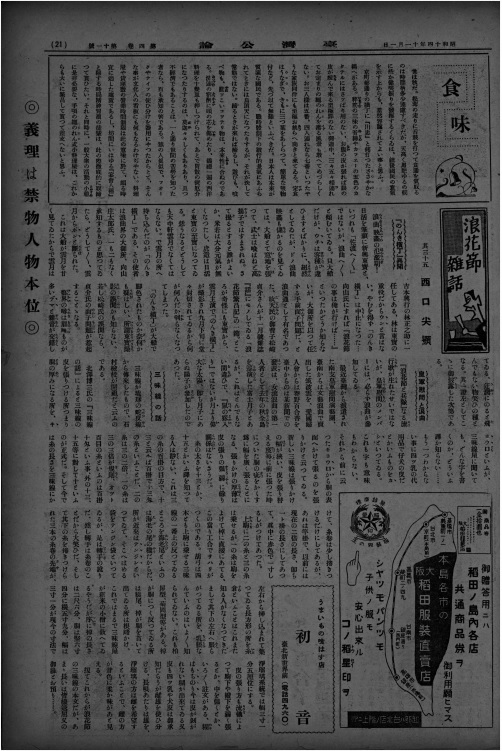

*圖01：該報章的其中一頁，勾起我的好奇心*[^圖01]

[^圖01]: 臺灣公論社，（1939），《[昭和十四年十一月一日]　臺灣公論》，頁21

我頭頂上的雷達讓我瞬間發現，讓我們放大來看：

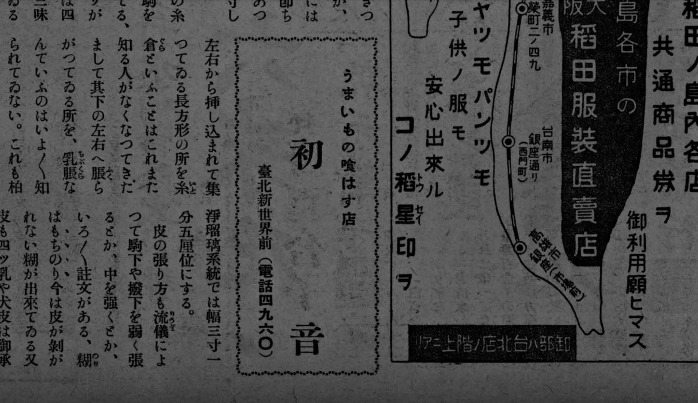

*圖02*

什麼！？1939年的報章下方的廣告，大喇喇地寫著初音兩字！看內文的敘述，似乎是一間餐廳的名字，因此勾起我的好奇心，想要一探究竟。決心要調閱更多文獻*（翻譯：暫時擱下我的論文）*，把這間餐廳找出來。

首先我想透過廣告中給的提示：

- 地點：臺北新世界前

- 電話：四九六零

- 根據「うまいもの喰はす店[^うまいもの喰はす店]」推測其為餐廳。

這三個線索來尋找當時的地圖與文獻來比對。

[^うまいもの喰はす店]: 試譯：「讓你能有美食享用的店」。「喰はす」非錯字，此乃二戰前的古日文，現代拼法為「喰わす」，或者更白話的「食わせる」。

本篇文討論的範圍僅限於1895至1945年之間，在臺灣出現的「初音」地名。**乙未前以及二戰後均不在本次的討論範圍內。**

# **探索一　位於今西門町附近的「初音」餐廳**

在著手探索的前幾天，由於手邊除了臺北市役所勸業課所出版的臺北市商工人名錄，以及臺北市1936年的職業別明細圖以外，幾乎尋不著任何資源。我只能透過臺北新世界的線索，得知其在今日西門町附近，但是是多附近？至此仍然是個謎。弔詭的是，出版於1940年的，1939年臺北市商工人名錄之中，居然找不到名為「初音」的這家店！（偏偏我手中沒有隔年的名錄，也找不到）翻遍了前幾年的名錄也同樣沒有。

這讓我開始懷疑，會不會那則「廣告」不是廣告，甚至餐館也不是餐館，一切都是假的，童話裡都是騙人的呢？

幸運的是，這樣的擔憂沒有持續太久。因為我終於找到了當時的電話簿。原本想找電話簿的時候，我將關鍵字錯誤地輸入為現代日文所用的「電話帳」，後來才得知，當時的出版品稱之「電話帖」，與現代並不同。重新尋找關鍵字後，終於找到1940年臺北市的電話簿，並且成功找到了當時的地址。

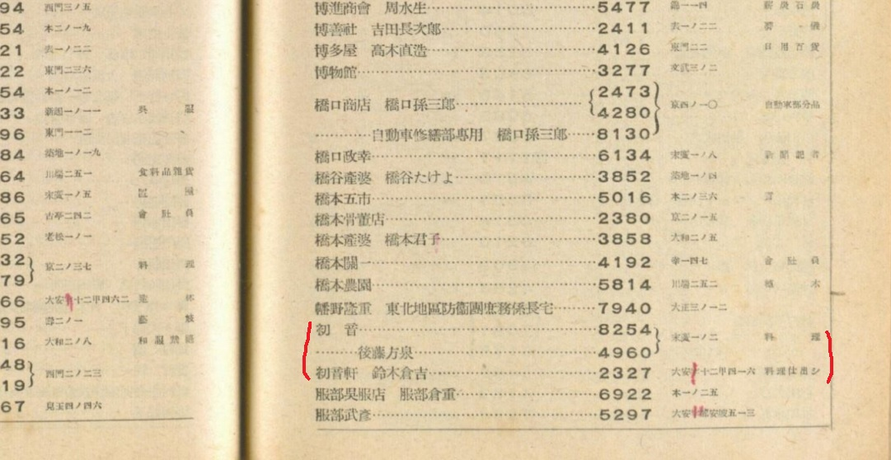

*圖03：電話簿上除了初音餐廳，還有……初音軒？*[^圖03]

[^圖03]: 臺灣總督府交通局遞信部，（1940），《電話帖》，頁123

接著還找到了1943年的臺北商工人案內（如下圖04），終於找到了初音餐廳，只是當時的負責人不是後藤方泉，而是另一位齊藤小義，不知道是負責人更換了還是共同經營，或是其他關係。不過接下來就得尋找位在大安十二甲的「初音軒」了，這個就留到探索二吧。

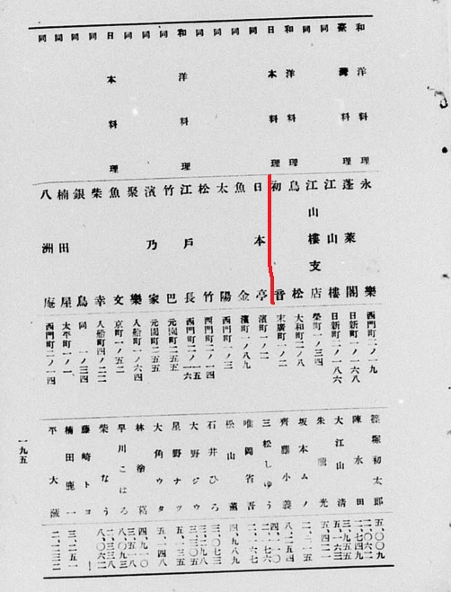

*圖04：1943年的商工人案內之中，終於找到西門町附近的初音餐廳*[^圖04]

[^圖04]: 臺北商工會議所，（1943），《[昭和十八年版]　臺北商公會議所　臺北商工人案內》，頁195

儘管不能得知開業和歇業日期，但找到了兩人的電話，後藤的電話與初音餐廳廣告上的一致。也終於找到了餐廳的所在地：「末廣一之二」，確認其為真實存在的餐廳。對比中央研究院地理資訊術數位典藏計畫所藏之1935年的臺北市街圖可以發現，臺北市的末廣町位於今天廣義的西門町之中，今日西門町六號出口的所在地即是末廣町一丁目的一部分。但是接下來的問題是，「末廣一之二」，我知道末廣町，也知道一丁目，**但是哪裡是二號呢？**

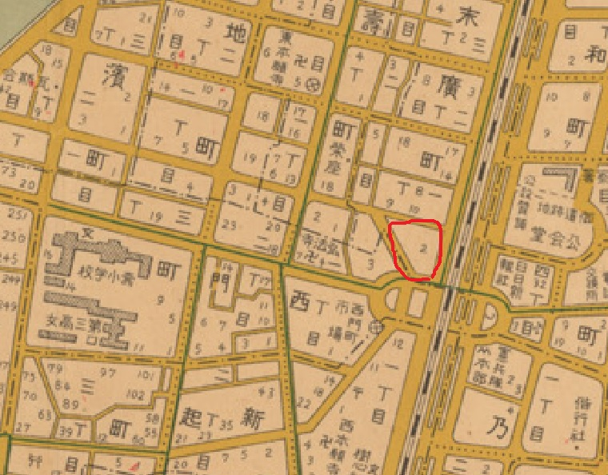

*圖05：1936年臺灣日日新報所載之臺北市街圖，可以看到末廣一之二。*

調閱1936年的臺北市街圖，可以看到末廣町一丁目上有一個數字二，根據該圖之圖例顯示，該數字是「土地番號」。當時的臺灣和日本一樣，地號和門牌號兩者並不區分，今日臺灣門牌號與地號不同，前者屬戶政、後者屬地政，但兩者仍有關聯。有興趣的朋友可以到內政部地政司網站以自家門牌號搜尋地號等資訊。

如果寄信到日本去，也可以發現他們不像我們是以一條一條的街路為單位來編號，而是以一塊一塊的「町丁」來編號，在當時的臺灣也是這樣。所以「末廣一之二」對應的是一整塊地，上面有好幾間商家，因此除非有當時的職業別明細圖或是更詳盡的研究，我們都無法得知「初音」餐廳的確切位置。

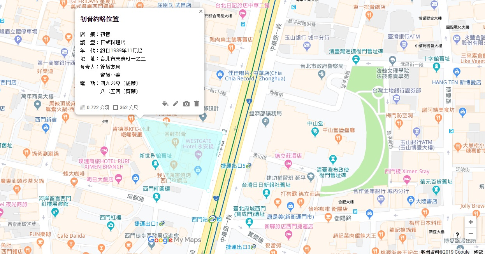

*圖06：初音餐廳的位置：末廣一之二對應到今日的區域。*

不過至少我們圈得出當時的大概位置了。

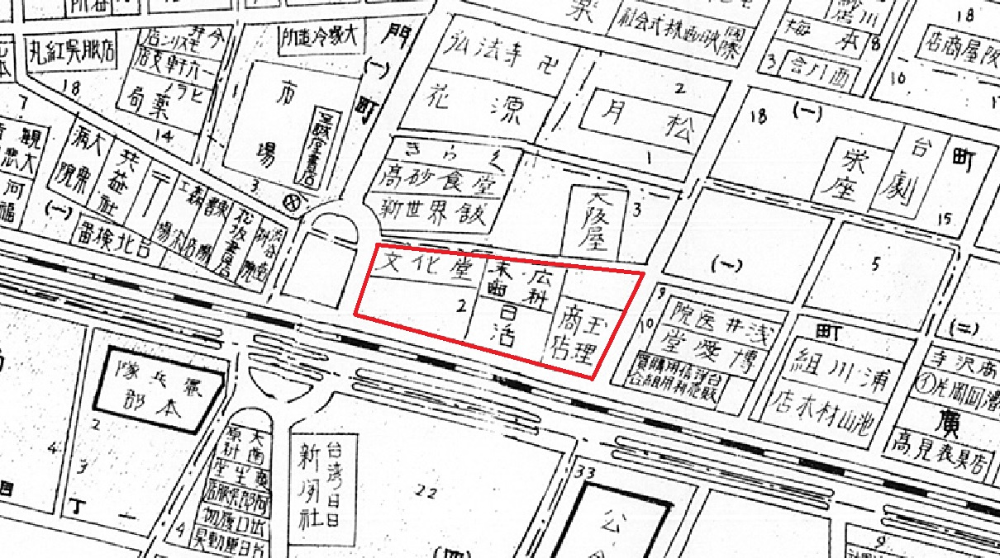

*圖07：紅圈處為1936年的末廣一之二，此時「初音」尚未開幕。可以看到當時有玉理商店、末廣齒科等商家林立*[^圖07]

[^圖07]: 〈1936年臺北市職業別明細圖〉中央研究院地理資訊術數位典藏計畫

如果將來發現更多照片、文獻等史料，就可以佐證「初音」的確切位置。這邊就先打個休止符，等待後續研究。

# **探索二　臺北大安初音軒**

由於在圖03的電話簿中找到了另一間餐廳「初音軒」，因此開啟了另一輪的探索。這次的線索更多：

- 地址：大安字十二甲四一六
- 電話：二三二七
- 負責人：鈴木倉吉

尋找的方式跟前一個方法類似，先找古地圖對應地址，再透過電話和人名尋找關於該店的更多資訊。

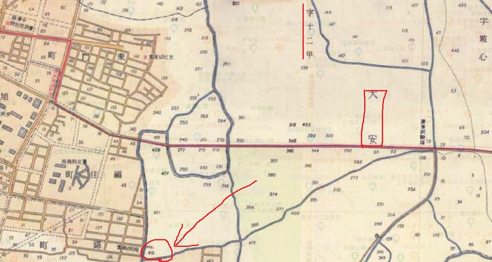

*圖08：在1932年臺北市區計畫街路並公園圖中的大安字十二甲416*

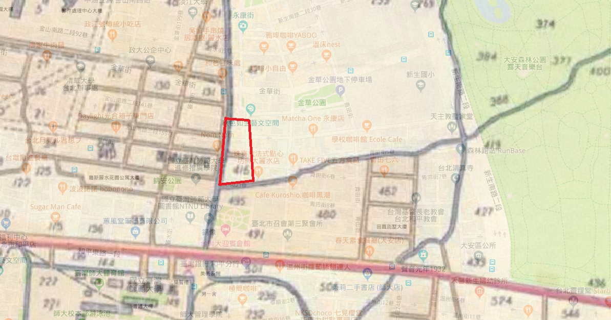

*圖09：上一張圖的放大圖再疊上今日的地圖，紅框標出416的約略範圍*

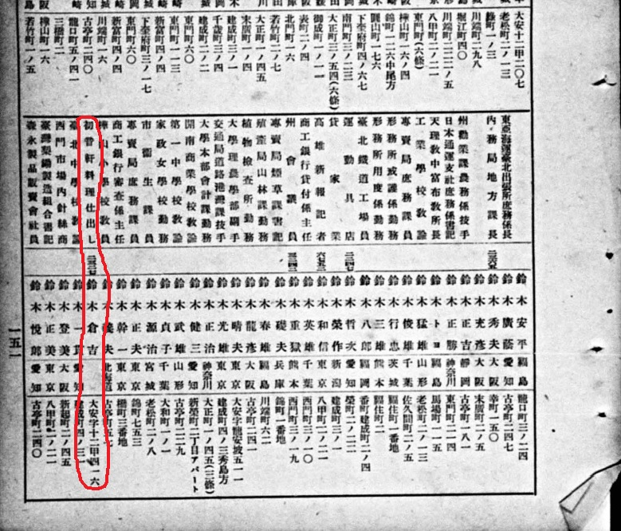

*圖10：臺北市民住所錄之中的鈴木倉吉，確實開著初音軒餐廳*[^圖10]

[^圖10]: 住所月報社，（1940），《臺北市民住所錄　(內地ノ部) 》，頁151

從上面的資料可以大致窺見，「初音軒」所在地的大安字十二甲四一六，現在大致上是錦安市場一帶，位於臺師大圖書館校區後方，沒想到我個人熟悉的地方，居然有如此深刻的歷史w。由於大安字十二甲四一六占地較小，其內又有人聲鼎沸的昭和市場（今日的錦安市場），因此在這裡推測該店設於昔日昭和市場周邊，以此為據畫出概略範圍。

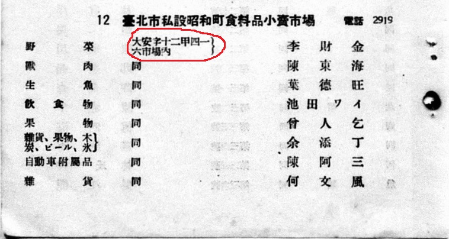

*圖11：大安字十二甲四一六內有個私設昭和市場，今天是錦安市場一帶*[^圖11]

[^圖11]: 臺北市勸業課，（1939），《臺北市商工人名錄　昭和十三年版》，頁358

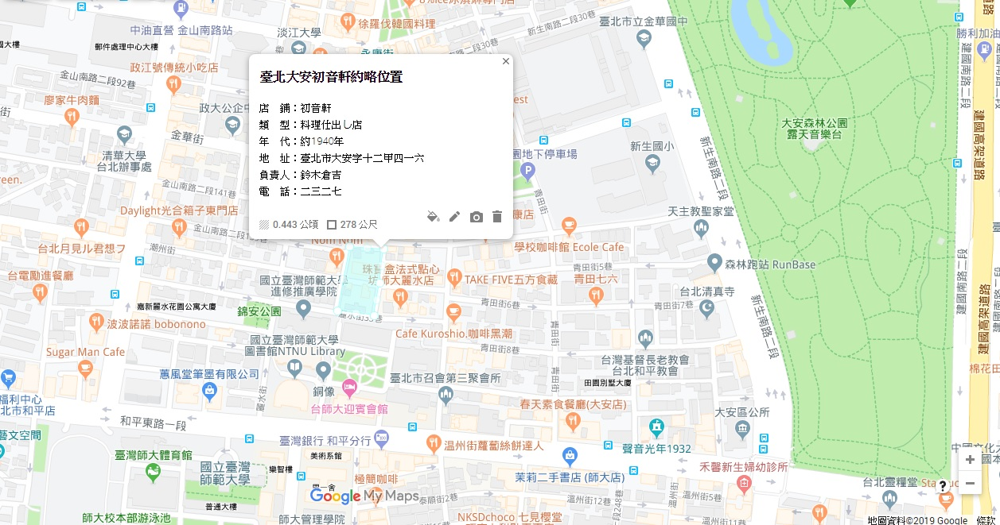

*圖12：對應現今約略位置（昔日之實際位置可能會超出框外）*

# **探索三　基隆與臺南**

在尋找臺北州於1936年與1940年出版的電話簿後，發現了上面兩間位於今日臺北市內的「初音」古地名。這讓我更好奇，臺灣其他地方還有嗎？因此我開始尋找臺灣的其他區域，

透過1936年和1940年出版的臺北州電話簿，以及1937年出版的新竹州、臺中州、臺南州、高雄州、澎湖廳、花蓮港廳和臺東廳電話簿，找出其他地區的「初音」。雖然在當時，就算是店家也不是每間都擁有電話，可能只有半數左右的店家擁有，但比起尋找各地的職業別明細圖（如果有的話），這或許是較為迅速且不失準確的方法。

## **探索三之一：基隆**

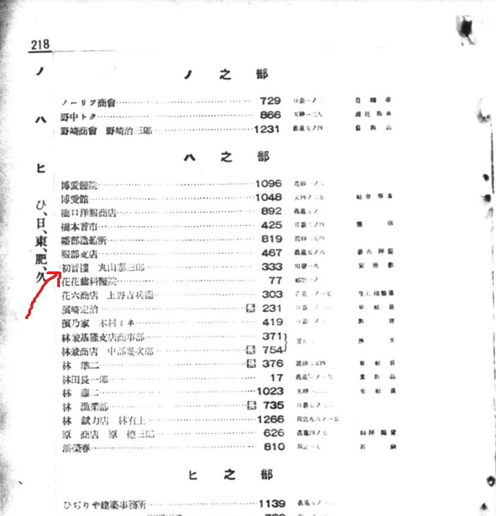

*圖13：基隆市田寮一九的初音樓*[^圖13]

[^圖13]: 臺灣總督府交通局遞信部，（1936），《電話帖　台北州下各局》，頁218

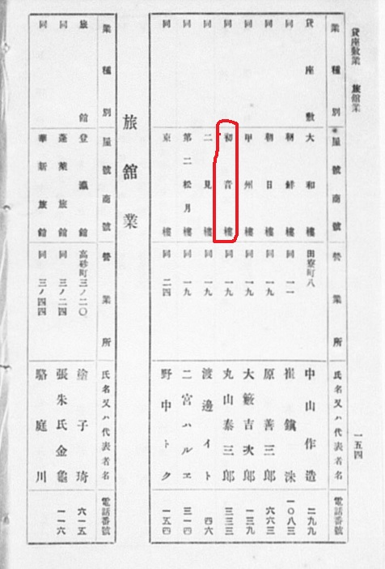

*圖14：1936年的商工人名錄之中的初音樓*[^圖14]

[^圖14]: 基隆市勸業課，（1936），《基隆市商工人名錄　昭和十一年度》，頁154

位於基隆的初音樓屬於「貸座敷」業，簡單來說就是風化場所。基隆市田寮一九即是當時的「遊廓」。圖14之中可以看到其它的「貸座敷」業也集中在田寮一九附近。而根據1929年的職業別明細圖（圖17），遊廓位於當時的稻荷神社前，因此以當時的稻荷神社現今的位置來定位，就可以知道較精確的位置。雖然目前無法尋找「基隆市田寮一九」的確切位置，但在本次探索中推測其在昔日之貸座敷組合之內。

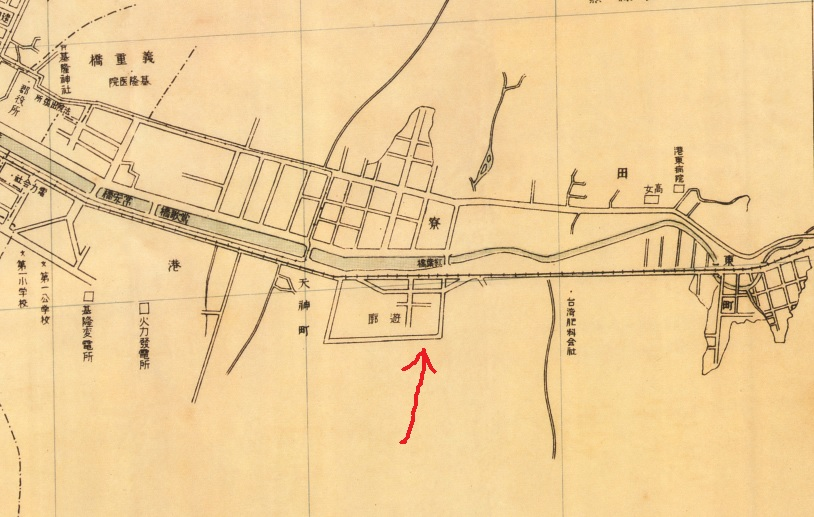

*圖15：1935年基隆市街圖*

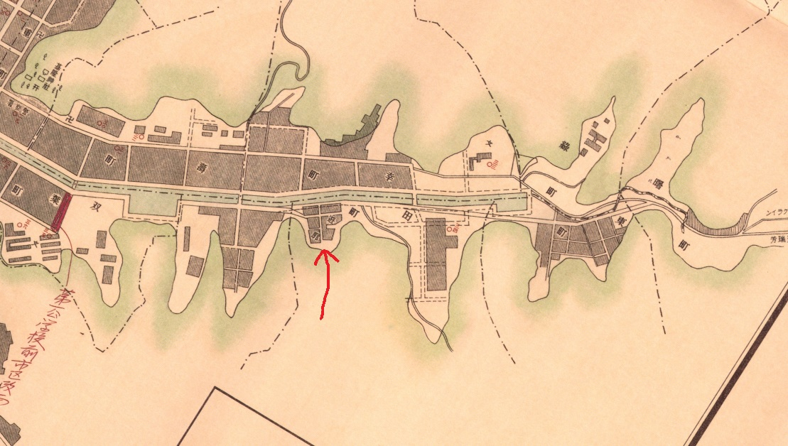

*圖16：1930年基隆市街圖*

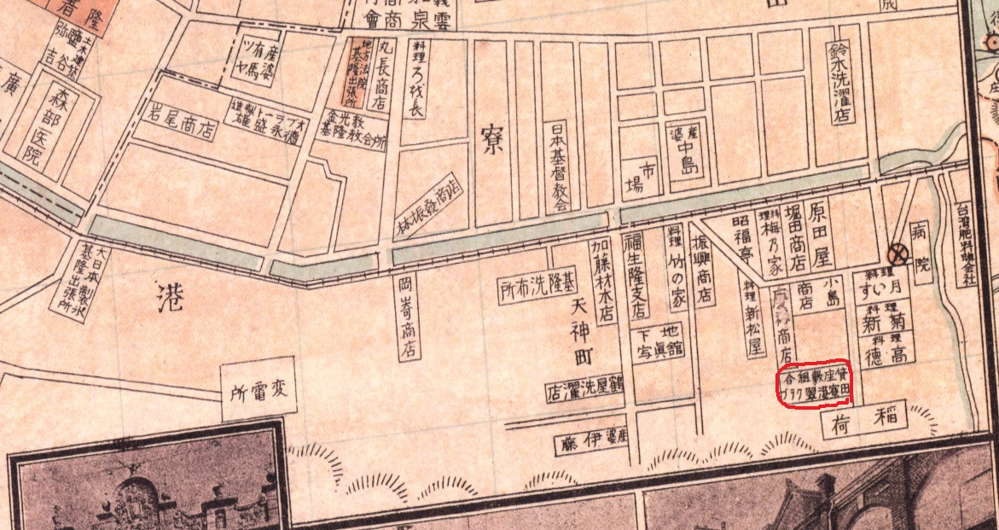

*圖17：1929年〈基隆市大日本職業別明細圖〉所見之遊廓*

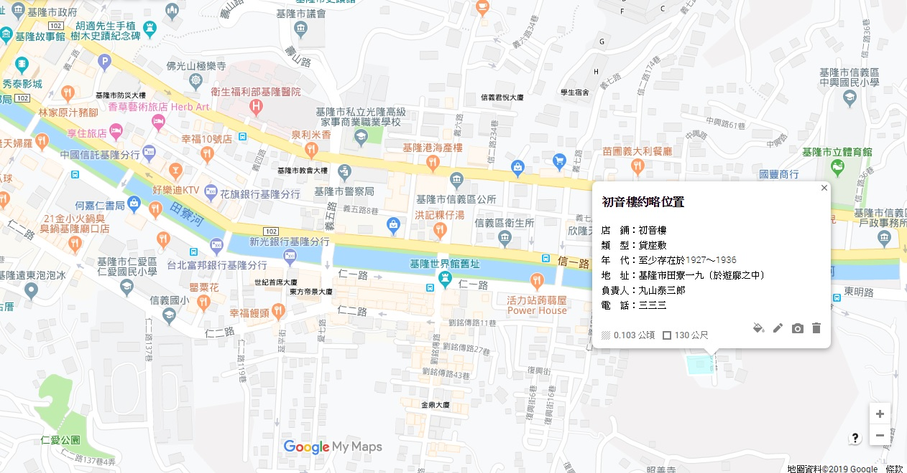

*圖18：對應今日約略位置（約於今基隆市信義區仁一路37巷內。昔日之實際位置可能會超出框外）*

## 探索三之二：臺南

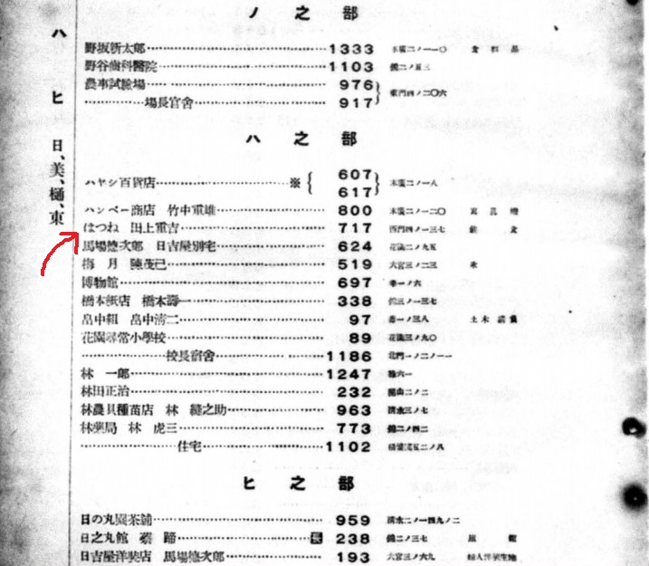

*圖19：臺南市西門四之一三七的はつね*[^圖19]

[^圖19]: 臺灣總督府交通局遞信部，（1937），《臺南州電話帖　昭和十二年六月》，頁30

雖然臺南是筆者的故鄉，卻也是透過這次的探索，才知道臺南過去也有「初音」。不過店名是以平假名來標記。

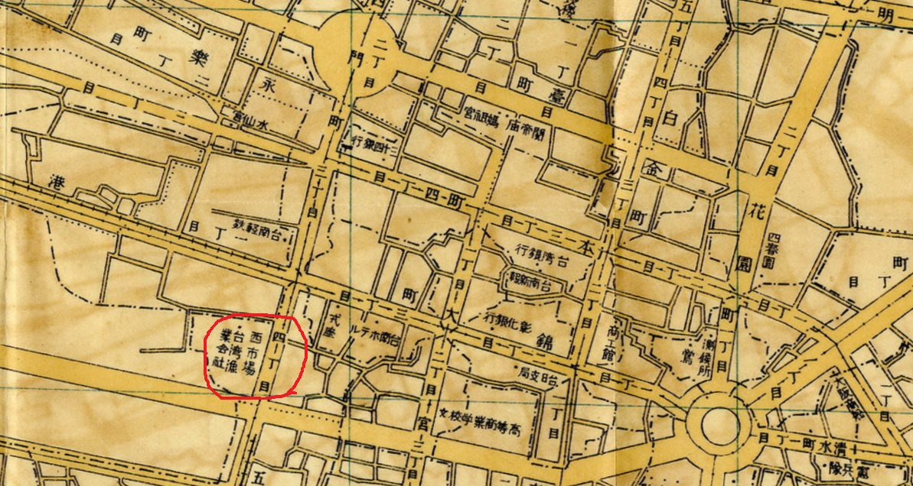

*圖20：1927年的西門町四丁目，內有臺南西市場*

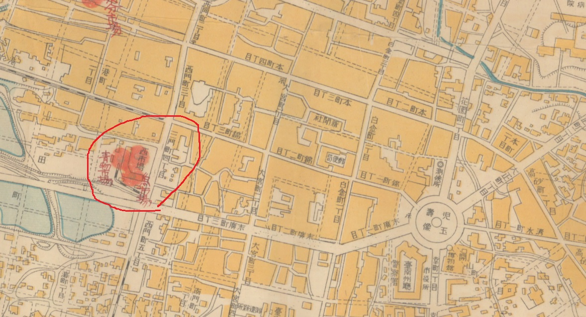

*圖21：1924年的西門町四丁目。地圖內標註為「三門町」應為誤植。*[^圖21]

[^圖21]: 小林德太郎，（1924），〈臺南市全圖〉

在圖19之中，「はつね」被標註為一家飲食店，所以我開始從西市場下手來尋找。可以看見當時的西市場還是V字型的，在1930年改築[^1930年西市場改築]之後，西市場除了原有的西門四之一四一等地號之外，還囊括了附近包括一三七的地號。

[^1930年西市場改築]: 「台南市消費市場改築資金許可ノ件」（日期不詳），〈昭和五年永久保存第五卷〉，《臺灣總督府檔案》，國史館臺灣文獻館，典藏號：00010560003

還好中研院建立了「日治時期台南府城區域住所番地查詢」的系統，臺南這間的地號不用太辛苦，網路上對應一番就可以得出結果：

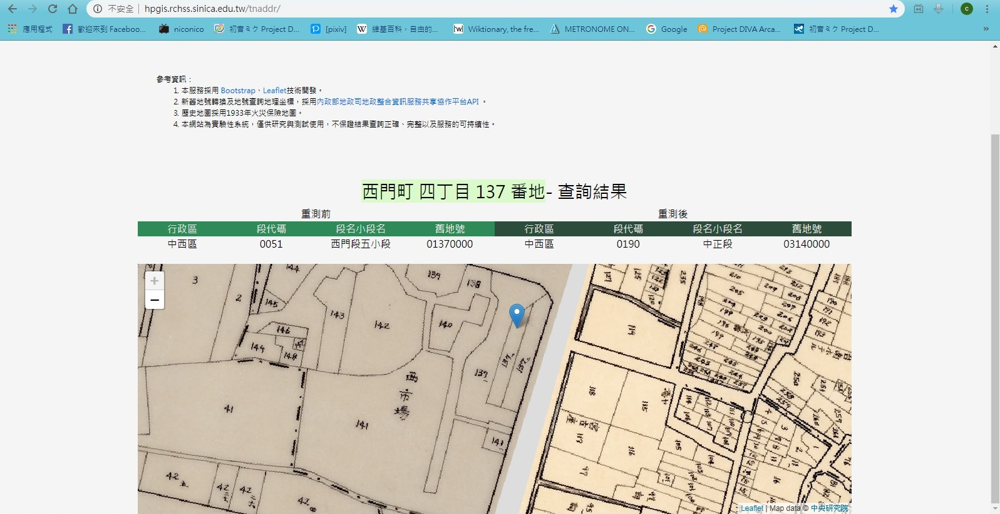

*圖22：使用中研院的系統後查詢的結果*

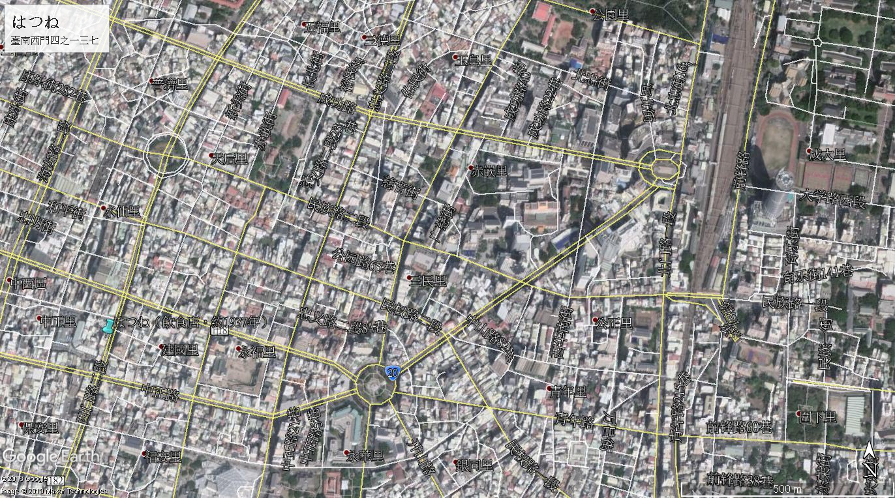

*圖23：對應現今位置（本圖左下方），位於今日臺南西市場東側，西門路旁*

# **探索四　初音町的所在地　臺中**

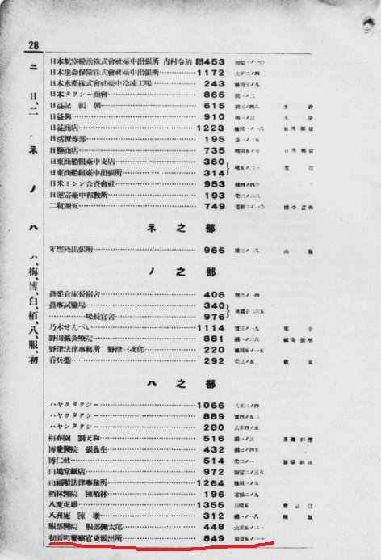

*圖24：1937年臺中州電話簿顯示初音町的警察官吏派出所電話*[^圖24]

[^圖24]: 臺灣總督府交通局遞信部，（1937），《臺中州電話帖　昭和十二年六月》，頁28

臺中的情況相對單純，因為「初音町派出所」是公家機關，地圖上會直接標示位置，所以不需要透過地號來尋找，可以直接對應地圖。初音町的範圍也可以直接對照地圖。

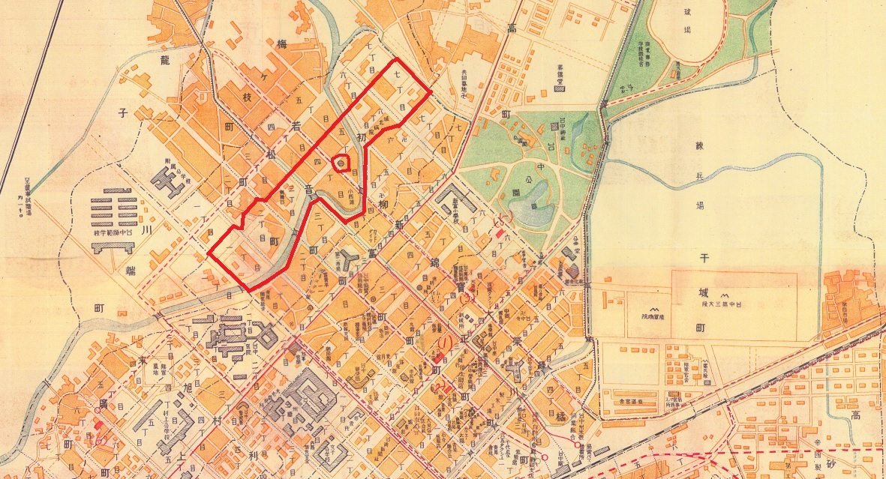

*圖25：1937年的臺中市地圖*[^圖25]

[^圖25]: 高木末雄，（1937），〈臺中市地圖〉

圖25的臺中市地圖中，紅框是代表初音町的範圍，紅框內的紅圈是地圖中標註出的初音町警察官吏派出所的所在位置。

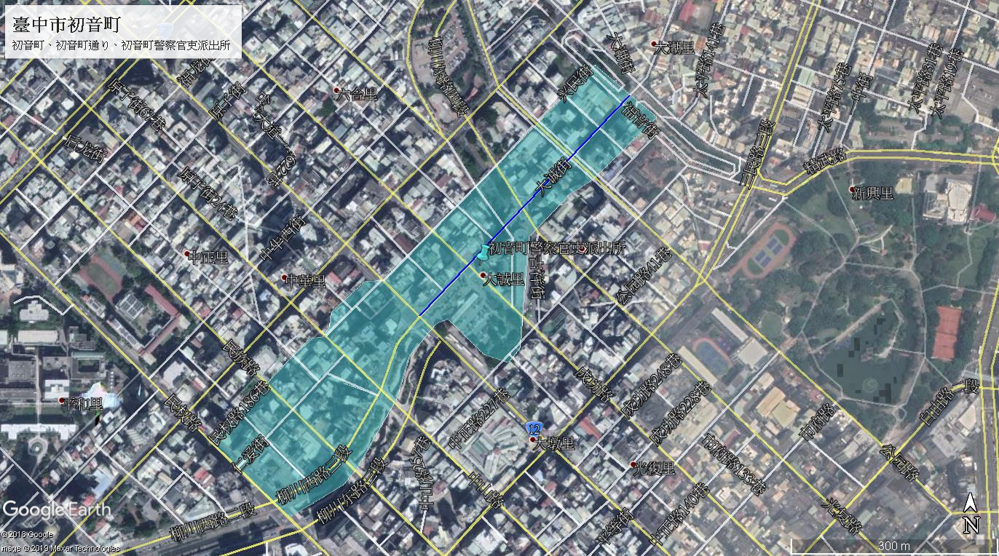

*圖26：對應現今位置。臺中車站位於東南方*

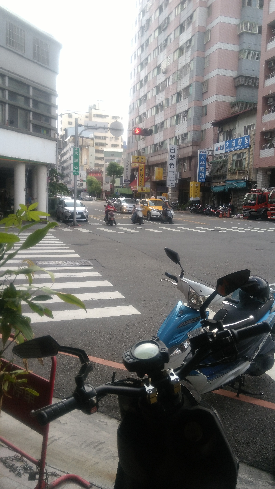

*圖27：臺中市大誠街今貌（2017-08-03），在日治時期是初音町通り*

# **探索五　初音山的所在地　花蓮**

花蓮的情況比較特殊，因為吉安庄（今花蓮縣吉安鄉）之下的初音小字，在1945年之前，除了初音發電所附近以及初音驛之外，幾乎尚未被開發：

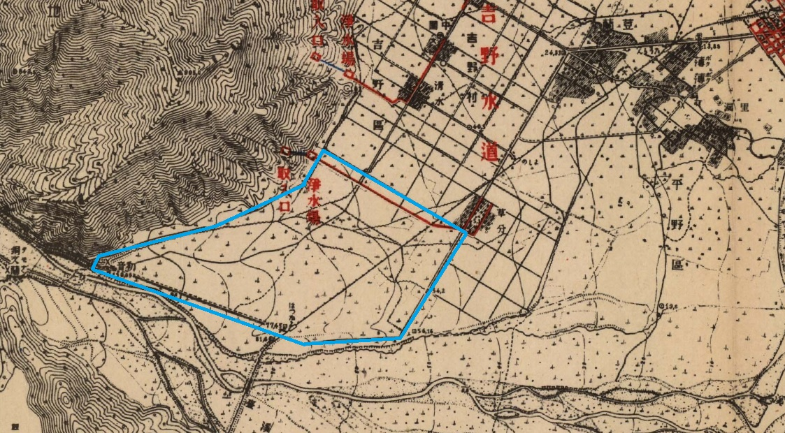

*圖28：1941年的初音小字（藍框）*[^圖28]

[^圖28]: 1941年〈花蓮港市水道圖〉

而除了1916年10月通車的**初音驛**[^初音驛]，以及1941年2月竣工的**初音發電所**[^初音發電所]以外，似乎僅有**初音山**[^初音山]和**初音小字**[^初音小字]是在1945年之前出現。

[^初音驛]: 「初音停車場設置」（1916年10月24日），〈臺灣總督府府報第1139號〉，《臺灣總督府府（官）報》，國史館臺灣文獻館，典藏號：0071021139a001
[^初音發電所]: 劉智淵（2008），〈後山電力博物館　獨具風格的東部發電廠〉。臺電月刊，第551期（2008年11月），頁13
[^初音山]: 其實在日治時期的古地圖之中，這座山始終沒有被標上名字，與旁邊時常被標上名字的七腳川山有著明顯區別。根據[21]這一份1915年的礦業權許可的文件，有一節專門處理地名問題：「地域內木瓜溪左岸稱為初音山」。但有紅筆在旁加註後來該地的地名「ムキイボ社」。由此推測，「初音山」雖然從來都不是該座山的正式名稱，而是花蓮港廳花蓮郡蕃地ムキイボ社下的一座無名小山。但在日治時期確實被以「初音山」如此非正式地稱呼過。也或許這樣的「綽號」也影響到戰後的地圖開始標註其為「初英山」。參考：「鑛業權許可（勝部鍾一郎）」（1915年04月01日），〈大正三年永久保存第七十一卷〉，《臺灣總督府檔案》，國史館臺灣文獻館，典藏號：00002290014
[^初音小字]: 「製糖場原料採取區域外原料採取」（1929年11月13日），〈臺灣總督府府報第817號〉，《臺灣總督府府（官）報》，國史館臺灣文獻館，典藏號：0071030817a0

其他像是「初英一號堤」、「初英自行車道」、「初英橋」等，或許都是在戰後才出現。甚至是「長老教會初音禮拜堂」，由於日治時期和戰後初期的地圖均找不到該禮拜堂，因此推論也是戰後才出現，由於本次探索旨在探尋日治時期臺灣的初音地名，所以以上地標均不討論。

最後我們可以畫出四大區域：初音山、初音小字、初音驛和初音發電所。

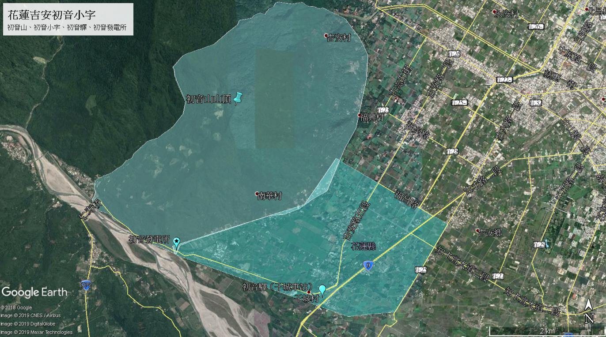

*圖29：花蓮縣吉安鄉與秀林鄉之中的初音古地名對應今日位置*

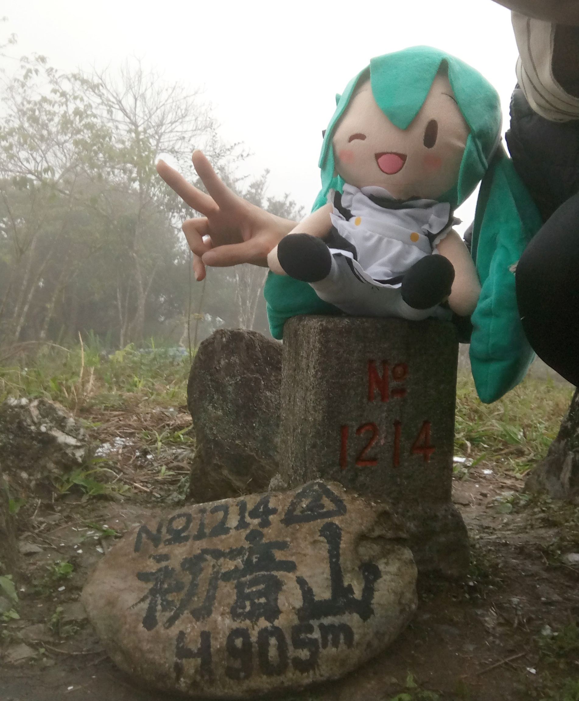

*圖30：初音山山頂（2019-01-24）*

# **臺灣初音古地名地圖**

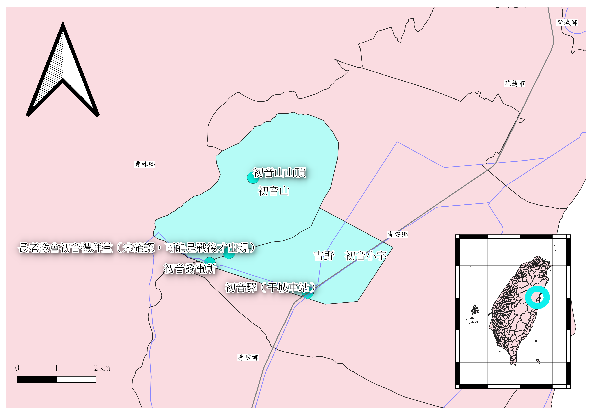

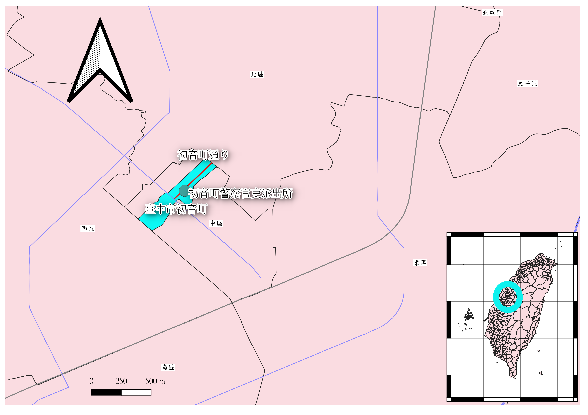

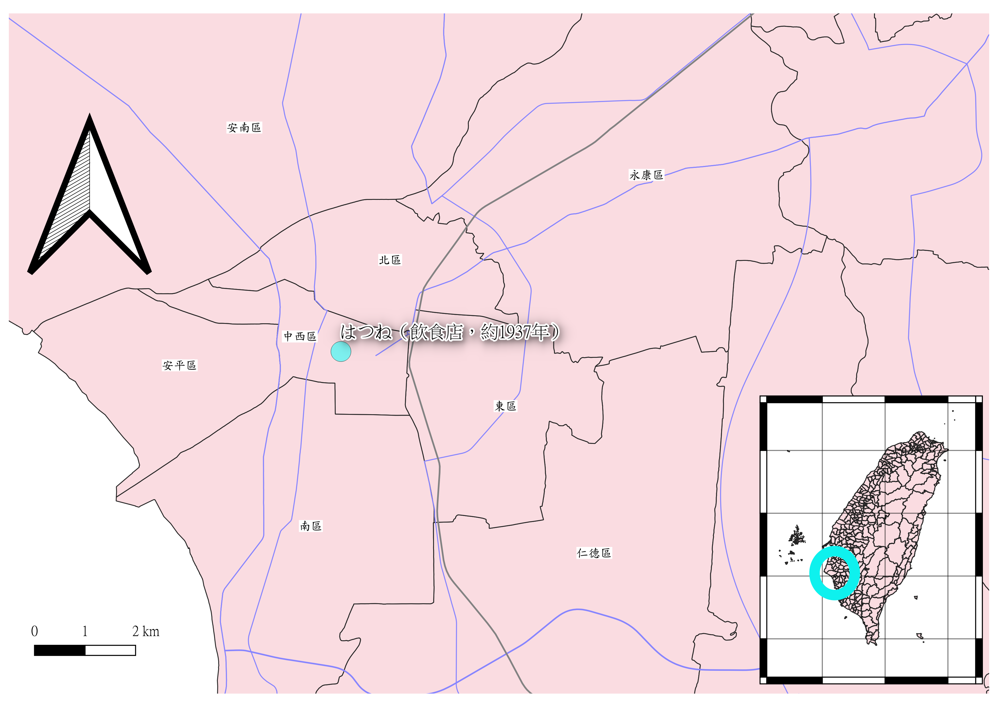

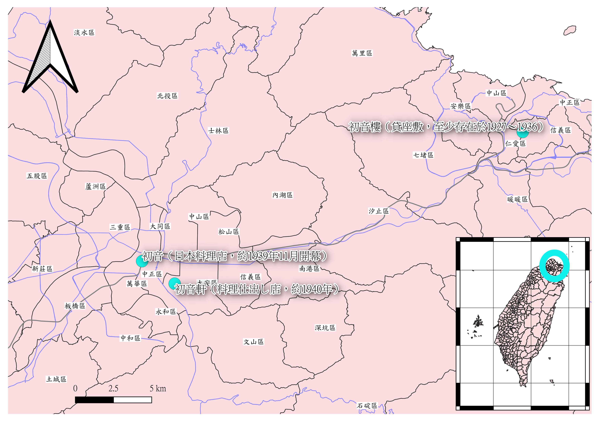

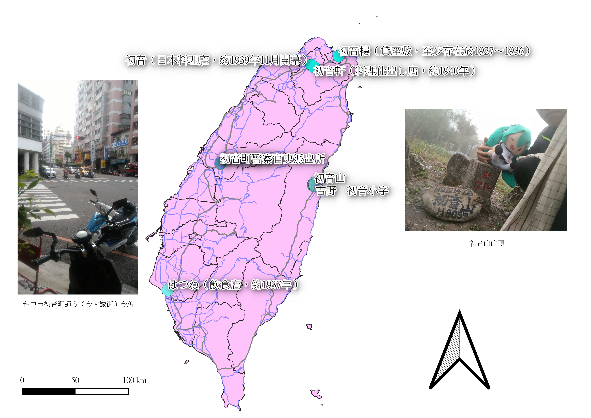

*圖31–35：全臺灣、臺北基隆、臺中、臺南、花蓮的初音古地名分布簡圖。*[^圖31–35]

[^圖31–35]: 皆為自行繪製

# 結語

透過對史料的搜尋與簡單考證，我們得知了臺灣過去除了有臺中的初音町以及花蓮吉安初音小字以外，各地還散落著一些以「初音」為名的古地標。雖然今天大多已不可見，但也不失為一種探索的樂趣。

臺北市的兩間餐廳、基隆市的一間貸座敷、臺南市的一間餐飲店，都曾以「初音」為名；臺中市初音町警察官吏派出所與初音町通り，就在日治時期的初音町之內；今日花蓮縣吉安鄉境內的初音驛和初音發電所，以及在旁矗立著的初音山，都圍繞著日治時期的初音小字。

以上只是有找到的，日治時期的古地名。或許還有隱藏版的「初音」？或許還有更多史料尚待發掘？哪天我們可以看見這些店鋪的影像資料嗎？本人僅以今天這篇不甚嚴謹的研究做為拋磚引玉，期待後續更多人的深入研究。

走進今日的街道，想像著80年前這裡曾存在一間名為初音的餐廳。或許，我們與「初音」的距離，一直以來都並不遙遠。

**CCT**

**2019年07月23日**

# **參考文獻**

## 政府出版品

- 臺灣總督府交通局遞信部，（1936），《電話帖　臺北州下各局》，出版地不詳：臺灣總督府交通局遞信部

- 基隆市勸業課，（1936），《基隆市商工人名錄　昭和十一年度》，基隆市：基隆市役所

- 臺灣總督府交通局遞信部，（1937），《臺中州電話帖　昭和十二年六月》，出版地不詳：臺灣總督府交通局遞信部

- 臺灣總督府交通局遞信部，（1937），《臺南州電話帖　昭和十二年六月》，出版地不詳：臺灣總督府交通局遞信部

- 臺北市勸業課，（1939），《臺北市商工人名錄　昭和十三年版》，臺北市：臺北市勸業課

- 臺灣總督府交通局遞信部，（1940），《電話帖》，出版地不詳：臺灣總督府交通局遞信部

## 政府檔案

- 「鑛業權許可（勝部鍾一郎）」（1915年04月01日），〈大正三年永久保存第七十一卷〉，《臺灣總督府檔案》，國史館臺灣文獻館，典藏號：00002290014

- 「初音停車場設置」（1916年10月24日），〈臺灣總督府府報第1139號〉，《臺灣總督府府（官）報》，國史館臺灣文獻館，典藏號：0071021139a001

- 「製糖場原料採取區域外原料採取」（1929年11月13日），〈臺灣總督府府報第817號〉，《臺灣總督府府（官）報》，國史館臺灣文獻館，典藏號：0071030817a0

- 「台南市消費市場改築資金許可ノ件」（日期不詳），〈昭和五年永久保存第五卷〉，《臺灣總督府檔案》，國史館臺灣文獻館，典藏號：00010560003

## 期刊

- 劉智淵（2008），〈後山電力博物館　獨具風格的東部發電廠〉。臺電月刊，第551期（2008年11月）

## 專書

- 國島守，（1939），《[昭和十四年十一月一日]　臺灣公論》，臺北市：臺灣公論社

- 住所月報社，（1940），《臺北市民住所錄　(內地ノ部) 》，臺北市：住所月報社

- 臺北商工會議所，（1943），《[昭和十八年版]　臺北商公會議所　臺北商工人案內》，臺北市：臺北商工會議所

## 地圖

- 小林德太郎，（1924），〈臺南市全圖〉，臺南市：森田屋商店

- 1927年〈臺南市街圖〉

- 〈1928年臺北市職業別明細圖〉中央研究院地理資訊術數位典藏計畫

- 1929年〈基隆市大日本職業別明細圖〉

- 臺灣日日新報，（1930），〈基隆全圖〉

- 1932年〈臺北市區計畫街路並公園圖〉

- 臺灣總督府交通局鐵道部，（1935），〈基隆市街圖〉

- 〈1935年臺灣博覽會紀念臺北市街圖〉中央研究院地理資訊術數位典藏計畫

- 〈1936年臺北市職業別明細圖〉中央研究院地理資訊術數位典藏計畫

- 臺灣日日新報社編輯局，（1936），〈臺北市區計畫街路及公園　改正臺北市全圖〉

- 高木末雄，（1937），〈臺中市地圖〉，臺中市：育英堂書店

- 1941年〈花蓮港市水道圖〉
- 1945年美軍所繪之臺北市地圖
- 1945年美軍所繪之基隆市地圖
- 1945年美軍所繪之臺中市地圖
- 1945年美軍所繪之臺南市地圖

---

> **原文出處**
>
> 本文最初發布於 **2019-07-23**，
> 原 Facebook 初始發文時間及連結已不可考，巴哈姆特為備份。
>
> 原文連結如下，本站版本僅針對排版進行改善及更正錯別字，未改動內文：
>
> - Facebook 未來群像：（佚失）
> - 巴哈姆特（備份）：https://home.gamer.com.tw/artwork.php?sn=5967069
