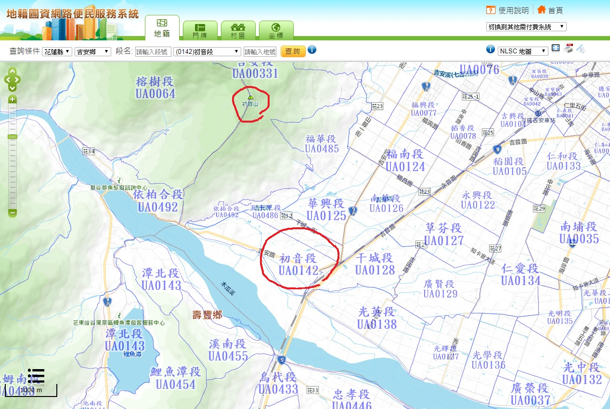
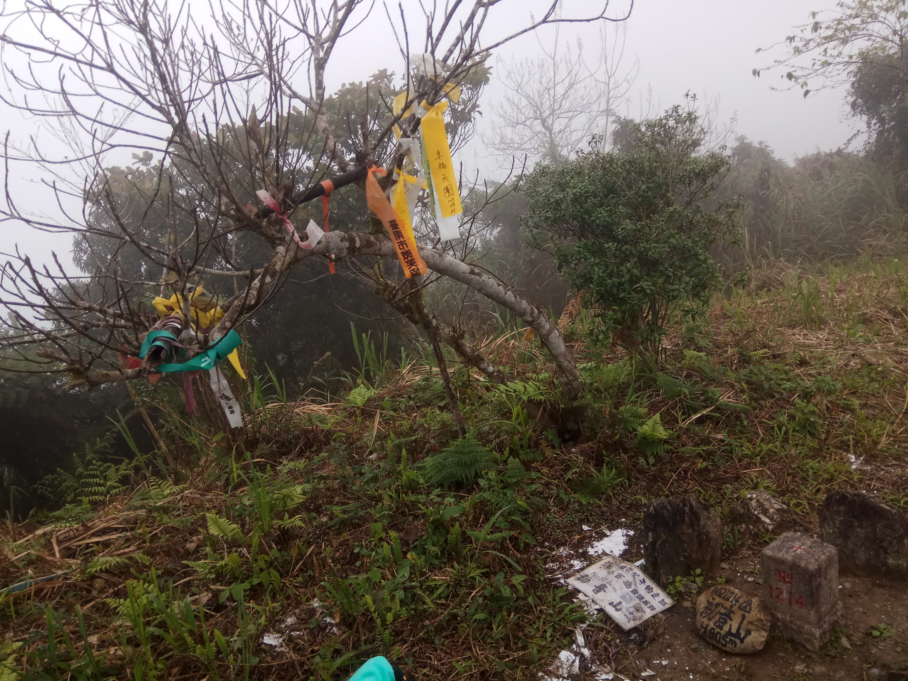
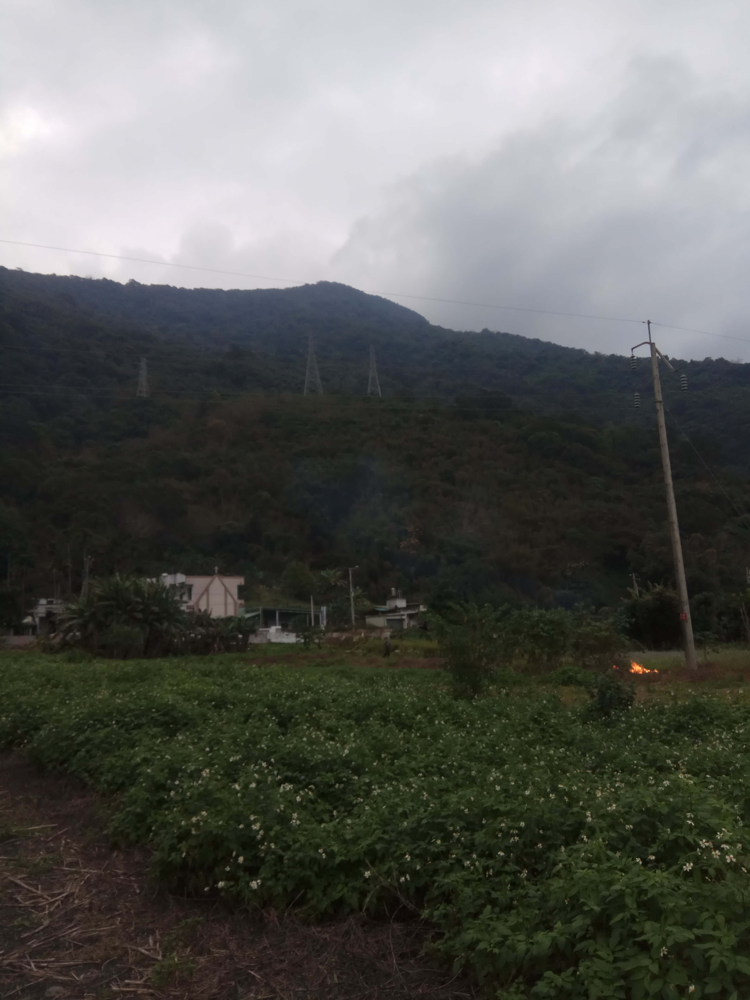
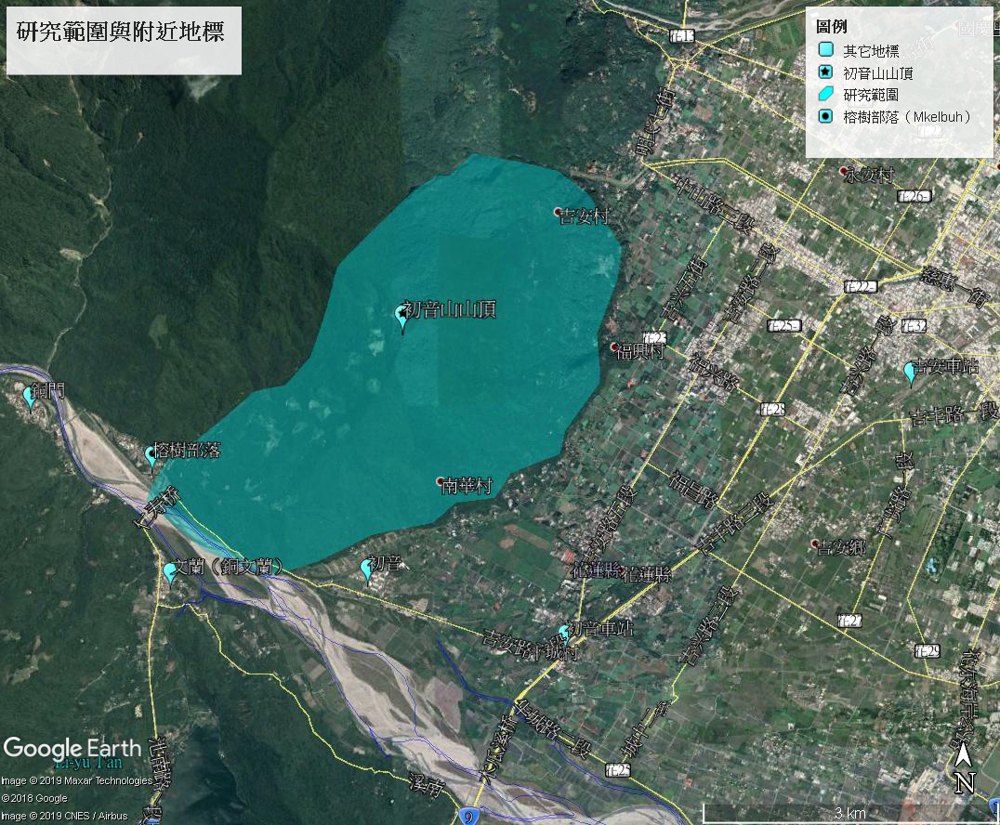
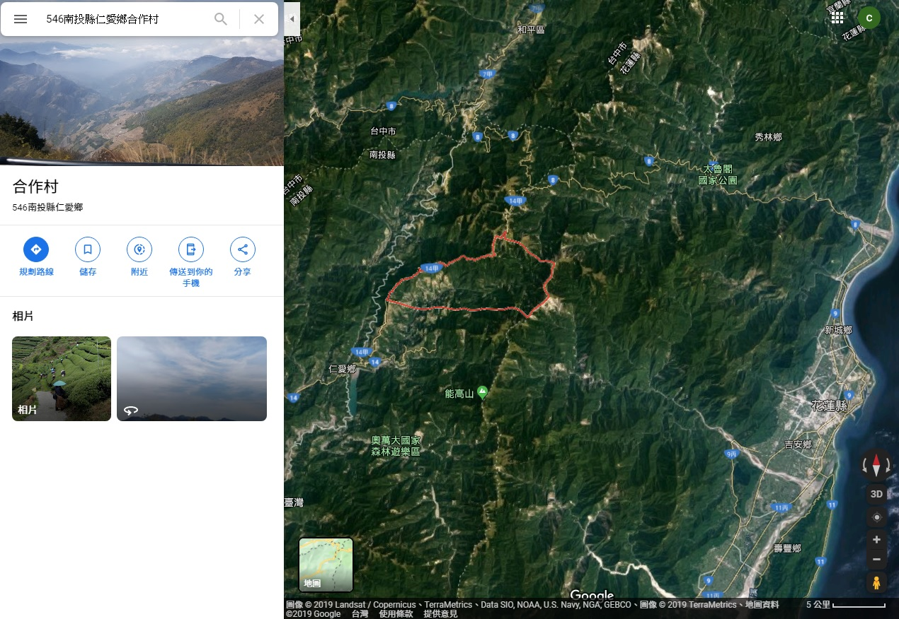
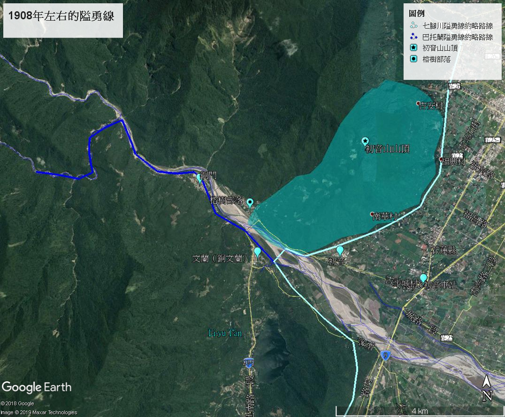
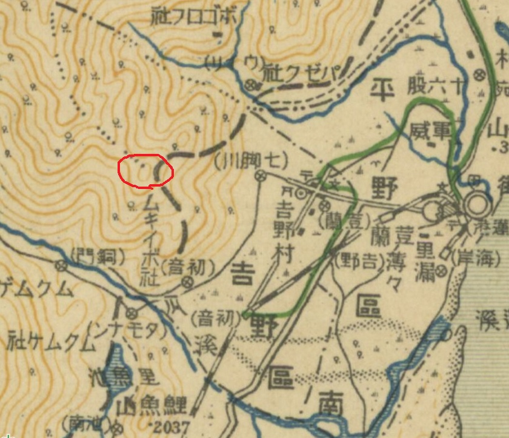
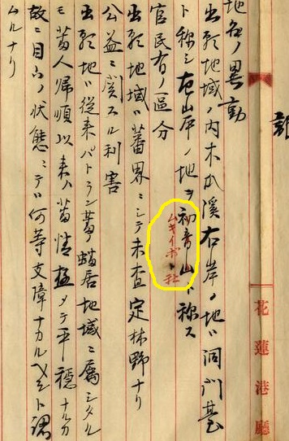
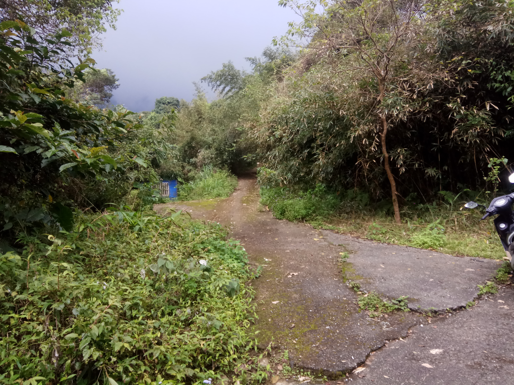

大家好，這裡是CCT。

臺灣初音史變成系列文啦！！！！！！（乾

原本寫著寫著，開始在想這篇文會不會太偏題，太脫離初音未來的脈絡，但經過對身邊朋友的小調查，普遍都覺得還OK，因此不好意思，這次就讓我再多嘴一些枯燥乏味的東西了。

在[前一篇]()我們找出了分散在臺灣各地的許多古地名，分別在今日的臺北、基隆、臺南、臺中和花蓮，這些地標除了餐廳和貸座敷等店面之外，還有以「初音」為名的一整塊行政區，例如初音町或初音小字，在之上或旁邊也座落了以其為名的地標、機關等設施，甚至自然地景。

如果說上一篇是以「量」為導向，那麼本篇將以「質」為導向，前篇捨棄深度而求廣度，並沒有在各個環節討論太深，當然某方面也是因為要找到當時的其他史料，使其開業、歇業、確切位置等資訊得以明朗，難度顯然是滿大的，也需要大量的時間，因為個人現實因素，沒有辦法太過深入探討。

儘管其他各地的「初音」地名已基本消失無蹤，但是花蓮的「初音」地名在今日留下的痕跡如此明顯，以至於連政府機關的地圖都會一字不差地用上「初音」兩字。透過查詢內政部地政司的地籍圖網站，我們可以得知不只是「初音山」三個字正大光明地寫在地圖上，就連吉安鄉都有這麼一塊被稱為「初音段」的地段。[^地籍與路名的段]

*圖01：初音山與初音段*

[地籍圖資]: https://easymap.land.moi.gov.tw/R02/Index

上一篇文我們有稍微提到地籍與戶籍的區別，地籍上的「段」與路名的「段」概念並不同。前者多在房屋交易之中看見；後者僅是將長度較長的公路分段，對一般人來說能見度則高得多。

[^地籍與路名的段]: 土地法第40條在地籍上對「段」的說明：「地籍整理以直轄市或縣（市）為單位，直轄市或縣（市）分區，區內分段，段內分宗，按宗編號。」由此可知明顯與公路的分段不同。

既然「初音段」是地籍中的正式地名，這便代表了當地的房屋交易市場中，「初音段」之名並不稀奇。值得注意的是，在戰後將許多此處的地名從「初音」改為「初英」之時，地籍中的「初音」卻不知為何保留了下來。如果「初音」地名是遺產，那麼花蓮吉安及其周圍大概就是個歷史悠久的大寶庫吧。

儘管只是七腳川山的支脈之中小小的一座山，但正當「初音山」[^初音山]之名，名正言順地顯示在政府資訊中，並被我們視為稀奇且難得的存在時，我們卻對那座山之身世一無所知。

[^初音山]: 徐松海、邱永雙，（2002），《吉安鄉志》，花蓮：吉安鄉公所，頁27

因此出於（至少是我個人的）這樣的好奇心，今天就針對這座山進行人文歷史的探討。這裡暫且不討論自然歷史以及地質等面向，我們先從它的主人：太魯閣族說起。

*圖02：初音山山頂（2019-01-24）*

*圖03：從山腳下眺望初音山山頂（圖中突起者，2019-01-24）*

**聲明：本人既非人類學研究者，研究領域亦與原住民族無關，因此或許會有理解不周或認知錯誤的部分，若有敘述錯誤請不吝指正。**

*圖04：研究範圍*

# **太魯閣族Ibuh部落早期遷移簡史**

目前仍未找到證據表明在太魯閣族遷入之前， 究竟是誰居住在初音山，或是「初音山到底有沒有更早的居民」，雖然我們已知慕谷慕魚（太魯閣語：Mqmgi）[^慕谷慕魚部落]部落， 是太魯閣族之中最早遷移至銅門村的部落。

[^慕谷慕魚部落]: Lin PS, Liu YL (2015) Niching sustainability in an Indigenous community: protected areas, autonomous initiatives, and negotiating power in natural resource management. Sustain Sci (2016) 11:107

但由於不清楚更精確的範圍，以及太魯閣族遷入之前的狀況，因此本篇文先從可考的部分：太魯閣族的摩古伊玻厚社（太魯閣語：MkeIbuh）[^MkeIbuh]說起。

[^MkeIbuh]: 此處的MkeIbuh，I經常寫作大寫，但也可以寫成小寫”Mkeibuh”。原因與其太魯閣語原文有關，後面會詳述原因。

現今的太魯閣族依照地理位置的不同，分為外太魯閣與內太魯閣[^外太魯閣與內太魯閣]，初音山的主人：MkeIbuh社由於靠近海邊，屬於外太魯閣[^MkeIbuh社屬外太魯閣]，現在主要聚居在初音山南側的山腳下，被稱為榕樹部落。作為部落的主要成員，榕樹部落之名是來自MkeIbuh這個名字，MkeIbuh的意思是「來自Ibuh部落的人」[^ibuh的意思]， 而ibuh在太魯閣語是「赤榕」的意思。因為”Mke”在此處是修飾”Ibuh”這個專有名詞，因此也常會將I寫為大寫。

[^外太魯閣與內太魯閣]: 王廷元、林佩琪，（2019），《百年太魯閣　尋覓歸鄉路》，臺北：采薈軒，頁45
[^MkeIbuh社屬外太魯閣]: 同上，頁308
[^ibuh的意思]: 艾思源、楊珮猷，（2015），《移動的記憶：太魯閣族部落史及家鄉資源調查成果冊》，頁42

太魯閣族最早來自現今的南投縣仁愛鄉合作村（太魯閣語：Truku Truwan），在大約300多年前，來自南投的太魯閣族Tkdaya群先東遷到了巴托蘭（太魯閣語：Btulan），但不久後遷離；到了約200年前， 由立霧溪流域大量南遷的太魯閣族人，建立了「巴托蘭群」[^巴托蘭群]（太魯閣語：Tnkagan Btulan），伊玻厚部落（Ibuh）便是巴托蘭群的一部分[^伊玻厚部落]。

[^巴托蘭群]: 孫大川，（2006），《秀林鄉志》，花蓮：秀林鄉公所，頁165
[^伊玻厚部落]: 同上，頁168

*圖05：南投縣仁愛鄉合作村海拔比清境農場更高，是太魯閣族的起源地。*

起初Ibuh部落屬於內太魯閣， 但在立霧溪的Ibuh部落族人在進入日本時代前，便開始陸續下山前往木瓜溪（太魯閣語：Yayung Mglu），也就是初音山南側的方向遷居[^Ibuh部落遷居]。至1902年[^1902年]為止，「來自Ibuh部落」的人們，就住在今日榕樹部落現址上方緩坡地[^部落現居地]，也就是初音山南側的山坡上。

[^Ibuh部落遷居]: 艾思源、楊珮猷，（2015），《移動的記憶：太魯閣族部落史及家鄉資源調查成果冊》，頁42
[^1902年]: 孫大川，（2006），《秀林鄉志》，花蓮：秀林鄉公所，頁220
[^部落現居地]: 艾思源、楊珮猷，（2015），《移動的記憶：太魯閣族部落史及家鄉資源調查成果冊》，頁43

# **日本時代的初音山**

1895年，臺灣歸於日本人的管轄之下，日本政府為了加強統治，對原住民時而綏撫、時而動武[^時而綏撫] [^時而動武]，關於太魯閣族與日本人的衝突史，這裡並不多加著墨。總之在1908年七腳川事件前後[^七腳川事件]，日本政府於初音山附近建立巴托蘭隘勇線（バトラン隘勇線）[^巴托蘭隘勇線]，從銅文蘭（太魯閣語：Tmunan，今文蘭）到銅門以及更深山[^文蘭到銅門]，後來又建立了七腳川隘勇線[^七腳川隘勇線]，太魯閣族與日本人在隘勇線附近互相對峙，直至前者在後來的數次戰役中被打敗。

[^時而綏撫]: 孫大川，（2006），《秀林鄉志》，花蓮：秀林鄉公所，頁448
[^時而動武]: 王廷元、林佩琪，（2019），《百年太魯閣　尋覓歸鄉路》，臺北：采薈軒，頁27
[^七腳川事件]: 同上，頁28-31
[^巴托蘭隘勇線]: 佚名，（1908），《臺東廳下バトラン隘勇線竣工ス》，出版地不詳：臺灣總督府史料編纂會，頁1-2
[^文蘭到銅門]: 臺灣日日新報社，〈臺東雜信〉，《臺灣日日新報》，1908/06/13/05版
[^七腳川隘勇線]: 臺灣日日新報社，〈臺東の新隘線〉，《臺灣日日新報》，1909/01/21/02版

**

*圖06：1908年左右初音山附近的隘勇線*

1909年，日本人經過多次討伐太魯閣部落後，設置包括「初音分遣所」[^初音分遣所]的警察官吏駐在所（有點像平地的派出所），先施以懷柔勸導，後將太魯閣族陸續遷下山，分散在各地以加強管制；1928年，「來自Ibuh部落的人」（MkeIbuh）也從初音山山腰上被遷移下山[^MkeIbuh遷移下山]，住在今日的榕樹部落。部落名沿襲了原名，繼續稱為MkeIbuh，日本人也依據此發音，稱花蓮郡蕃地初音山附近的區域為ムキイボ社[^ムキイボ社]。 

[^初音分遣所]: 「花蓮港廳訓令第八號隘勇監督所隘勇監督分遣所及隘擔任區域ヲ定ムル件」（1911年05月26日），〈明治四十四年永久保存第二十八卷〉，《臺灣總督府檔案》，國史館臺灣文獻館，典藏號：00001794053
[^MkeIbuh遷移下山]: 艾思源、楊珮猷，（2015），《移動的記憶：太魯閣族部落史及家鄉資源調查成果冊》，頁43
[^ムキイボ社]: 山下太郎，（1939），《臺灣地名便覽　附行政區域一覽》，臺北：社會教育社，頁100

*圖07：1924年初音山附近，紅圈為初音山山頂[^圖07]*

[^圖07]: 〈日治三十萬分一台灣全圖〉（1924）

# **「初音山」與「ムキイボ社」的關聯**

*圖08：1915年一份礦業權許可的文件，「地域內木瓜溪左岸稱為初音山」的「初音山」被用紅筆畫掉，改為「ムキイボ社」[^圖08]*

[^圖08]: 「鑛業權許可（勝部鍾一郎）」（1915年04月01日），〈大正三年永久保存第七十一卷〉，《臺灣總督府檔案》，國史館臺灣文獻館，典藏號：00002290014

就如同我在前一篇文提到的一樣，ムキイボ社作為該地行政區劃的正式名稱，其實「初音山」這個名字在日本時代從未被正式使用過。在日治時期的古地圖之中，這座山始終沒有被標上名字，與旁邊時常被標上名字的七腳川山有著明顯區別。但透過圖08這份礦業許可文件，我們推測這座山在日治時期確實被以「初音山」如此非正式地稱呼過， 也或許這樣的「綽號」也影響到戰後的地圖開始標註其為「初英山」。 [27]在本文之冒頭處已提過，地政司所使用的名稱為「初音山」，這個日本味濃厚的名字，反倒是在戰後才成為某種程度上的正式名稱。而它的舊名ムキイボ社，也在戰後成為了花蓮縣秀林鄉銅門村的榕樹部落，並沿用至今。

[^日本時代始終沒有被標上名字]: 包含且不僅限於〈假製版五萬分一地形圖〉（1895）；〈臺灣堡圖〉（1904）；〈日治官有林野圖〉（1923）；〈二十萬分一帝國圖〉（1932）；〈花蓮港市水道圖〉（1941）等等日本時代的地圖，經查閱無一例外。
[^戰後開始標為初英山]: 〈兩萬五千分之一經建版地形圖（第一版）〉（1985）

# **現今的初音山及結論**

1928年，初音山上的太魯閣族人遷下山後，除了山腳下的榕樹部落以外，初音山上已經沒有了有一定規模的聚居地，不過在山上仍居住著零星的農家，在山腰上從事農業活動。

*圖09：初音山山腰上，產業道路旁的小屋（2019-01-24）*

不過在此前，太魯閣族居住在此處，替這附近取下了不少名字，並且沿用至今。本篇文標題中的”Dgiyaq MkeIbuh”[^DgiyaqMkeIbuh]，就是太魯閣族給予「初音山」這座山的名字。顯然太魯閣人稱呼初音山也是以摩古伊玻厚為名，而透過我們的簡單考證，我們得知了這個名字可以追溯到內太魯閣的伊玻厚部落，並回推到太魯閣族的共同起源：Truku Truwan。今天，「榕樹」部落雖然在讀音上迥異於摩古伊玻厚，但在字義上保留了下來。雖然我們今天不稱初音山為「摩古伊玻厚山」，這座山以旁邊平地上的初音小字為名，流傳至今，但也因為這樣，誤打誤撞地讓喜歡初音未來的我們注意到它，並且使我們更了解太魯閣族，以及當地的歷史和風土民情。

歷史是偶然抑或是必然？如果是必然，那我們必然會，也必然需要認識這座山；如果是偶然，那麼這大概是一座臺灣的小山與日本的超人氣虛擬偶像之間，一種最戲劇化、最令人拍案叫絕的連結過程了吧。假如這一切都沒能發生，我們或許也無法得知這些歷史了。

[^DgiyaqMkeIbuh]: dgiyaq在太魯閣語意味著「山」

# **後記**

其實我在尋找資料時還發現，太魯閣語的"MkeIbuh"可能不是唯一的拼寫方法。在 *Lin PS, Liu YL (2015)* 這篇期刊論文之中，我們可以看到MkeIbuh拼作"Meqeboh"；慕谷慕魚Mqmgi拼作"Meqmegi"。我在思考會不會有可能是拼寫方法沒有統一造成這種現象？還是這篇文章僅為了閱讀方便而換成另一種拼寫法呢？不過因為個人對語言學僅略知皮毛，對其方法論更是一竅不通，因此目前對答案是毫無頭緒，只好將疑問留下。

另外前面也有提到日本人在與原住民對峙時，建立了「初音分遣所」的警察官吏設施。其實一直很好奇位置在哪，以及有沒有遺跡可尋；還有同時期建立的跨越木瓜溪的「初音鐵線橋」，雖然有照片，但卻無法得知詳細，例如何時興建、何時停用、確切在哪，以及有沒有遺跡。

*（因為相片並非本人所有，因此無法擅自公開，敬請見諒。）*

這些問題目前繼續困擾著我，但我已經進入paper跟修課的修羅場，應該很難再有心力挖資料。但假如之後有新的發現，就留到臺灣初音史Ⅲ再討論吧。*（如果有的話(#　）*

**CCT**

**2019年09月24日**

# 參考資料

## 政府出版品

- 佚名，（1908），《臺東廳下バトラン隘勇線竣工ス》，出版地不詳：臺灣總督府史料編纂會

- 徐松海、邱永雙，（2002），《吉安鄉志》，花蓮：吉安鄉公所

- 孫大川，（2006），《秀林鄉志》，花蓮：秀林鄉公所

- 艾思源、楊珮猷，（2015），《移動的記憶：太魯閣族部落史及家鄉資源調查成果冊》，花蓮：秀林鄉公所

## 政府檔案

- 「花蓮港廳訓令第八號隘勇監督所隘勇監督分遣所及隘擔任區域ヲ定ムル件」（1911年05月26日），〈明治四十四年永久保存第二十八卷〉，《臺灣總督府檔案》，國史館臺灣文獻館，典藏號：00001794053

- 「鑛業權許可（勝部鍾一郎）」（1915年04月01日），〈大正三年永久保存第七十一卷〉，《臺灣總督府檔案》，國史館臺灣文獻館，典藏號：00002290014

## 期刊雜誌

- 臺灣日日新報社，〈臺東雜信〉，《臺灣日日新報》，1908/06/13/05版

- 臺灣日日新報社，〈臺東の新隘線〉，《臺灣日日新報》，1909/01/21/02版

- Lin PS, Liu YL (2015) Niching sustainability in an Indigenous community: protected areas, autonomous initiatives, and negotiating power in natural resource management. Sustain Sci (2016) 11:103-113

## 專書

- 山下太郎，（1939），《臺灣地名便覽　附行政區域一覽》，臺北：社會教育社

- 王廷元、林佩琪，（2019），《百年太魯閣　尋覓歸鄉路》，臺北：采薈軒

## 地圖

- 〈假製版五萬分一地形圖〉（1895）

- 〈臺灣堡圖〉（1904）

- 〈官有林野圖〉（1923）

- 〈三十萬分一台灣全圖〉（1924）

- 〈二十萬分一帝國圖〉（1932）

- 〈花蓮港市水道圖〉（1941）

- 〈兩萬五千分之一經建版地形圖（第一版）〉（1985）

---

> **原文出處**
>
> 本文最初發布於 **2019-09-24**，
> 原 Facebook 初始發文時間及連結已不可考，巴哈姆特為備份。
>
> 原文連結如下，本站版本僅針對排版進行改善及更正錯別字，未改動內文：
>
> - Facebook 未來群像：（佚失）
> - 巴哈姆特（備份）：https://home.gamer.com.tw/artwork.php?sn=5974354
