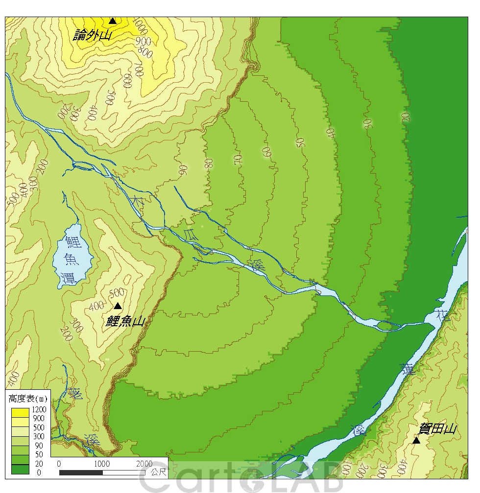
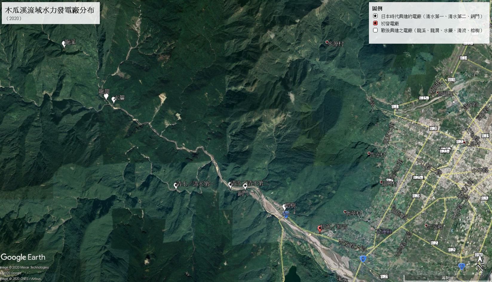
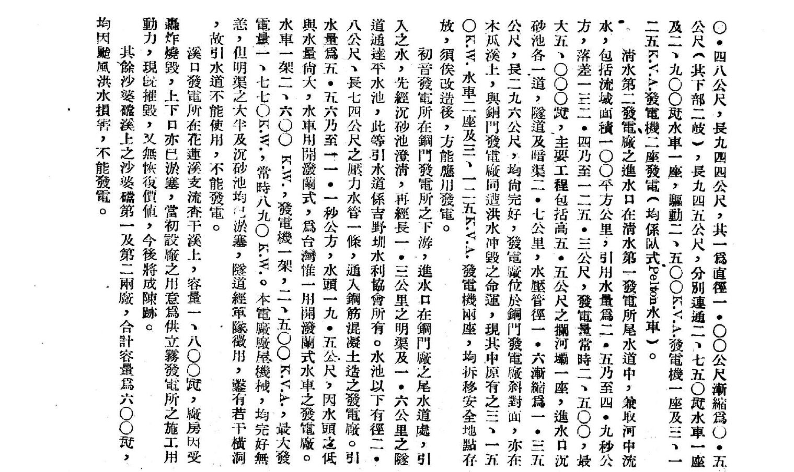

**大家好，這裡是CCT。**

**臺灣初音史終於進入到第三集了！**

這次我想改變一下排版。原本的排版是每一兩句就一行，行與行之間根據相關性給予一到兩行的空格來區分段落，每一行的字數都不會太多，看起來不那麼吃力；透過行與行之間的空格，更能釐清行與行之間的段落分別。直到我後來發現，原本的排版在手機上看的話，區分段落的空格全都會被吃掉，每一行之間都沒有區隔，難以分辨段落。所以把排版改成現在這樣子：不再每一到兩句就換行，而是寫完一整段再換行，如此的話，在手機上看也能看出明顯的段落分別。

言歸正傳，雖然我們在[臺灣初音史第一集]()就有稍微聊過，初音水力發電所始建於1938年，並於1941年完工投入使用，現在屬於臺灣電力公司東部發電廠，是在木瓜溪上8座水力發電廠的其中一座。初音電廠的正式名稱其實是「臺灣電力公司東部發電廠初英機組」，但因為本文焦點打算著重在日本時代，因此使用日本時代時所稱的「初音水力發電所」，並再以中文的習慣將其略稱為「初音發電廠」或「初音電廠」，並在行文中如此稱之。

> [!NOTE]
>
> 事實上，在戰後乃至近現代，臺電公司出版的文獻中在指涉日本時代與戰後初期時的這座電廠時，也常會稱其為「初音」電廠，或者將「初音」與「初英」並列；而民間出版物則兩者都具有相當比例，足見「初音」電廠之舊名與其現今之正式名稱同樣深植人心。
>

在這一次的臺灣初音史之中，我們想再深入探索這座有著美麗名字的水力發電廠，並著重探討它的興建背景。初音電廠利用木瓜溪上游各水力電廠發電的尾水來發電，彷彿為木瓜溪補上「尾刀」，充分利用木瓜溪的水力資源。其所在地海拔僅有約110公尺，看起來在這裡興建水力發電廠的效率好像並不高，因為水力發電廠的發電量與水位落差有著密切的關聯。那麼既然這樣，為什麼要在海拔如此低的地方蓋水力發電廠呢？初音發電廠是為了誰而興建？初音電廠之所以被興建，其歷史背景究竟為何？這些都是我們想探索的問題！

*（圖01） 現代的初英（初音）電廠。圖源：自行拍攝（2020-01-13）*

**初音水力發電廠的發電量**

目前木瓜溪流域總共有8座水力發電廠，從上游至下游分別是龍溪、龍澗、水簾、清水、清流、銅門、榕樹和初音，其中清水、銅門和初音於日本時代完工啟用，其餘五座都是戰後啟用[^1]，而初音至今也是整個木瓜溪流域，位處最下游的水力發電廠；事實上，初音電廠就位於木瓜溪沖積扇的扇頂，而我們知道沖積扇是一條河進入下游時會形成的地貌。因此初音水力發電廠幾乎是在木瓜溪的下游。

*（圖02）[^2] 木瓜溪沖積扇。圖源：國立臺灣大學地理環境資源學系地圖與多媒體研究室，取自：* [*http://140.112.64.37/web2/archive.php?class=202*](https://ref.gamer.com.tw/redir.php?url=http%3A%2F%2F140.112.64.37%2Fweb2%2Farchive.php%3Fclass%3D202)

但其實光看上下游或海拔高度，就魯莽地斷定水力發電廠的發電量是遠遠不夠的。很不幸地，在初音電廠1941年完工啟用，直到太平洋戰爭結束，我們都沒辦法知道它的確切發電量，出於戰時情報考量，當時的文獻會將這些電廠的發電量打上馬賽克，因此我們無法知悉這些電廠當時的實際發電量。但我們還是可以透過戰後的文獻，比較「有效落差」、「流量」、「裝置容量」和「常時發電量」來窺知清水、銅門和初音三座位於日本時代啟用，且在木瓜溪流域的水力發電廠。

# **小巫見大巫**

| 電廠名稱 | 有效落差（m） | 流量（cms） | 裝置容量（kW） | 常時發電（kW） |
| :------: | ------------: | ----------: | -------------: | -------------: |
| 清水第一 |         410±7 | 1.745±0.495 |          7,000 |          4,000 |
| 清水第二 |   128.85±3.55 |     3.7±1.2 |          5,000 |          2,500 |
|   銅門   |           172 |  11.12±5.56 |         24,000 |   16,000±8,000 |
|   初音   |          19.5 |   8.33±2.77 |          1,770 |            890 |

*表01：[^3] 1947年清水、銅門與初音三座電廠之比較。資料來源：臺灣電力公司土木處（1947），《臺灣之水利資源》，臺北市：臺灣電力公司土木處，頁21*

> [!NOTE]
>
> 戰後留下的清水為第一發電廠，第二發電廠則在戰後廢棄不用，後來在清水第二發電廠的位置重建為清流發電廠
>

其中流量單位cms意味著每秒流過多少立方公尺的水量。有效落差則是指[^4]：

> 發電進水口水位與尾水出口水位間，其水位差即為水頭落差。發電用水流過之處，如進水口、水路、壓力鋼管、尾水路等，會產生水頭的損失，將此水頭損失減去後，即為用來發電的有效水頭落差。

*（許如林、陳敏村，2005：5）*

從表中可以看出，無論是有效落差、裝置容量和常時發電量，初音發電廠都是當時木瓜溪最低的；唯獨流量僅次於銅門電廠。而發電機的實際出力P又有以下公式[^4]：

$$
P = 9.8ηQH
$$

> [!NOTE]
>
> 其中$η$代表發電機與水輪機效率的乘積、$Q$為流量（cms）、$H$為落差（m）
>

在不考慮各廠發電機與水輪機效率乘積的情況下，我們根據流量與落差比較四間發電廠的水輪機理論出力（$9.8QH$，單位kW）：

* 清水第一：7,011.410
* 清水第二：4,672.101
* 銅門：　　18,743.872
* 初音：　　1,592.863

初音電廠僅有1,500多kW，遠低於表中其他電廠。從上述可以得知，初音電廠在日本時代木瓜溪各電廠之中，發電量應該是最低的，因為它的理論出力遠低於當時其他在木瓜溪的電廠；就算在2008年，初音電廠的有效落差不變，流量大增為15.75 cms，理論出力也大增至3,009.825 kW的情況下，仍比當年的清水、銅門還低：初音與清水和銅門相比，是小巫見大巫。

*（圖03） 木瓜溪流域水力發電廠分布（2020）。圖源：自行以Google Earth繪製*。

# **特殊的初音電廠**

如此低的水位與落差，水輪機還有辦法有效工作嗎？其實初音電廠的特色就之一在於它的水輪機。臺灣的水力發電廠，水輪機主要分成三種：Pelton（佩爾頓）式、Francis（法蘭西斯）式和Kaplan（卡布蘭）式，關於這三種水輪機的區別，可以參考YouTube工程科普頻道Learn Engineering給出的解釋。：[三種水輪機的比較](https://www.youtube.com/watch?v=k0BLOKEZ3KU)及[卡布蘭式水輪機的工作原理](https://www.youtube.com/watch?v=0p03UTgpnDU)。

概括來說三者大約有以下區別：

* Pelton式：高海拔落差、低流量。水流方向與葉片旋轉方向多是呈切線。
* Francis式：中等海拔落差與流量，因為運作條件海拔與流量的容許範圍較大，所以最常被使用。水流方向與葉片旋轉方向是垂直與切線的混合。
* Kaplan式：低海拔落差、高流量。水流方向與葉片旋轉方向多是垂直的。

猜猜初音電廠使用的是哪一種？Kaplan式水輪機！為了使得低海拔的初音電廠能更有效地工作，初音電廠採用三菱製的Kaplan式水輪機：卡布蘭機常用於低水位[^5-1] 。至於為什麼說是特色呢？是因為在戰後接收時（精確來說是1947），初音水力發電廠是全臺灣唯一使用Kaplan式水輪機的水力發電廠[^3] ！而在當時與現在的臺灣乃至於世界範圍內，Francis式都備受喜愛，因為它能適應的落差與流量範圍都較廣，Kaplan式則相對受到地形侷限，但也正因如此，就算海拔較低，水力發電廠也是可以有不錯的發電效率。

> [!NOTE]
>
> 當然經過了好幾十年，現在的初音電廠已經不是臺灣唯一使用Kaplan式水輪機的發電廠了，初音電廠上游不遠處的，在戰後開始發電的榕樹電廠也是使用Kaplan式水輪機。
>

另外，前面說到初音電廠用三菱製的Kaplan式水輪機，只要談到臺灣在日本時代的經濟史，想要不談到當時日本的幾大財閥都很困難，而三菱正是掌控著當時臺灣經濟各方各面的資本巨人之一。大家先記住三菱這個響亮的名字，我們後面會再談到這個巨大的財閥。

*（圖04）[^15] Kaplan式水輪機（圖中之水輪機非初音電廠所使用）。圖源：（無須授權，CC0）[Wikipedia](https://en.wikipedia.org/wiki/Kaplan_turbine#/media/File:Kaplan_Turbine.JPG)*

# **初音電廠：戰爭需求下的產物**

說了這麼多，這跟我們最初提到的問題：初音電廠為誰興建、為何興建，看似沒有半點皮毛關聯。但其實從水輪機與初音電廠的建造位置就可以窺探出一點歷史的痕跡。

## **工業臺灣，農業南洋**

1919年巴黎和會之後，日本作為第一次大戰戰勝國，取得了南洋託管地，範圍相當於今天的美屬北馬里亞納群島以及另外三個獨立國家：帛琉、密克羅尼西亞聯邦和馬紹爾群島。日本在南洋設置了南洋廳，在南洋興發株式會社創立後，於南洋廳管內開發各類自然資源，1930年代後更加緊腳步，創立南洋拓殖株式會社，制定南洋開發十年計劃，在北馬里亞納的塞班島（Saipan）、天寧島（Tinian）和羅塔島（Rota）大力推展製糖業，在帛琉的安瓜爾島（Angaur）開採磷礦等；並且在當時由日本關東軍部控制的滿洲（今日的中國東北），以南滿洲鐵道株式會社為中介，開發滿洲豐富的自然資源；在當時屬於日本的樺太島（庫頁島，今日為俄國的薩哈林）北緯50度以南，開發木材與礦業資源。與此同時，日本治下的諸「外地」（南樺太、朝鮮、南洋和臺灣，另外當時部分文獻將北海道也視為外地），在開發自然資源的同時，也加緊了工業化的腳步，其中就包括臺灣。

而促成這些轉變的原因，不外乎中日關係的日益緊張。1937年07月07日盧溝橋事變爆發，中日兩國進入事實上的全面戰爭狀態*（但在法理上兩國還尚未對對方宣戰，正式宣戰是4年後的事了）*。為此，日本在臺灣加速開展資源開發與工業化的措施，並且統制了包括電力在內的大部分資源，以支應戰爭需要。

初音水力發電廠正是在這樣的時空背景下誕生的。當然同時還建造了許多發電廠，初音電廠只不過是其中一座小電廠。儘管如此，初音電廠被稱為「東臺灣電力興業的印鈔機」[^6] 可不是浪得虛名。

（圖05） 初音電廠旁的水圳。圖源：自行拍攝（2020-01-13）

## **三菱不只有汽車──它什麼都能參一腳**

與戰後發電廠幾乎都為國營臺電公司所經營不同，在日本時代，許多發電廠都是民營電廠，初音電廠便是由「東臺灣電力興業」所經營。與其他民營電力公司不同的是，東臺灣電力興業的後臺可是出了名的硬。

> 為了確立本島的電力政策，以及促進開發電力來源，使得在東臺灣的新電力會社被設立……該社以有效且快速開發東部豐富的水力資源為基礎，將內外地特別是南方的資源為原料的臺灣工業化為目標，不斷調整與分配自家發電與經營發送電事業。

*（林佛樹，1939：161）*[^7]

> （*東臺灣電力興業的*）主要股東為在當地有事業計畫的日本鋁業、東邦金屬製鍊、東洋電化工業、新興窒素工業、鹽水港木漿五社，對參加股東分配電力基於實費主義給予低價特權供應電力。

*（屋部仲榮，1941：56）*[^8]

可以看到「東臺灣電力興業」是配合政府開發東部電力與水力資源，用來加工從南方輸入的工業原料：以日本鋁業為例，主要是使用產自荷屬東印度（今天的印尼）民丹島（Bintan）的鋁土礦為原料來生產鋁。那麼股東又是何方神聖呢？東邦金屬製鍊屬於古河財閥，古河財閥是當時日本重要的軍需工業經營者[^9] ；日本鋁業[^10] 和鹽水港木漿[^11] 都屬於三菱財閥，而三菱財閥屬於當時日本的四大財閥之一[^12] ，因此，當時初音發電所背後的大老闆是四大財閥之一的三菱財閥！這後臺在當時的臺灣，應該只有三井財閥才惹得起。

雖然現在的三菱集團和當時的三菱財閥有些不同──現代的三菱集團是戰後財閥解體形成的，比當初要縮減不少。但就連現在，三菱也是龐大的企業體，更甭說當時了。而東臺灣電力興業的主要推動者：日本鋁業（日本アルミニウム）便是三菱集團的一員。初音電廠的水輪機用的是三菱的產品，正因為初音電廠曾經是自己三菱財閥下投資興建的發電廠，就連到了今天，初音電廠不再與三菱集團相關，初音電廠仍然使用三菱水輪機。

當然三菱等其他當時日本的大財閥，在臺灣的經濟影響可不只有這樣，例如1935年當時臺灣十分發達的製糖業，當時有幾大製糖會社：**大日本製糖**、**臺灣製糖**、**明治製糖**、**鹽水港製糖**、帝國製糖、昭和製糖、新興製糖、新高製糖和臺東製糖等等，其中前四者粗體字部分被稱為四大會社，存續至戰後，其他會社都在稍後被兼併。這四大會社其中兩家：明治與鹽水港都屬於三菱財閥！此外，臺灣製糖屬於三井財閥，也掌控島內大小經濟命脈；大日本與新高屬於日糖（藤山集團），由藤山雷太與其子藤山愛一郎經營。在戰後接收時，日糖的規模遠大於明治與鹽水港，並稍大於臺灣製糖。更重要的是，當時各大糖業公司透過經營糖業鐵路營業線，在陸運尚不發達的年代，掌控許多臺灣地方交通命脈，而聚落的經濟聯繫又得靠交通，因此這些財閥在當時對臺灣經濟的影響力可見一斑。

# **初音電廠是發電界的「速成延長主義」？**

臺灣鐵道之父長谷川謹介在興建臺灣縱貫鐵道時，採用了「速成延長主義」的原則興建[^14] ，不像美國大西部鐵路慢慢從東往西開進，臺鐵縱貫線是分段同時開工。其原則為「快速」及「便宜」，越快越好、越節省越好。期望用最少的預算，在最快的時間內完工通車。迫切需要電力的日鋁和迫切需要電廠的東臺灣電力，在當時的開發與此有異曲同工之妙嗎？

由於製鋁要消耗大量的電力，鋁又是戰爭的重要資源，因此如何在短時間內提供大量、穩定且便宜的電力便是當時日本政府的主要考量。誠如前述，日本政府注意到臺灣東部有豐富的水力資源（林佛樹，1939：161），民生用電量又比西部還要少，在該地設置軍需工業基地就是再好不過的選擇了。

> （*東臺灣電力*）對東部電力的第一次開發計畫選在木瓜溪……而從（*盧溝橋*）事變以來由於資金與物資的統制強化，只有第一次計畫部分完成，也就是木瓜溪的第一次和第二次發電計畫。日本鋁業為了供給自身鋁業的第一期生產所需的電力，以自社資本開展了工程，完工後一切設備亦由該社出資。當中初音與清水第二兩座發電所業已完成，另銅門發電所預計在今（*1942*）秋竣工。

*（金融之世界社，1942：45）*[^13]

我們可以看到，初音發電廠本身是東臺灣電力開發計畫的一部份，也是日本鋁業對於生產鋁的電力需求而生的產物。在此前木瓜溪還沒有水力發電所，但為了軍需考量，一口氣在木瓜溪興建了四座電廠：

| 電廠名稱 |    始建時間    |  商轉開始時間  | 興建時程（月） |
| :------: | :------------: | :------------: | :------------: |
| 清水第一 |   1936年10月   |   1941年10月   |       60       |
| 清水第二 |   1938年09月   |   1941年10月   |       37       |
|   銅門   |   1939年11月   |   1943年04月   |       41       |
| **初音** | **1938年09月** | **1941年02月** |     **29**     |

*表02：[^5-2] 日本時代後期木瓜溪各水力發電廠的始建時間和商轉開始時間*

雖然在前面我們知道，初音電廠的發電量為四者最低，但我們可以從表中看到，初音電廠的興建時程比其他三間電廠都要快：僅用了不到2年半就完成，甚至快過早2年開始興建的清水第一發電廠。可惜的是，我們不知道當時這四所發電廠的建造預算和實際花費，否則更能解釋初音電廠是否類似於速成延長主義。儘管如此，我們從時間上就能推測出初音電廠的功用：先求有再求多，先快點建好電廠，趕快發電製鋁，隨著其他電廠的完工，再慢慢增加產量。

另外也因為在完工當時，其他東臺灣電力興業的水力發電廠都尚未完工，但初音電廠拔得頭籌打了先鋒，開始從木瓜溪源源不斷地發電，幫助日本鋁業快速產鋁，也幫助東臺灣電力賺到事業第一桶金，也難怪在完工當時會被叫做「印鈔機」了。

其實同時期，日本鋁業還投資了一座與初音電廠相似的電廠，是位於壽豐溪的溪口電廠，它始建於1938年03月，完工於1941年04月，耗時37個月。溪口電廠與初音電廠一樣，是在河川的下游，理論與常時發電量也與當時的初音電廠相去不遠，完竣後也同樣是由東臺灣電力興業經營，但溪口電廠的施工時程卻比初音電廠要長，其原因仍然不明朗。但由此可窺出初音電廠的興建速度是相對快速的，提早幫助日鋁生產需求日益提高的鋁。而這一切的開端，則是日本不斷對外用兵的戰爭需求，所以若說初音電廠是戰爭下的一件產物，也不太奇怪了。只不過它剛好在初音小字，才被冠上初音之名，被我們在本文中聚焦。

*（圖06）[^3] 戰後初期的初音電廠因為沉砂池淤塞，無法工作，至1949年修復啟用。圖源：臺灣電力公司土木處（1947），《臺灣之水利資源》，臺北市：臺灣電力公司土木處，頁21*

# **結論**

綜上所述，初音電廠之所以興建，是因為中日關係逐漸緊張，尤其是盧溝橋事變爆發之後日本日益提高的輕金屬需求，導致三菱集團的日鋁必須提高產量以支應戰爭，在發現臺灣東部還有豐富的水力資源，可以迅速提供產鋁所需要的大量、穩定且便宜的電力之後，聯合了許多股東創立東臺灣興業株式會社，並且在三菱的出資下，在木瓜溪等流域建設了許多水力發電廠。其中的初音發電廠，我們認為是由於工業對電力之需求日益緊迫，所產生的速成結果：雖然它的發電量較低，但因為可以比較快投入使用，所以大力投資建造初音電廠，也並不是全無理由。

至於之所以在海拔低處，個人推測或許是成本與速度的考量，但礙於尚未找到當時工程的興建費用；用戰後電廠來比較時，也需要針對工程類物價指數的近一步研究，才能夠直接比較。因為個人研究不夠透徹，導致這些限制仍無法突破，因此仍需要更多證據支持。

初音電廠之所以蓋得快，與它位於海拔低處有多強的關聯？初音電廠與溪口電廠在建設過程之中有著什麼差異，造成它們施工時程相差8個月之久？另外，當初日鋁的工廠究竟設立在今日花蓮的哪裡呢？還找得到痕跡嗎？這些新問題，正等待著我們繼續探索。

**CCT**

**2020年06月05日**

# **參考資料**

[^1]: 劉智淵（2008），〈後山電力博物館　獨具風格的東部發電廠〉。臺電月刊，第551期（2008年11月），頁16

[^2]: 國立臺灣大學地理環境資源學系地圖與多媒體研究室，取自： [http://140.112.64.37/web2/archive.php?class=202](https://ref.gamer.com.tw/redir.php?url=http%3A%2F%2F140.112.64.37%2Fweb2%2Farchive.php%3Fclass%3D202)

[^3]: 臺灣電力公司土木處（1947），《臺灣之水利資源》，臺北市：臺灣電力公司土木處，頁21

[^4]: 許如林、陳敏村（2005），《水力發電》，臺北市：中興工程科技研究發展基金會，頁5

[^5-1]: 李瑞宗（2019），《後山電火：東部水力發電》，臺北市：臺灣電力股份有限公司，頁105

[^5-2]: 同上，頁246

[^6]: 林炳炎（1997），《臺灣電力株式會社發展史》，臺北：三民書局，頁49

[^7]: 林佛樹（1939），《戰時下の台灣經濟　[昭和十四年版]》，臺北市：臺灣經濟通信社，頁161

[^8]: 屋部仲榮（1941），《[昭和十六年版]躍進臺灣の全貌》，出版地不詳：金融之世界社，頁56

[^9]: 栂井義雄（1937），《戦争・財閥・軍需工業》，東京：東洋経済新報社　頁95

[^10]: 小島精一（1941），《三菱財閥論》，東京：世界経済情報社

[^11]: 大園市藏（1942），《臺灣人事態勢と事業界》，臺北市：新時代社臺灣支社，頁29

[^12]: 三宮維信（1935），《日本財閥の実質を語る. 後巻》，東京：日満経済調査局　頁294、295

[^13]: 金融之世界社（1942），《台湾産業金融事情. 昭和17年版 産業・会社篇》，東京：金融之世界社，頁45

[^14]: 蔡龍保（2005），〈長谷川謹介與日治時期臺灣鐵路的發展〉，《國史館學術集刊》第六期，頁82

[^15]: （CC0）Wikipedia，取自：[https://en.wikipedia.org/wiki/Kaplan\_turbine#](https://en.wikipedia.org/wiki/Kaplan\_turbine#)

---

> **原文出處**
>
> 本文最初發布於 **2020-06-05**，
> 原 Facebook 初始發文時間及連結已不可考，巴哈姆特為備份。
>
> 原文連結如下，本站版本僅針對排版進行改善及更正錯別字，未改動內文：
>
> - Facebook 未來群像：（佚失）
> - 巴哈姆特（備份）：https://home.gamer.com.tw/artwork.php?sn=5978504
