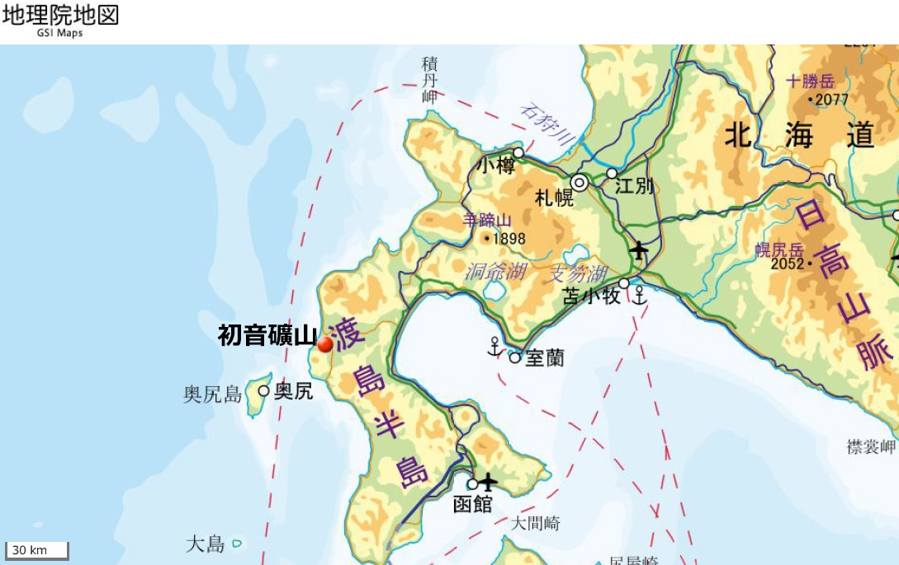
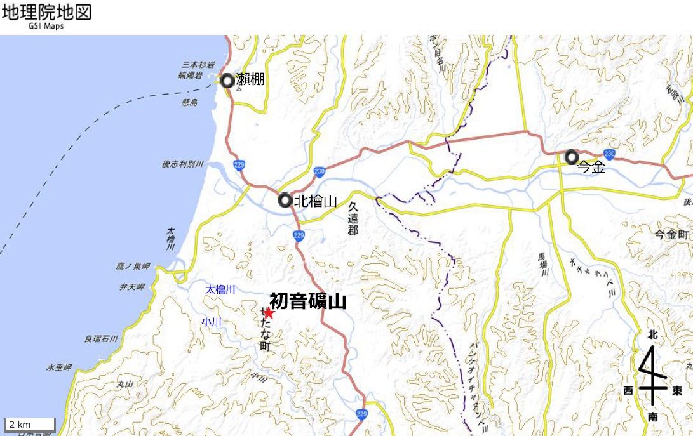
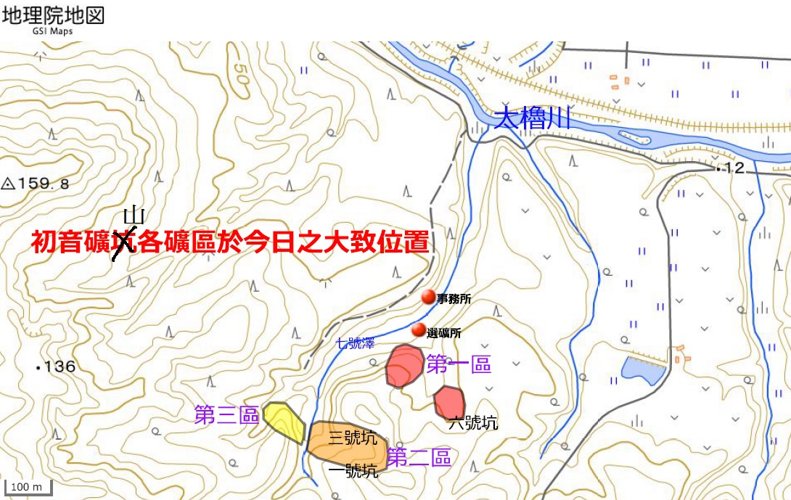
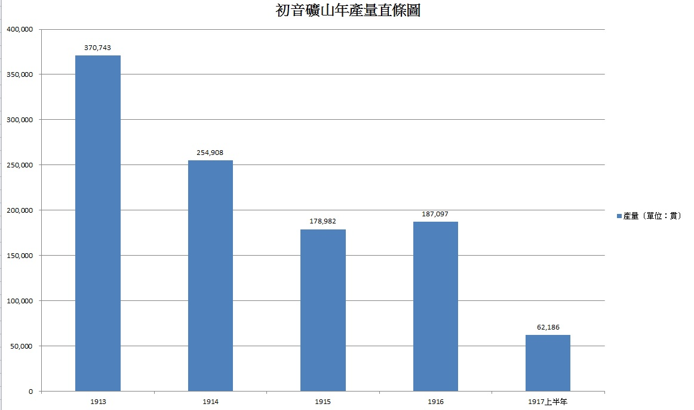

> [!NOTE]
>
> 原副標題：【臺灣初音史・番外篇①】。此處將本文自臺灣初音史系列移轉至初音地名系列以符合文章主旨。

大家好，我是因為碩論修羅纏身，久未登場，早已被遺忘的CCT。

臺灣初音史經過了前兩集，在這段期間富堅了一陣子，其實不是因為沒有題材，Ⅲ的題材早就想好了，而且還特地去考察了一下，只差文字、排版跟主軸如何規劃，這些還沒想好，純粹只是因為現在真的太沒時間了。

不過最近幾天或許能輕鬆一下（因為進度暫時超前w），正好在網路上挖到寶，也就是今天要介紹的內容，所以借用本系列，岔出一個番外篇來講位於北海道的初音礦山。

# **探索「初音」**

在日本，不乏為了尋找各地的「初音」而奔走的人，例如網友H.Hiro *（@h\_hiro\_）*，就在其個人網站刊登了「全國初音地名之旅」就在其個人網站刊登了「[全國初音地名之旅](http://tinyurl.com/hatsune)」，收集一些日本的初音地名。並且在網站中還給出了另外三人的類似網站，時隔十數年，仍然有兩條連結可以訪問。另一位叫做木村的網友更[收集了全日本約715處](http://home.m01.itscom.net/mixroom/page002.html)，與Vocaloid角色相關的地名、店名甚至是物件。

顯然，上述這些探索大多是基於「現今」的地標，以旅遊導向的方式進行探索，這些大多是現今可見的設施，若是現今不可見，則大多也有紀念碑等明顯之線索，除了少數像是位於日本神奈川縣川崎市多摩區已不存在的「初音ヶ丘」，比較屬於在歷史，回溯時間軸來尋找初音。而今天已不存，早已被人遺忘的「初音礦山」，包含上述網友，目前所見之探索者均仍未提及該處地標。有鑑於此，便賦予我們探索初音礦山的主要動機，究竟它在哪裡呢？它現在如何？它的來龍去脈又是如何？

# **初音礦山在哪裡？**

日本從明治末期到大正年間（約1900–1925），曾經針對尤其是北海道地區的各個礦山與礦區，做了詳細的調查報告。其中關於初音礦山，是在1918年出版之《鉱物調査報告・第26號》所見。文獻紀載，初音礦山是個主要出產錳礦的礦山，位於「後志國太櫓郡太櫓村字七號澤」，這些地名在今天幾乎已經不可見（大概只剩下附近的太櫓川），在地圖上搜尋七號澤，也是找不到東西的。

對比了一下地圖，發現這個位置隸屬於今日的北海道檜山振興局久遠郡せたな町（瀨棚町），透過文獻中所附錄之地圖，疊上今日之地圖，對比河川、等高線等訊息，加上文獻中所介紹的交通方式及距離，我們能夠確定初音礦山的位置。

幸虧日本的國土地理院幸虧日本的國土地理院所提供之[線上製圖功能](https://maps.gsi.go.jp)，儼然是簡易版的線上GIS軟體，並且大範圍底圖是地形圖，小範圍是等高線圖，貼心的設計也正好符合我們的需求。所以我們能夠輕而易舉地呈現。

*圖01–03：初音礦山位置。地圖來源：作者自行以國土地理院地圖繪製*

其中圖03所呈現的是各礦區的概略範圍，以及各坑道分別位於哪個礦區。值得注意的是，由於經過了100多年，當地的地形地貌已經發生了極大的變化，對照等高線時，有許多處之形狀與凹凸等均已經對不上，主要只能靠著七號澤的大致走向來定位（因為大致形狀還保留原貌），因此除了再強調這些位置僅是概略之外，也對這些礦區的保存現況感到不安，不知道會不會早已經埋入深深的泥土中。其中主要礦坑道路分布於第二區，地圖上未標註的二號坑也位於第二區，推測是這些礦區中主要之組成部分。

比起這些，大家可能更關心的是現況，很可惜，在地圖上看這附近，除了農地和產業道路以外，幾乎看不到什麼開發的跡象，自然也就沒有街景等線索。這個地方也是默默無聞，許多人根本壓根沒聽過，所以想要瞭解現況的話，或許也只能找機會親自前往，說不定還能發現坑道遺跡之類的東西呢。

# **初音礦山為什麼如此默默無聞？**

誠如前述，連四面八方、古往今來、臥虎藏龍的各同好，目前所見都沒有紀載有關初音礦山的任何資訊。那麼到底為什麼初音礦山這麼默默無聞？以至於當地連個紀念牌都沒有？

根據《鉱物調査報告・第26號》（1918）第9頁紀載，初音礦山的嚆矢始於當地之農夫濱田定次郎發現，並且在1912年（大正元年）由函館人原文次郎開坑。隔年的1913年，由函館的霍爾（ハウル）社繼承，其後轉手予函館人片谷永藏；1915年再轉手予岩手縣釜石製鐵所的橫山久太郎，並且持續至調查報告之出版年1918年。另外在文獻中同時紀載（頁9、22、23），

> 本礦山在後志國（*在當時*）是較有名的錳礦礦山，但目前（*1918年*）正在走向衰退。

> 本礦山礦床多已挖掘殆盡，若今後要如同目前，向其走向或傾斜處沿著礦石殘留的部分探礦一樣，就必須在第一區或第二區之適當處往下試掘，以期發現第二層錳礦床。

*圖04：初音礦山錳礦產量情形，其中一貫＝3.75公斤。可窺出其衰退情形。資料來源：農商務省（1918），《鉱物調査報告・第26號　（後志國太櫓郡及び久遠郡鑛物調査報文）》，頁10*

從文獻中可以推測，現（1918）已探明之錳礦幾乎已經採掘殆盡，如果要繼續生產，就勢必賭它一把，看看下方還有沒有第二層錳礦床。但是會這樣提並非沒有原因，文獻中特別提到是因為不久前，在瀨棚郡利別村目津府的一座錳礦山，就在向下試掘的過程中，發現了第二層錳礦床。那麼初音礦山課這一單，是否歐氣爆發，真的發現第二層礦床呢？

前面我們提到，1915年初音礦山轉讓予釜石製鐵所（釜石位於岩手縣）的橫山久太郎，橫山久太郎出生於1856年，現今之靜岡縣，1886年，經歷了大風大浪後，釜石礦山田中製鐵所成立，之所以謂之田中，乃因橫山受雇於靜岡人田中長兵衛之下。大家先記著「田中長兵衛」這個名字，過不久我們會再提到。

田中於1901年逝世後，由其子安太郎（又被稱為田中長兵衛二代目）接手，1917年釜石製鐵所改組為「田中製鐵株式會社」，這間會社與另一間位於東京，由田中平八經營之「田中礦業株式會社」並不同。1922年橫山逝世，1924年安太郎也隨之過世，由其子長一郎接手，其會社也在1924年改稱釜石礦山株式會社（佐藤正義，1938；阿久津寿太郎，1943）。我們從1924年《日本鉱業名鑑：内地》（內地乃指日本本土）中可以發現，「釜石礦山株式會社」之取締役確實為田中長一郎，因此可以確定本會社是當初取得初音礦山之會社。但是在其所下轄的礦山當中，找不到初音礦山，甚至他們在北海道已經沒有礦山了，且初音礦山同樣未見於《北海道鉱業誌》（1924）。因此基本能夠斷定，初音礦山是在1917年至1924年之間關閉停產，至此能夠推測，當初就算挖到第二層礦床，產量也不足以幫助初音礦山撐過下一個八年。戰後，釜石製鐵出版了《釜石製鉄所七十年史》（1955），本書詳細記載該會社70年以來之歷史，可惜該書仍於版權保護範圍，且臺灣沒有藏書，因此現在仍然無法窺知其內容。

綜上所述，初音礦山於1912年開坑，不到1924年即關閉，時間短促，加上年代久遠，也難怪它今天會這麼默默無聞了。

# **初音礦山與臺灣的金瓜石**

這座位於北海道的初音礦山，居然跟位於臺灣的金瓜石有某種奇妙的聯繫嗎？很顯然，金瓜石是產金，初音礦山是產錳，乍看之下好像沒什麼關聯。但是這就與我們接下來要說的歷史有關。

在《日本鉱業名鑑：内地》（1924）之中，同時紀載著各個主要礦業會社有哪些礦山。其中釜石製鐵在此時除了擁有日本本土的8座礦山之外，也擁有位於臺灣的金瓜石。原來金瓜石就是當初田中長兵衛取得的，而田中長兵衛就是當初雇用橫山久太郎（曾擁有初音礦山）的人。1897年，在日本領臺後兩年，田中長兵衛取得了金瓜石的採煤權，在次年又取得了金瓜石的金礦採掘許可，而金瓜石的隸屬又至少到1924年，都還是田中釜石製鐵所所轄。也就是說，從初音礦山歸屬於橫山的1915年以來，直到初音礦山停閉的這段時間，初音礦山與金瓜石曾同時是同一間會社下的礦山！

# **結論**

這次的鍵盤探索，我們讓臺灣的礦業史與初音又建立了某種奇妙的聯繫，這座礦山只活了最多12年，加上距離關閉也已經時隔將近一百年，如此短命的開採史，以致於現今連在日本，都不太有人知道它的身世。或許很難親自去看看它現在長什麼樣子，但我們還能繼續拓展時間軸和空間軸，尋找更多初音。

**CCT**

**2020年05月03日**

# **參考資料**

## 出版品

- 農商務省（1918），《鉱物調査報告・第26號　（後志國太櫓郡及び久遠郡鑛物調査報文）》，東京市：東陽堂

- 小笠原栄治（1924），《北海道鉱業誌》，札幌市：北海道石炭鉱業会

- 高橋美章（1924），《日本鉱業名鑑：内地》，東京市：鉱山懇話会

- 佐藤正義（1938），《日本製鉄株式会社事業概要 [昭和13年]》，東京市：日本製鉄株式会社

- 阿久津寿太郎（1943），《横山久太郎翁伝》，釜石市：釜石製鉄所産業報国真道会

## 檔案

- 「田中長兵衛金礦中石炭採掘許可」（1897年11月16日），〈明治三十年乙種永久保存第四十一卷〉，《臺灣總督府檔案》，國史館臺灣文獻館，典藏號：00000185002

- 「礦第二號田中長兵衛金礦採掘許可、同上礦區訂正許可」（1898年10月24日），〈明治三十一年乙種永久保存第三十七卷〉，《臺灣總督府檔案》，國史館臺灣文獻館，典藏號：00000296018

## 網路資料

- [国土地理院・地理院地図](https://maps.gsi.go.jp)
- 「[全国『初音』地名の旅](http://tinyurl.com/hatsune)」
- 「[全国の『初音』を探せ](http://home.m01.itscom.net/mixroom/page002.html)」

---

> **原文出處**
>
> 本文最初發布於 **2020-05-03**，
> 原 Facebook 初始發文時間及連結已不可考，巴哈姆特為備份。
>
> 原文連結如下，本站版本僅針對排版進行改善及更正錯別字，未改動內文：
>
> - Facebook 未來群像：（佚失）
> - 巴哈姆特（備份）：https://home.gamer.com.tw/artwork.php?sn=5981004
