> [!NOTE]
>
> 原副標題：【臺灣初音史・番外篇②】。此處將本文自臺灣初音史系列移轉至初音地名系列以符合文章主旨。

大家好，這裡是CCT。

因為個人因素，有一陣子沒有浮上來了。

最近同樣是在尋找文獻的過程中，發現除了臺灣以外，在當初的日本殖民地，也就是「外地」，也散佈著一些初音地名。當初在「臺灣初音史Ⅰ」，探索臺灣的初音地名的時候，就已經在思考如何把其他地方的初音町也找出來，並且也在「臺灣初音史・番外篇①」時討論過，日本已有不少人建立網站，紀錄日本各地的初音地名分布。因此我們可以知道日本本土與臺灣的「初音町」分布，但是對於其他曾經被日本統治過的「外地」，也就是朝鮮、樺太、關東州和南洋等地，是否也留有初音町仍是一無所知。那麼這些地方是否也有初音町呢？

儘管探索的想法已久，但拖到現在，終於是可以拿出來跟大家見面了：我偶然找到一本出版於大正11（1923）年出版的書（如圖01），裡面記載著日本各地包含外地的町丁讀法。在本書之中我發現除了以前談過的臺灣，在朝鮮（今天的南北韓）、樺太（今天的庫頁島北緯50度以南）和關東州（今日屬於中國遼寧省大連市之南端部分，即遼東半島南部）的部分市街，確實都散佈著若干的初音町！

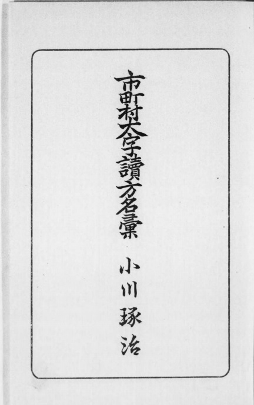

*（圖01）《市町村大字讀方名彙》封面。圖源：（小川琢治，1923）。*

在討論這些初音町究竟都在哪裡之前，我們先來說說日本帝國的殖民地都是怎麼來的。在臺灣的朋友應該不陌生，臺灣是根據1895年《馬關條約》割讓予日本，成為日本第一塊殖民地；但其實在此前，日本就已經透過各種方式取得兩條島鏈：琉球群島以及千島群島。1870年代日本透過兩次琉球處分，將**原本獨立的琉球國**編入內地；千島群島的取得過程則分為兩階段，1855年日俄兩國簽訂《日俄和親通好條約》，確認千島群島擇捉島（含）以南為日本領土；並在1875年與沙俄簽訂《樺太・千島交換條約》，日本將樺太全島讓予俄國，而俄國將北千島群島也讓予日本，日本則將整個千島群島編入北海道根室支廳管轄。儘管今天千島群島已非日本實際控制，但在當時琉球群島和千島群島都是日本的內地。

[^原本獨立的琉球國]: 其實當時琉球國也不完全是獨立，除了是清朝的藩屬國以外，在1609年位於今日鹿兒島的薩摩藩入侵後，也變成薩摩藩的臣屬國；自此琉球王國向中日兩國進貢稱臣，持續了兩世紀有餘。
[^千島群島的現狀]: 雖然千島群島今日均由俄國實際控制，但日本主張擁有齒舞群島、色丹島、國後島、擇捉島，也就是北方四島（南千島群島）的主權。關於日俄兩國北方四島的主權爭議問題，在此不加贅述。

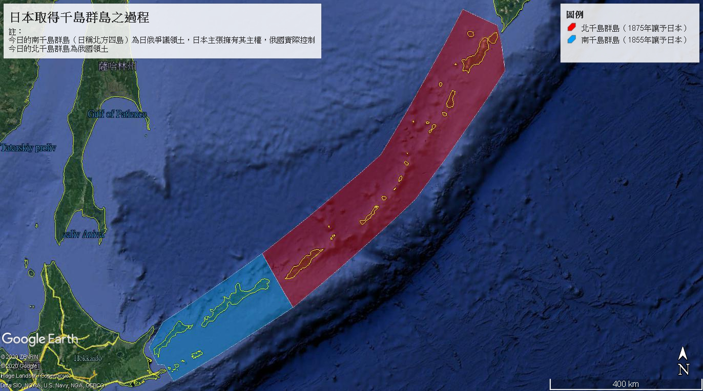

*（圖02）日本取得千島群島之過程。圖源：筆者自行繪製。*

# **日本「外地」簡史**

在九一八事變之前，日本掌控的「外地」有臺灣、朝鮮、樺太、關東州和南洋群島，以及當時位於中國境內的滿鐵附屬地和五個租界。

1895年的《馬關條約》除了割讓臺灣以外，清朝亦將遼東半島讓予日本，但經過俄、德、法三國干涉後，日本迫於壓力，同意讓清朝根據《遼南條約》贖回遼東半島；1898年俄國根據《旅大租地條約》租借了遼東半島，並建立了旅順軍港，隨後在1904年日俄戰爭，日本攻佔旅順口，俄國戰敗後根據1905年《樸茨茅斯條約》將遼東半島讓予日本，並且把東清鐵路寬城子（今中國吉林省長春市）以南的鐵路割讓予日本。日本至此取得遼東半島，成立關東廳（後來的關東州）；並且成立「南滿洲鐵道株式會社」（滿鐵），由日本政府持股50%，經營旅順、大連至長春的鐵路，並且在鐵路沿線、礦山、港灣、市街地等區域管轄所謂的「滿鐵附屬地」，滿鐵亦掌控附屬地內的行政與警察權。

[^滿鐵的持股比例]: 滿鐵發行股份無論如何增加，日本政府始終持股50%，例如1932年03月31日，滿鐵總共發行880萬股，共4億4千萬圓（一股50圓），其中日本政府持有440萬股，共2億2千萬圓；1939年03月31日，1,600萬股之中，日本政府持有800萬股；1944年03月31日，總共發行2,800萬股，日本政府持有1,400萬股。以上僅舉數例；顯示其為日本之國有企業。參見：南滿洲鐵道株式會社（1932）《滿鐵要覧》，頁56；（1940）《營業一斑－昭和14年版》，頁40；（1944）《第四十三回事業報告書》，頁1。

前述1905年《樸茨茅斯條約》，俄國除了割讓遼東半島以外，亦將樺太（即庫頁島，今日屬俄羅斯的薩哈林）南部讓予日本，兩國以北緯50度線為分界，以北屬於俄羅斯帝國，以南屬於大日本帝國。日本取得樺太（又稱南樺太），成立「樺太廳」管轄。

日本取得朝鮮的過程亦從甲午戰爭開始，甲午戰爭後日本即在朝鮮駐軍，朝鮮成為日俄兩國的角力戰場；但在日俄戰爭後俄國勢力退出，而日本勢力深入朝鮮，透過1904、1905、1907年三次《日韓協約》以及1910年《日韓併合條約》，成立朝鮮總督府，朝鮮成為日本的「外地」。

1914年第一次世界大戰爆發，日本根據「日英同盟」對德意志帝國宣戰，攻佔了德國在東亞的領地，戰後的1919年巴黎和會之中，原德屬新幾內亞的赤道以北（今天的帛琉、馬紹爾群島、密克羅尼西亞聯邦以及美屬北馬里亞納群島）成為國際聯盟託管地，並委由日本統治，日本成立南洋廳，取得了南洋群島。

餘下五個租界不再贅述。我們至此可以描繪出當時大日本帝國的管轄範圍，以1925年為例：

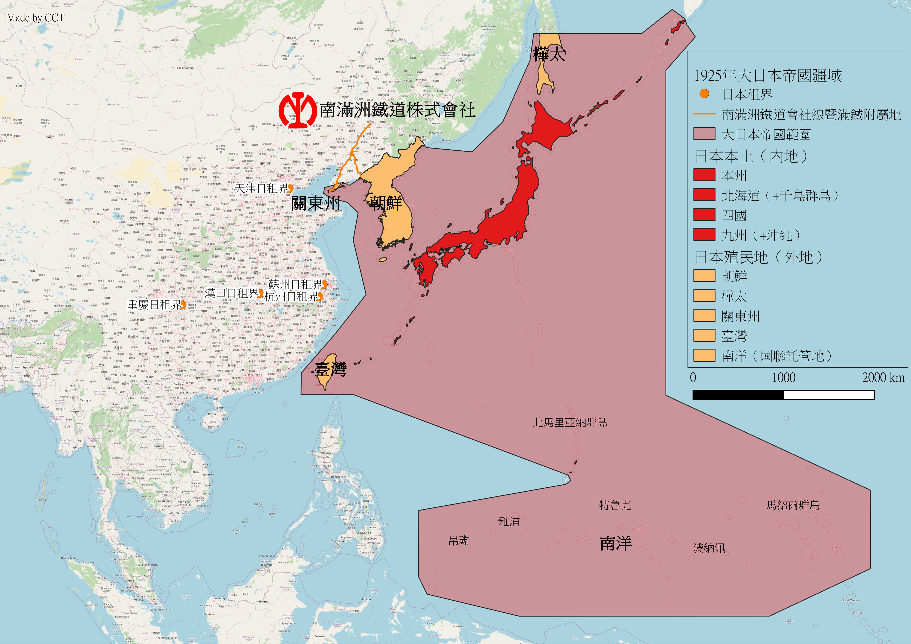

*（圖03）1925年大日本帝國領土範圍。圖源：筆者自行繪製。*

*註：淺紅圍出的海域並非領海等嚴格意義上統治下的海域，僅是概略標示出範圍，以方便囊括當時的南洋群島等散佈於海洋上的諸島。*

接著我們終於可以開始探索，在這些日本治下的外地，各地的「初音町」分別在哪裡呢？

# **朝鮮的「初音町」**

日本統治朝鮮之後，主要城市開始出現了日式地名，其中有兩處存在「初音町」，分別是位於中朝邊境的新義州（今日屬於北韓），以及朝鮮總督府的首府京城（今日的南韓首爾）。

## 京城（今南韓首爾）

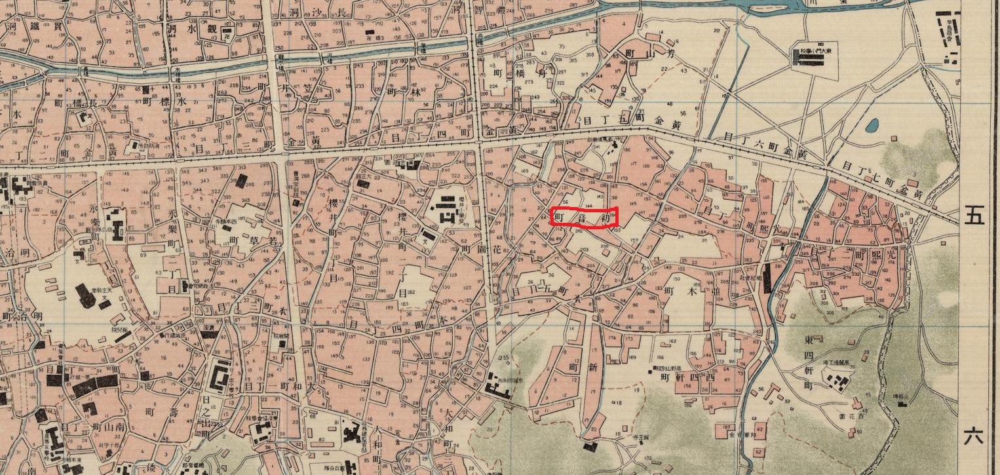

*（圖04）朝鮮總督府成立初期的京城市街一角。圖源：Korea, Seoul City, 1:7500. 1910. From Geography and Map Division, Library of Congress.*

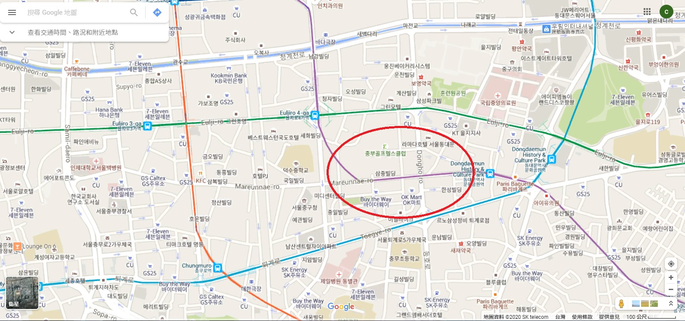

*（圖05）對照今日地圖。圖源：Google Map。*

當時的初音町在京城府市街的市中心，距離舊朝鮮王朝的王宮以及當時的朝鮮總督府廳舍僅有一公里餘之遙。今日位於韓國首爾特別市中區光熙洞五壯洞*（오장동，Ojang-dong）*，也就是青瓦臺東側約一公里餘，今天是人口逾2,000萬人的首爾都會區的中心部，高樓林立，交通發達。

## 新義州（今北韓新義州）

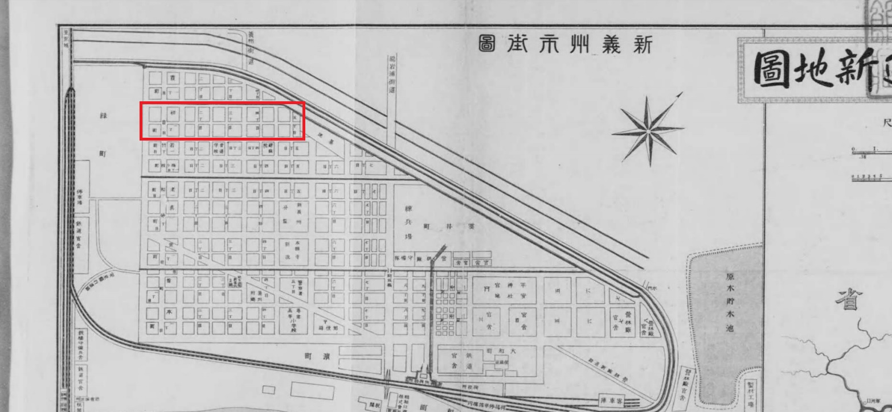

*（圖06）新義州市街圖中的初音町（右上為北）。圖源：（炭谷傳次郎，1916）*

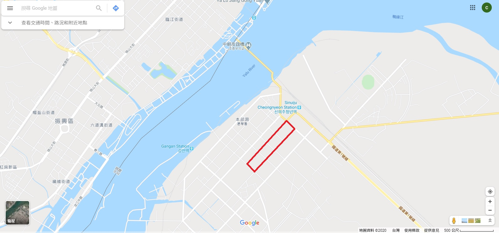

*（圖07）對照今日地圖。圖源：Google Map。*

新義州是中、朝兩國間的重要口岸，與中國的安東市（今中國遼寧省丹東市）僅有鴨綠江一水之隔，現今著名的中朝友誼橋便在本市。當時本市的初音町，僅在新義州鐵路車站（今新義州青年驛，신의주청년역）西側不遠處，本站為朝鮮總督府鐵道（鮮鐵）與滿鐵的重要連接點，而鮮鐵透過釜山的渡輪連接日本本土，形成日本與滿洲地區之間的大動脈，新義州的重要性可見一斑；初音町在當時即為新義州的中心地帶，今天屬於北韓。北韓新義州的初音町與今天南韓首爾的初音町彷彿是「被三八線分隔的」初音。

[^朝鮮總督府鐵道（鮮鐵）]: 不可簡稱為「朝鐵」，「朝鐵」指的是當時朝鮮的私鐵「朝鮮鐵道株式會社」。

# **樺太的「初音町」**

樺太的初音町位於南部亞庭灣的港口重鎮大泊町（今科沙可夫，俄語：Корсаков，拉丁轉寫：Korsakov），在1925年，大泊町的市街地人口甚至高於樺太廳治所在地的豐原町（今南薩哈林斯克，俄語：Южно-Сахалинск，拉丁轉寫：Yuzhno-Sakhalinsk），在當時為樺太第一大城，後來才被廳治豐原町超越。

[^大泊町及豐原町的市街地人口]: 樺太廳（1925），《樺太要覧－大正14年》，頁28、29

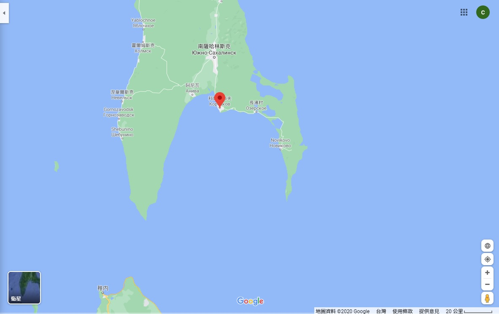

*（圖08）大泊町（今科沙可夫）位置。圖源：Google Map。*

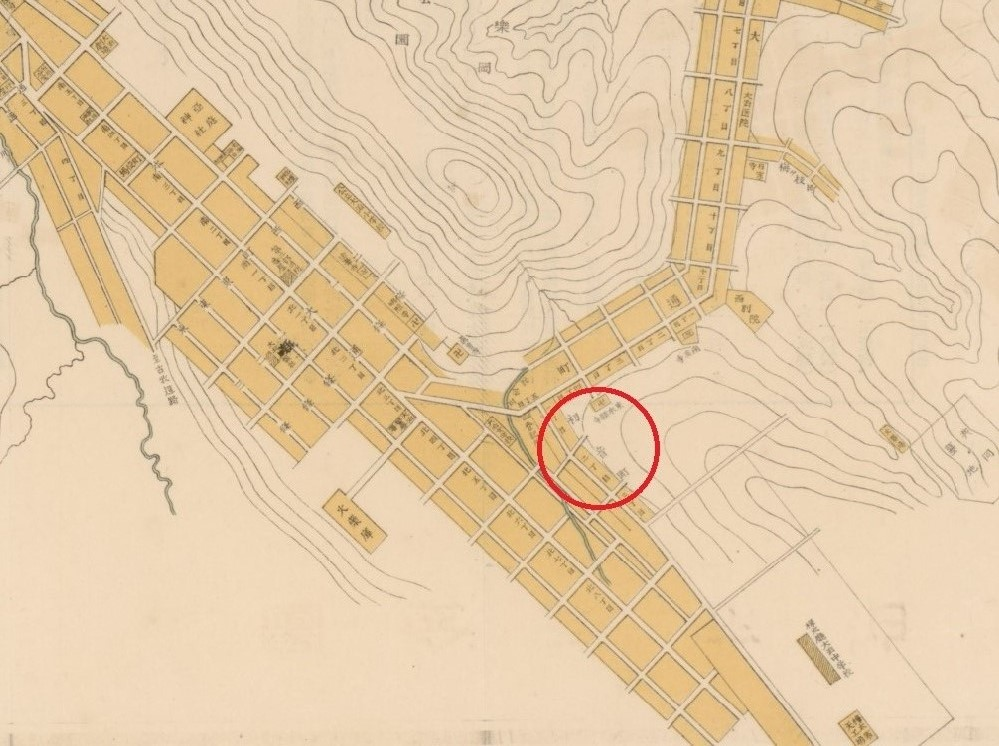

*（圖09）大泊市街地中的初音町（右側為北）。圖源：〈大泊市街全圖〉，現藏於國際日本文化研究中心（国際日本文化研究センター）。*

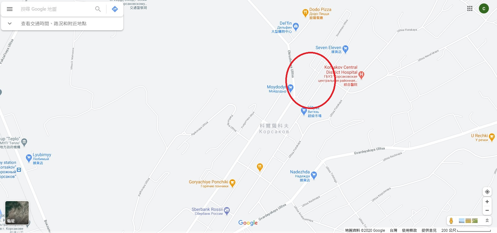

*（圖10）對照今日地圖。圖源：Google Map。*

大泊町在日本統治時期即為樺太與日本本土之間聯絡的重要港口，與北海道許多城市都有水運交通連結，為兩地交通的客貨運集散地，其重要性可見一斑；今日北海道許多聚落的鐵路車站（尤其是留萌與雉內）終端處都留有與渡輪連接的設施，這些設施在昔日多是為通往樺太大泊町的船隻停靠與裝卸貨方便而建，可見大泊（與樺太）與北海道的來往密切。大泊初音町位於港口東北側的山坡地，今日主要是住宅區，雖然該地與北海道和日本已較少連結，但仍可見日本統治之痕跡。

# **關東州的「初音町」**

關東州的初音町位於今日中國遼寧省大連市的旅順，旅順在俄領時期為遼東半島的第一大軍港，俄國的主要港口與要塞均建於此；日本統治關東廳之後，將重心移往東側的大連，旅順雖然自此退居次要角色，但仍為關東州重要港口之一。

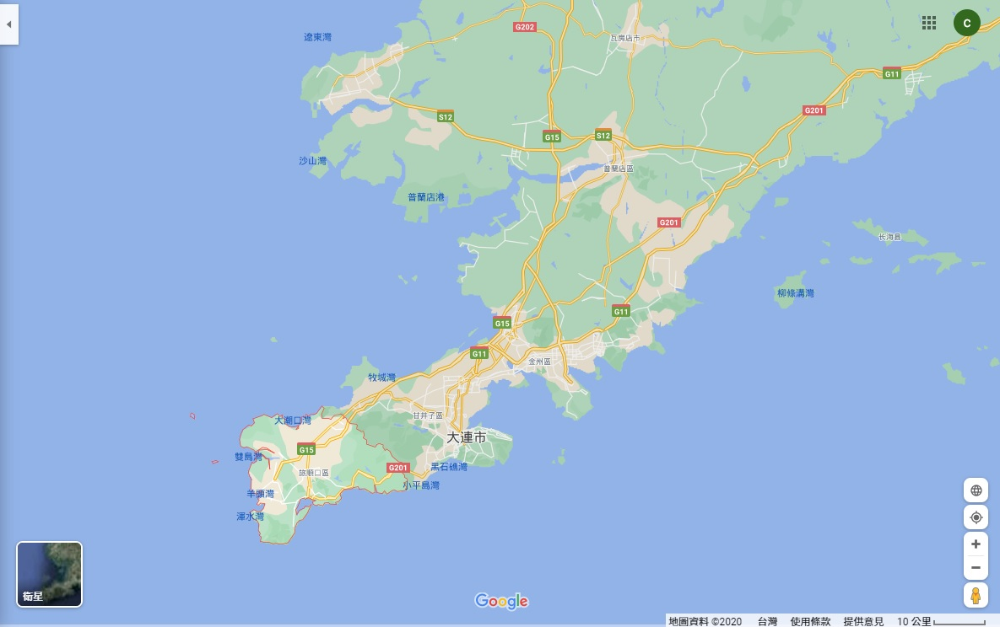

*（圖11）旅順位於遼東半島尖端，大連市區的西側。圖源：Google Map。*

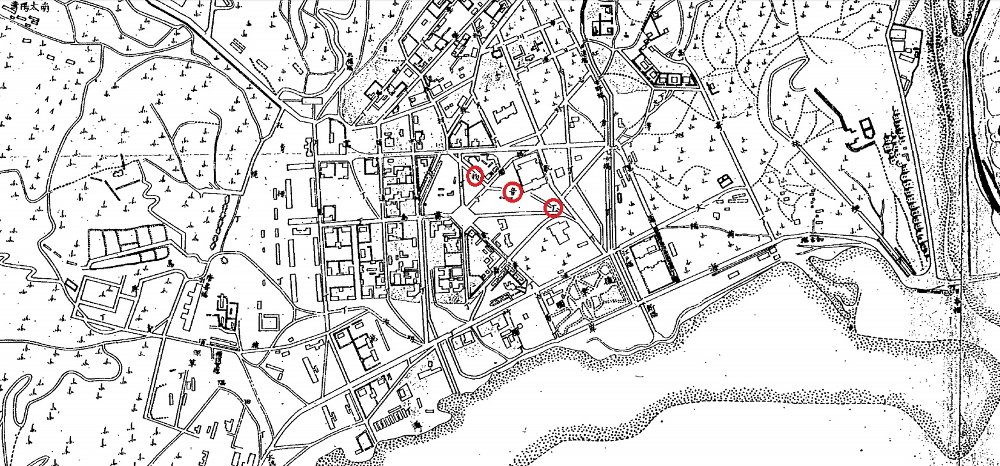

*（圖12）旅順的初音町。圖源：外務省外交史料館檔案，典藏號：B13080895100。*

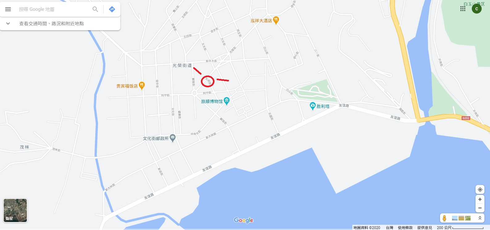

*（圖13）對照今日地圖。圖源：Google Map。*

旅順被龍河分割成位於西岸的新旅順以及東岸的舊旅順，初音町為當時新旅順市區中較小的街道。在今日由於市區街道變化，當時的初音町已被分割，西段作為東明街持續存在，而東段則分割成小巷，或是成為建築物；但新旅順市街的街道雛形與日本統治時則無太大變化。且可能是由於旅順初音町範圍較小且位於市中心緊湊的街道之中，當時的旅順市街圖為了簡潔起見，極少有標上初音町三字，以至於必須依靠日本外務省檔案所藏之地圖。

# **結論**

除了南洋群島沒有初音町以外，日本當時的各外地：朝鮮、樺太、關東州與臺灣都存在至少一處「初音町」，散佈於部分大型市街之中，並且多為市街靠近中心的精華地帶；「初音」一詞源於《源氏物語五十四帖》中的第23帖之標題，該詞的背後隱藏著濃厚的日本文化氣息，因此在日本也時常將此詞當作地名，在日本統治各外地後也將這個地名引入各外地的重要市街地，造就了「初音町」除了日本本土以外，也散佈於東亞各地的奇妙現象。

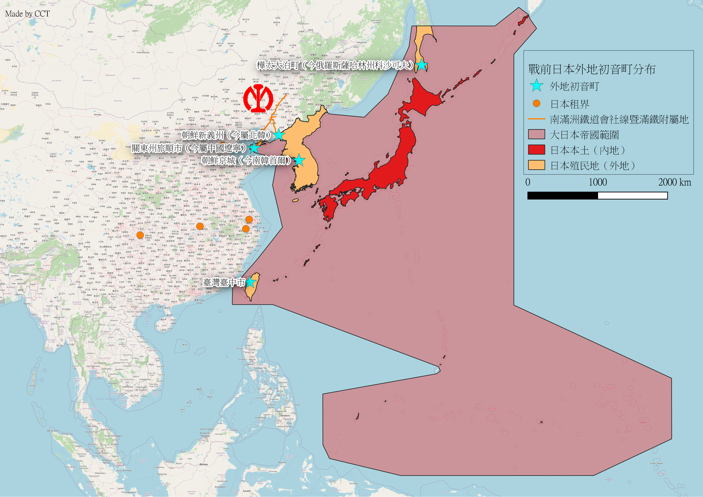

*（圖14）日本各外地的「初音町」分布。圖源：筆者自行繪製。*

> [!NOTE]
>
> 本圖僅繪出市街地之中名為「初音」的町丁，未計位於非市街地名為「初音」的小字，因此位於今日臺灣花蓮縣吉安鄉的初音小字並未繪出。
>

由此可見，對於日本所統治過的區域來說，「初音町」這個地名並不算稀有，幾乎是每一塊外地都有一處名為初音町的町丁，這些外地的「初音町」雖然由於歷史因素，已經不再稱為「初音町」，但它們卻見證了這些區域曾為日本所統治的歷史；今日的東亞各國也散佈著Vocaloid的愛好者，如同當年散佈著初音町一樣，標誌著日本文化對這些地區的影響力。也許對身處這些地區的，喜歡初音未來的Vocaloid粉絲們來說，對於自己住在昔日的「初音町」這件事，可能是最令人意外的美麗巧合。

**CCT**

**2020年08月22日**

# 參考資料

- 炭谷傳次郎（1916），《朝鮮平安北道新地圖》，大阪：炭谷傳次郎

- 小川琢治（1923），《市町村大字讀方名彙》，東京：成象堂

- 樺太廳（1925），《樺太要覧－大正14年》，樺太豐原町：樺太廳

- 大泊町役場（1925），〈大泊市街全圖〉，国際日本文化研究センター所蔵，現所蔵番号：YG/7/GE491/Ko、002464683

- 南滿洲鐵道株式會社（1932），《滿鐵要覧》，大連：南滿洲鐵道株式會社

- 南滿洲鐵道株式會社（1940），《營業一斑－昭和14年版》，大連：南滿洲鐵道株式會社

- 南滿洲鐵道株式會社（1944），《第四十三回事業報告書》，大連：南滿洲鐵道株式會社

- Korea, Seoul City, 1:7500. 1910. From Geography and Map Division, Library of Congress.

- JACAR（アジア歴史資料センター）Ref.B13080895100、各国地図／支那之部　第一巻（外務省外交史料館），頁6

---

> **原文出處**
>
> 本文最初發布於 **2020-08-22**，
> 原 Facebook 初始發文時間及連結已不可考；巴哈姆特備份亦佚失。
>
> 原文連結如下，本站版本僅針對排版進行改善及更正錯別字，未改動內文：
>
> - Facebook 未來群像：（佚失）
